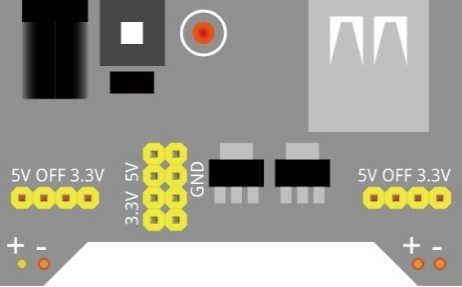
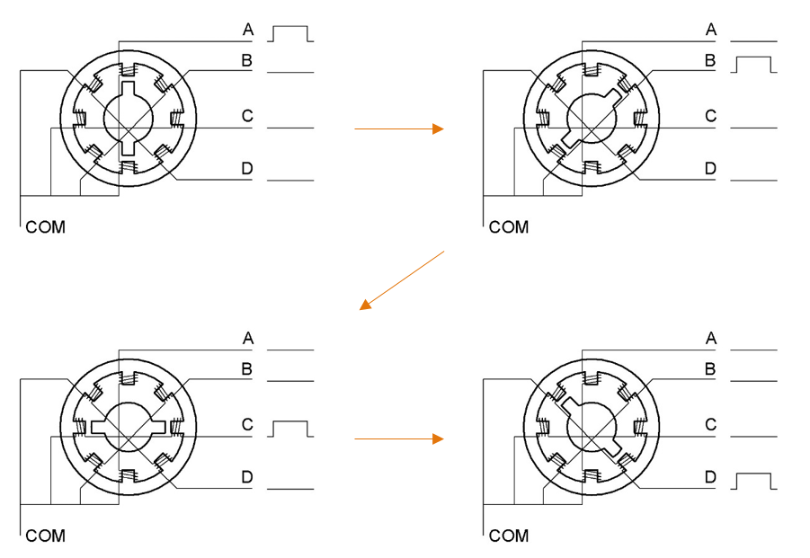
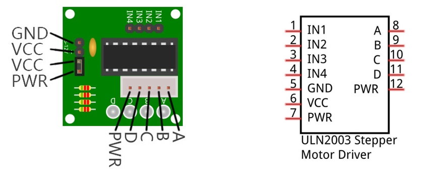

################################################################
Chapter Stepper Motor
################################################################

In this chapter, we will learn a new component, Seven-segment display (SSD).

Project Seven -segment display
****************************************************************

Component List
================================================================

+--------------------------------------------------+-------------------------------------------------+
|1. Raspberry Pi (with 40 GPIO) x1                 |                                                 |     
|                                                  | Jumper Wires x6                                 |       
|2. GPIO Extension Board & Ribbon Cable x1         |                                                 |       
|                                                  |  |jumper-wire|                                  |                                                            
|3. Breadboard x1                                  |                                                 |                                                                 
+--------------------------------------------------+-------------------------------------------------+
| Stepper Motor x1                                 | ULN2003 Stepper Motor Driver x1                 |
|                                                  |                                                 |
|  |stepper_Motor|                                 |  |stepper_Motor_Driver|                         |                           
+--------------------------------------------------+-------------------------------------------------+
| 9V battery (prepared by yourself) & battery line | Breadboard Power module x1                      |
|                                                  |                                                 |
|  |Battery_cable|                                 |  |power-module|                                 |                           
+--------------------------------------------------+-------------------------------------------------+

.. |jumper-wire| image:: ../_static/imgs/jumper-wire.png
.. |stepper_Motor_Driver| image:: ../_static/imgs/stepper_Motor_Driver.png
    :width: 70%
.. |stepper_Motor| image:: ../_static/imgs/stepper_Motor.png
    :width: 70%
.. |Battery_cable| image:: ../_static/imgs/Battery_cable.png

Component knowledge
================================================================

Stepper Motor
----------------------------------------------------------------

Stepper Motors are an open-loop control device, which converts an electronic pulse signal into angular displacement or linear displacement. In a non-overload condition, the speed of the motor and the location of the stops depends only on the pulse signal frequency and number of pulses and is not affected by changes in load as with a DC Motor. A small Four-Phase Deceleration Stepper Motor is shown here:

.. image:: ../_static/imgs/steppter_Motor_1.png
    :align: center

The electronic schematic diagram of a Four-Phase Stepper Motor is shown below:

.. image:: ../_static/imgs/stepper_Motor_2.png
    :align: center

The outside case or housing of the Stepper Motor is the Stator and inside the Stator is the Rotor. There is a specific number of individual coils, usually an integer multiple of the number of phases the motor has, when the Stator is powered ON, an electromagnetic field will be formed to attract a corresponding convex diagonal groove or indentation in the Rotor’s surface. The Rotor is usually made of iron or a permanent magnet. Therefore, the Stepper Motor can be driven by powering the coils on the Stator in an ordered sequence (producing a series of “steps” or stepped movements).

A common driving sequence is shown here:

In the sequence above, the Stepper Motor rotates by a certain angle at once, which is called a “step”. By controlling the number of rotational steps, you can then control the Stepper Motor’s rotation angle. By defining the time between two steps, you can control the Stepper Motor’s rotation speed. When rotating clockwise, the order of coil powered on is: A  B  C  D  A …… . And the rotor will rotate in accordance with this order, step by step, called four-steps, four-part. If the coils is powered ON in the reverse order, D  C  B  A  D … , the rotor will rotate in counter-clockwise direction.
There are other methods to control Stepper Motors, such as: connect A phase, then connect A B phase, the stator will be located in the center of A B, which is called a half-step. This method can improve the stability of the Stepper Motor and reduces noise. Tise sequence of powering the coils looks like this: A  AB  B  BC  C  CD  D  DA  A ……, the rotor will rotate in accordance to this sequence ar, a half-step at a time, called four-steps, eight-part. Conversely, if the coils are powered ON in the reverse order the Stepper Motor will rotate in the opposite direction.

The stator in the Stepper Motor we have supplied has 32 magnetic poles. Therefore, to complete one full revolution requires 32 full steps. The rotor (or output shaft) of the Stepper Motor is connected to a speed reduction set of gears and the reduction ratio is 1:64. Therefore, the final output shaft (exiting the Stepper Motor’s housing) requires 32 X 64 = 2048 steps to make one full revolution.

ULN2003 Stepper Motor driver
----------------------------------------------------------------

A ULN2003 Stepper Motor Driver is used to convert weak signals into more powerful control signals in order to drive the Stepper Motor. In the illustration below, the input signal IN1-IN4 corresponds to the output signal A-D, and 4 LEDs are integrated into the board to indicate the state of these signals. The PWR interface can be used as a power supply for the Stepper Motor. By default, PWR and VCC are connected.

Circuit
================================================================

When building the circuit, note that rated voltage of the Stepper Motor is 5V, and we need to use the breadboard power supply independently, (Caution do not use the RPi power supply). Additionally, the breadboard power supply needs to share Ground with Rpi.

+------------------------------------------------------------------------------------------------+
|   Schematic diagram                                                                            |
|                                                                                                |
|   |stepper_Motor_Sc|                                                                           |
+------------------------------------------------------------------------------------------------+
|   Hardware connection. If you need any support,please feel free to contact us via:             |
|                                                                                                |
|   support@freenove.com                                                                         |
|                                                                                                |
|   |stepper_Motor_Fr|                                                                           |
+------------------------------------------------------------------------------------------------+

.. |stepper_Motor_Sc| image:: ../_static/imgs/stepper_Motor_Sc.png
.. |stepper_Motor_Fr| image:: ../_static/imgs/stepper_Motor_Fr.png

Sketch
================================================================

In this project, a separate thread is opened to control the stepper motor. The uncertainty of the system time slice allocation may lead to the running of the stepper motor not smooth, which is a normal phenomenon.

Sketch SteppingMotor
----------------------------------------------------------------

First observe the result after running the sketch, and then learn about the code in detail.

1.	Use Processing to open the file Sketch_16_1_1_SteppingMotor.

.. code-block:: console    
    
    $ processing ~/Freenove_Kit/Processing/Sketches/Sketch_16_1_1_SteppingMotor/Sketch_16_1_1_SteppingMotor.pde

2.	Click on "RUN" to run the code.

After the program is executed, Display Window shows a pattern used to simulate the motor, and a button used to control RUN/STOP state of stepper motor. The stepper motor in the circuit and the virtual motor in the Display Window will start to rotate at the same time.

The stepper motor rotates clockwise at a fixed speed for a circle and then rotates counterclockwise for another circle, which repeats in an endless loop. Clicking on the Button can change the state (start or stop) of the stepper motor.

This project contains several code files, as shown below:

.. image:: ../_static/imgs/pr_motor_code.png
    :align: center

The following is program code:

.. literalinclude:: ../../../freenove_Kit/Processing/Sketches/Sketch_16_1_1_SteppingMotor/Sketch_16_1_1_SteppingMotor.pde
    :linenos: 
    :language: c
    :dedent:

First define 4 GPIOs connected to the motor, the BUTTON class object and SteppingMotor class object.

.. literalinclude:: ../../../freenove_Kit/Processing/Sketches/Sketch_16_1_1_SteppingMotor/Sketch_16_1_1_SteppingMotor.pde
    :linenos: 
    :language: c
    :lines: 9-11
    :dedent:

In the function setup(), initialize the Button, start thread of stepping motor, and set the rotating speed of the virtual motor.

.. literalinclude:: ../../../freenove_Kit/Processing/Sketches/Sketch_16_1_1_SteppingMotor/Sketch_16_1_1_SteppingMotor.pde
    :linenos: 
    :language: c
    :lines: 15-22
    :dedent:

In the function draw(), first draw the button, and calculate the position of the virtual motor and show the current rotating direction.

.. literalinclude:: ../../../freenove_Kit/Processing/Sketches/Sketch_16_1_1_SteppingMotor/Sketch_16_1_1_SteppingMotor.pde
    :linenos: 
    :language: c
    :lines: 25-45
    :dedent:

And then determine whether the stepper motor is in stopping state according to the value of “m.steps”. If it is true, change the rotating direction of motor, and drive the motor to rotate a circle.

.. literalinclude:: ../../../freenove_Kit/Processing/Sketches/Sketch_16_1_1_SteppingMotor/Sketch_16_1_1_SteppingMotor.pde
    :linenos: 
    :language: c
    :lines: 46-52
    :dedent:

Finally draws the virtual fan.

.. code-block:: c    
    :linenos:

    drawFan(rotaPosition);

Reference
----------------------------------------------------------------

.. py:function:: class SteppinMotor

    This is a custom class that defines some methods to drive the four-phase stepper motor.
   
    **public SteppingMotor(int[] mPins)**
   
    Constructor. The parameter represents the GPIO pin connected to the stepper motor.
   
    **public void motorStart()**
   
    Start a stepper motor thread, then the thread is in the state of waiting, waiting for a notification to wake it up.
   
    **public void moveSteps(int idir, int ims, int isteps)**
   
    Used to drive stepper motor to rotate, the parameter “idir” indicates the direction that can be set as CW/CCW. The parameter “ims” is the delay (with unit ms) between each two steps of stepper motor. The higher the value of “ims”, the lower the speed of stepper motor. Parameter “isteps” specifies the number of rotating steps of the stepper motor. As for four-phase stepper motor, four steps make a cycle, if set isteps=1, which means to specify the stepping motor to rotate four steps.
   
    **public void motorStop()**
   
    Stop stepper motor.
   
    **public void motorRestart()**
   
    Restart to drive stepper motor.
