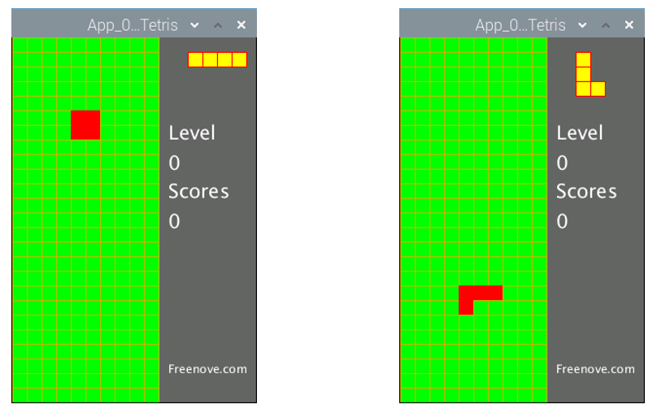
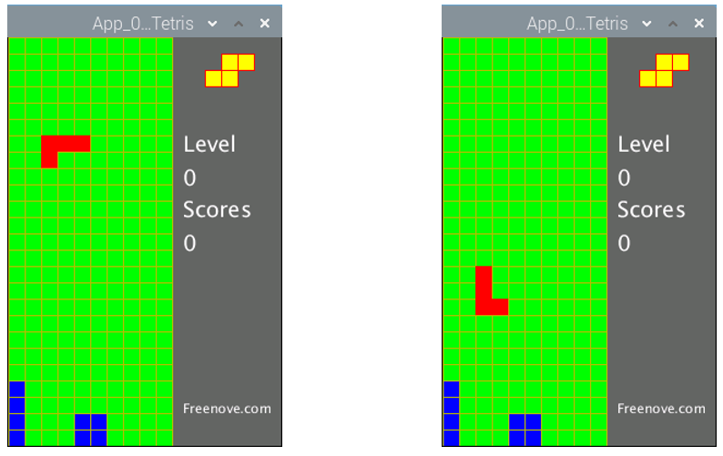
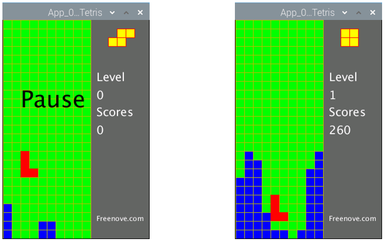
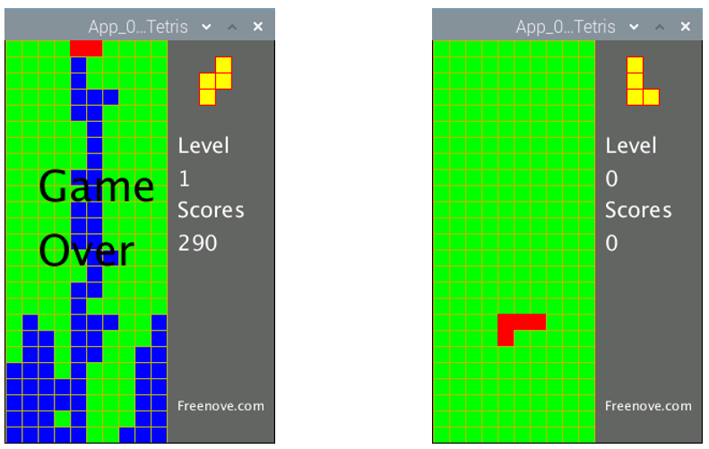

################################################################
App Tetris Game
################################################################

In this chapter, we will play a game, Tetris game.

App Tetris Game
************************************************

Now, let's create and experience our own game.

Component List
================================================================

+-------------------------------------------------+-------------------------------------------------+
|1. Raspberry Pi (with 40 GPIO) x1                |                                                 |     
|                                                 | Jumper Wires x12                                |       
|2. GPIO Extension Board & Ribbon Cable x1        |                                                 |       
|                                                 |  |jumper-wire|                                  |                                                            
|3. Breadboard x1                                 |                                                 |                                                                 
+-------------------------------------------------+-------------------------------------------------+
| Push button x4                                  | Resistor 10kΩ x4                                |
|                                                 |                                                 |
|  |button-small|                                 |  |Resistor-10kΩ|                                |
+-------------------------------------------------+-------------------------------------------------+

.. |jumper-wire| image:: ../_static/imgs/jumper-wire.png
.. |Resistor-10kΩ| image:: ../_static/imgs/Resistor-10kΩ.png
    :width: 10%
.. |button-small| image:: ../_static/imgs/button-small.jpg
    :width: 30%

Circuit
================================================================

+------------------------------------------------------------------------------------+
|   Schematic diagram                                                                |
|                                                                                    |
|   |snake_game_Sc|                                                                  |
+------------------------------------------------------------------------------------+
|   Hardware connection. If you need any support,please feel free to contact us via: |
|                                                                                    |
|   support@freenove.com                                                             | 
|                                                                                    |
|   |snake_game_Fr|                                                                  |
+------------------------------------------------------------------------------------+

.. |snake_game_Sc| image:: ../_static/imgs/snake_game_Sc.png
.. |snake_game_Fr| image:: ../_static/imgs/snake_game_Fr.png

Sketch
================================================================

Sketch TetrisGame
-------------------------------

1.	Use Processing to open the file Sketch_05_1_1_TetrisGame.

.. code-block:: console    
    
    $ processing ~/Freenove_Kit/Processing/Apps/App_05_1_1_Tetris/App_05_1_1_Tetris.pde

2.	Click on "RUN" to run the code.

After the program is executed, Display Window displays as below. 

The left and right button in the circuit can control the movement of the falling block to left or right. And the button below can accelerate falling of the block. The button above is used for rotating of the block. Four direction keys on keyboard can also be used to play the game.

In the process of game, pressing the space bar on the keyboard can pause the game. The right side of the Display Window shows the upcoming block, the current game speed and the current score. The more lines you eliminate once, the higher the scores you will get. If you eliminate one line once, you will get 10 points. If you eliminate 4 lines once, you will get 70 points. 

When the blocks are beyond the screen, the game is over. After the game is over, press the space bar to start a new game. 

