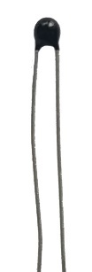
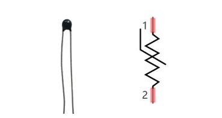
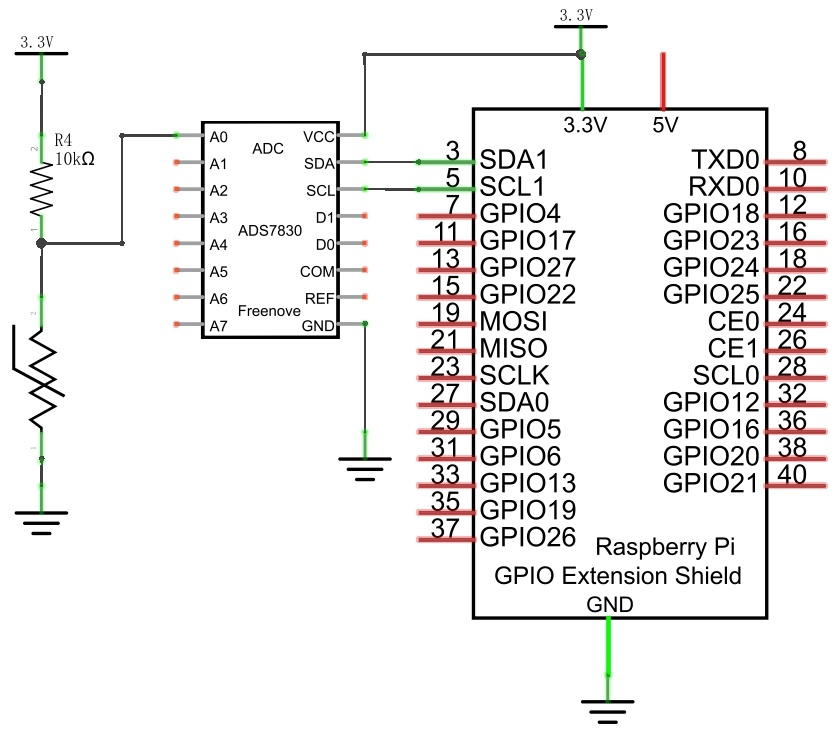
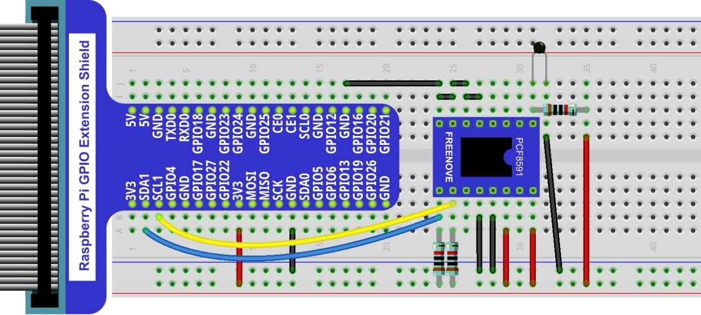

################################################################
Chapter Thermistor
################################################################

In this chapter, we will learn about Thermistors which are another kind of Resistor.

Project Thermometer
****************************************************************

A Thermistor is a type of Resistor whose resistance value is dependent on temperature and changes in temperature. Therefore, we can take advantage of this characteristic to make a Thermometer.

Component List
================================================================

+---------------------------------------------------------------+
|1. Raspberry Pi (with 40 GPIO) x1                              |     
|                                                               |       
|2. GPIO Extension Board & Ribbon Cable x1                      |       
|                                                               |                                                            
|3. Breadboard x1                                               |                                                                 
+-------------------------------+-------------------------------+
| Thermistor x1                 |   Resistor 10kΩ x3            |
|                               |                               |
| |Thermistor|                  |  |Resistor-10kΩ|              |                           
+-------------------------------+-------------------------------+
| ADC module x1                                                 |
|                                                               |
|   |ADC-module-1|   :xx-large:`or`  |ADC-module-2|             |                   
|                                                               |  
+---------------------------------------------------------------+
|   Jumper Wire M/M x14                                         |
|                                                               | 
|      |jumper-wire|                                            |
+---------------------------------------------------------------+

.. |jumper-wire| image:: ../_static/imgs/jumper-wire.png
.. |Resistor-10kΩ| image:: ../_static/imgs/Resistor-10kΩ.png
    :width: 10%

.. |ADC-module-1| image:: ../_static/imgs/ADC-module-1.png
.. |ADC-module-2| image:: ../_static/imgs/ADC-module-2.png

Component knowledge
================================================================

Thermistor
----------------------------------------------------------------

Thermistor is a temperature sensitive resistor. When it senses a change in temperature, the resistance of the Thermistor will change. We can take advantage of this characteristic by using a Thermistor to detect temperature intensity. A Thermistor and its electronic symbol are shown below.

The relationship between resistance value and temperature of a thermistor is:

.. math:: `Rt=R*EXP [B*(1/T2-1/T1)]`

- Where:
    - Rt is the thermistor resistance under T2 temperature;
    - R is in the nominal resistance of thermistor under T1 temperature;
    - EXP[n] is nth power of e;
    - B is for thermal index;
    - T1, T2 is Kelvin temperature (absolute temperature). Kelvin temperature=273.15 + Celsius temperature.

For the parameters of the Thermistor, we use: B=3950, R=10k, T1=25.
The circuit connection method of the Thermistor is similar to photoresistor, as the following:

.. image:: ../_static/imgs/Thermistor-3.png
        :width: 20%
        :align: center

We can use the value measured by the ADC converter to obtain the resistance value of Thermistor, and then we can use the formula to obtain the temperature value.
Therefore, the temperature formula can be derived as:

.. container:: centered

    :xx-large:`T2 = 1/(1/T1 + ln(Rt/R)/B)`

Circuit with ADS7830
================================================================

The circuit of this project is similar to the one in last chapter. The only difference is that the Photoresistor is replaced by the Thermistor.

+------------------------------------------------------------------------------------------------+
|   Schematic diagram                                                                            |
|                                                                                                |
|   |PCF8591-Schematic-5|                                                                        |
+------------------------------------------------------------------------------------------------+
|   Hardware connection. If you need any support,please feel free to contact us via:             |
|                                                                                                |
|   support@freenove.com                                                                         |
|                                                                                                |
|   |ADS7830-fritizing-6|                                                                        |
|                                                                                                |
|    **Thermistor has longer pins than the one shown in circuit.**                               |
|                                                                                                |
|    **Video:** https://youtu.be/-CvWcobXSFI                                                     |
+------------------------------------------------------------------------------------------------+

.. |ADS7830-fritizing-6| image:: ../_static/imgs/ADS7830-fritizing-6.png

.. raw:: html

   <iframe height="500" width="690" src="https://www.youtube.com/embed/-CvWcobXSFI" frameborder="0" allowfullscreen></iframe>

Circuit with PCF8591
================================================================

The circuit of this project is similar to the one in the last chapter. The only difference is that the Photoresistor is replaced by the Thermistor.

+------------------------------------------------------------------------------------------------+
|   Schematic diagram                                                                            |
|                                                                                                |
|   |PCF8591-Schematic-5|                                                                        |
+------------------------------------------------------------------------------------------------+
|   Hardware connection. If you need any support,please feel free to contact us via:             |
|                                                                                                |
|   support@freenove.com                                                                         |
|                                                                                                |
|   |PCF8591-fritizing-5|                                                                        |
|                                                                                                |
|   **Thermistor has longer pins than the one shown in circuit.**                                |
+------------------------------------------------------------------------------------------------+

.. |PCF8591-Schematic-5| image:: ../_static/imgs/PCF8591-Schematic-5.png

The formula for calculating temperature according to the circuit is shown below:

.. math:: T2 = 1/(1/T1 + ln(Rt/R)/B)

Sketch
================================================================

Sketch Thermometer
----------------------------------------------------------------

First, observe the result after running the sketch, and then learn about the code in detail.
1.	Use Processing to open the file Sketch_08_1_1_Thermometer.

.. code-block:: console

    $ processing ~/Freenove_Kit/Processing/Sketches/Sketch_08_1_1_Thermometer/Sketch_08_1_1_Thermometer.pde

2.	Click on "RUN" to run the code.

After the program is executed, the Display Window will show the current temperature, the ADC value and the voltage value.

This project contains a lot of code files, and the core code is contained in the file Sketch_08_1_1_Thermometer. The other files only contain some custom classes.

The following is program code:

.. literalinclude:: ../../../freenove_Kit/Processing/Sketches/Sketch_08_1_1_Thermometer/Sketch_08_1_1_Thermometer.pde
    :linenos: 
    :language: java

In this project code, first read ADC, and then calculate the current temperature according to the Ohm's law and temperature formula mentioned before, finally display them on Display Window.

.. literalinclude:: ../../../freenove_Kit/Processing/Sketches/Sketch_08_1_1_Thermometer/Sketch_08_1_1_Thermometer.pde
    :linenos: 
    :language: java
    :lines: 23-28