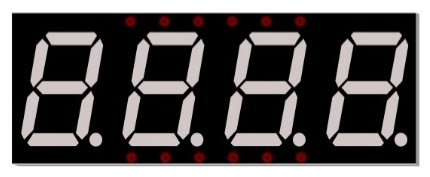
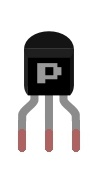
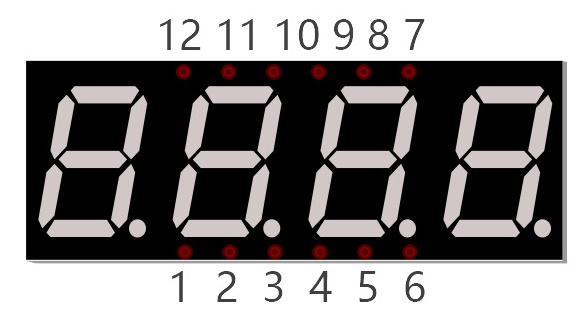
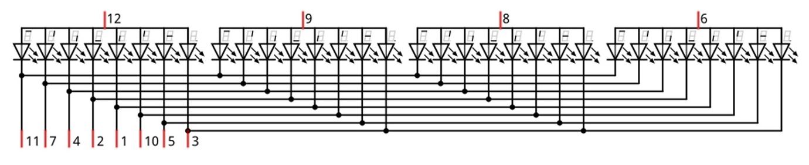
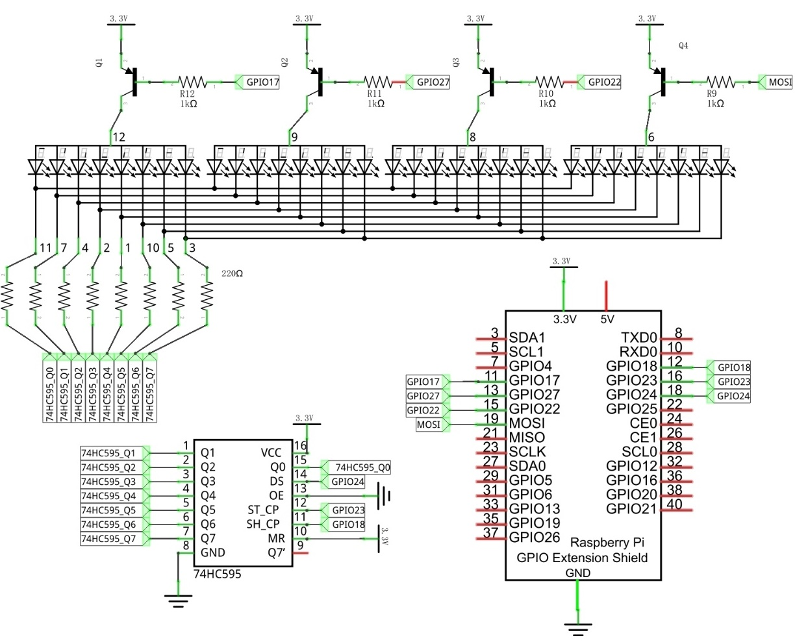
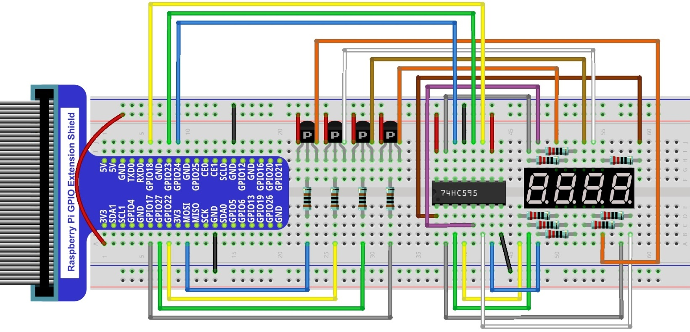

Project 4-Digit 7-Segment Display
****************************************************************

Now, let's try to control more-than-one digit displays by using a Four 7-Segment Display in one project.

Component List
================================================================

+-------------------------------------------------+-------------------------------------------------+
|1. Raspberry Pi (with 40 GPIO) x1                |                                                 |     
|                                                 |   Jumper Wires x18                              |       
|2. GPIO Extension Board & Ribbon Cable x1        |                                                 |       
|                                                 |     |jumper-wire|                               |                                                            
|3. Breadboard x1                                 |                                                 |                                                                 
+-----------------------------+-------------------+--------------+----------------------------------+
| 74HC595 x1                  | Resistor 1KΩ x4                  | Resistor 220Ω x8                 |
|                             |                                  |                                  |
|  |74HC595|                  |  |Resistor-1kΩ|                  |  |res-220R|                      |
+-----------------------------+-------------------+--------------+----------------------------------+
| 4-Digit 7-Segment Display x1                    | PNP transistor x4                               |       
|                                                 |                                                 |                                                            
|  |4_7_Segment_Display|                          |  |PNP|                                          | 
+-------------------------------------------------+-------------------------------------------------+

.. |jumper-wire| image:: ../_static/imgs/jumper-wire.png

Component knowledge
================================================================

4 Digit 7-Segment Display
----------------------------------------------------------------

A 4 Digit 7-segment display integrates four 7-Segment Displays into one module, therefore it can display more characters. All of the LEDs contained have a Common Anode and individual Cathodes. Its internal structure and pin designation diagram is shown below:

The internal electronic circuit is shown below, and all 8 LED cathode pins of each 7-Segment Display are connected together.

Display method of 4 Digit 7-segment display is similar to 1 Digit 7-segment display. The difference between them is that the 4-Digit displays each Digit is visible in turn, one by one and not together. We need to first send high level to the common end of the first Digit Display, and send low level to the remaining three common ends, and then send content to 8 LED cathode pins of the first Digit Display. At this time, the first 7-Segment Display will show visible content and the remaining three will be OFF.

Similarly, the second, third and fourth 7-Segment Displays will show visible content in turn by scanning the display. Although the four number characters are displayed in turn separately, this process is so very fast that it is unperceivable to the naked eye. This is due to the principle of optical afterglow effect and the vision persistence effect in human sight. This is how we can see all 4 number characters at the same time. However, if each number character is displayed for a longer period, you will be able to see that the number characters are displayed separately. 

Circuit
================================================================

+------------------------------------------------------------------------------------------------+
|   Schematic diagram                                                                            |
|                                                                                                |
|   |4_7_Segment_Sc|                                                                             |
+------------------------------------------------------------------------------------------------+
|   Hardware connection                                                                          |
|                                                                                                |
|   |4_7_Segment_Fr|                                                                             | 
+------------------------------------------------------------------------------------------------+

Code
================================================================

In this code, we use the 74HC595 IC Chip to control the 4-Digit 7-Segment Display, and use the dynamic scanning method to show the changing number characters.

Python Code StopWatch
----------------------------------------------------------------

This code uses the four step four pat mode to drive the Stepper Motor clockwise and reverse direction.

.. hint:: 
    :red:`If you have any concerns, please contact us via:`  support@freenove.com

1.	Use cd command to enter 16.1.1_SteppingMotor directory of Python code.

.. code-block:: console

    $ cd ~/Freenove_Kit/Code/Python_GPIOZero_Code/18.2.1_StopWatch

2.	Use python command to execute code "StopWatch.py".

.. code-block:: console

    $ python StopWatch.py

After the program is executed, 4-Digit 7-segment start displaying a four-digit number dynamically, and the will plus 1 in each successive second.

The following is the program code:

.. literalinclude:: ../../../freenove_Kit/Code/Python_GPIOZero_Code/18.2.1_StopWatch/StopWatch.py
    :linenos: 
    :language: python
    :dedent:

First, define the pin of 74HC595 and 7-segment display common end, character encoding and a variable "counter" to be displayed counter.

.. literalinclude:: ../../../freenove_Kit/Code/Python_GPIOZero_Code/18.2.1_StopWatch/StopWatch.py
    :linenos: 
    :language: python
    :lines: 15-21
    :dedent:

Subfunction **selectDigit** (digit) function is used to open one of the 7-segment display and close the other 7-segment display, where the parameter digit value can be 1,2,4,8. Using "|" can open a number of 7-segment display.

.. literalinclude:: ../../../freenove_Kit/Code/Python_GPIOZero_Code/18.2.1_StopWatch/StopWatch.py
    :linenos: 
    :language: python
    :lines: 38-42
    :dedent:

Subfunction **outData** (data) is used to make the 74HC595 output an 8-bit data immediately.

.. code-block:: python

    def outData(data):      # function used to output data for 74HC595
        latchPin.off()
        shiftOut(MSBFIRST,data)
        latchPin.on()

Subfunction **display** (int dec) is used to make a 4-Digit 7-Segment Display a 4-bit integer. First open the common end of first 7-Segment Display Digit and turn OFF the other three Digits, now it can be used as 1-Digit 7-Segment Display. The first Digit is used for displaying single digits of "dec", the second Digit is for tens, the third for hundreds and fourth for thousands respectively. Each digit will be displayed for a period by using delay (). The time in this code is very brief, so you will a mess of Digits. If the time is set long enough, you will see that every digit is displayed independently.

.. literalinclude:: ../../../freenove_Kit/Code/Python_GPIOZero_Code/18.2.1_StopWatch/StopWatch.py
    :linenos: 
    :language: python
    :lines: 44-60
    :dedent:

Subfunction **timer()** is the timer callback function. When the time is up, this function will be executed. Accompanied by the execution, the variable counter will be added 1, and then reset the time of timer to 1s. 1s later, the function will be executed again.

.. literalinclude:: ../../../freenove_Kit/Code/Python_GPIOZero_Code/18.2.1_StopWatch/StopWatch.py
    :linenos: 
    :language: python
    :lines: 61-67
    :dedent:

Subfunction **setup()** , configure all input output modes for the GPIO pin used. 

Finally, in loop function, make the digital tube display variable counter value in the while loop. The value will change in function **timer** (), so the content displayed by 7-segment display will change accordingly.

.. code-block:: python

    def loop():
        global t
        global counter
        t = threading.Timer(1.0,timer)      # set the timer
        t.start()                           #Start timing
        while True:
            display(counter)                #display the number counter

After the program is executed, press "Ctrl+C", then subfunction destroy() will be executed, and GPIO resources and timers will be released in this subfunction.

.. code-block:: python

    def destroy():  
        global t
        dataPin.close()
        latchPin.close()
        clockPin.close() 
        t.cancel()  