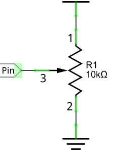
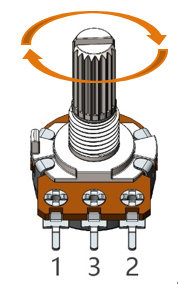
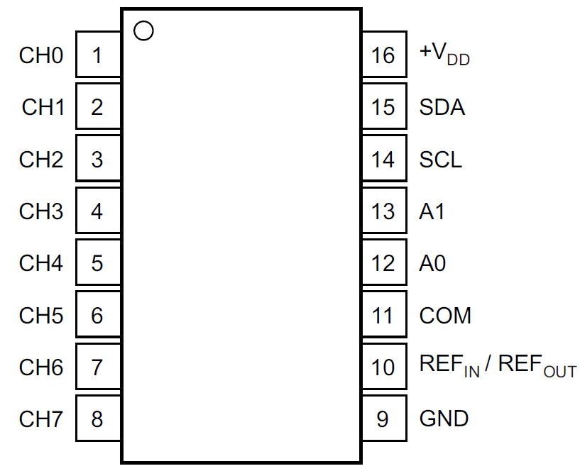
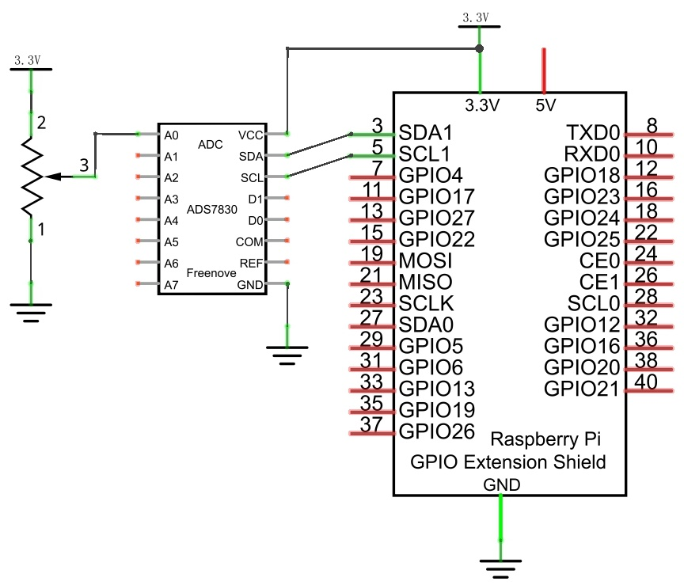

.. _ADC:

################################################################
Chapter ADC
################################################################

We have learned how to control the brightness of an LED through PWM and that PWM is not a real analog signal. In this chapter, we will learn how to read analog values via an ADC Module and convert these analog values into digital.

Project Read the Voltage of Potentiometer 
****************************************************************

In this project, we will use the ADC function of an ADC Module to read the voltage value of a potentiometer.

Component List
================================================================

+---------------------------------------------------------------+
|1. Raspberry Pi (with 40 GPIO) x1                              |     
|                                                               |       
|2. GPIO Extension Board & Ribbon Cable x1                      |       
|                                                               |                                                            
|3. Breadboard x1                                               |                                                                 
+-------------------------------+-------------------------------+
| Rotary potentiometer x1       |   Resistor 10kΩ x2            |
|                               |                               |
| |Rotary-potentiometer|        |  |Resistor-10kΩ|              |                           
+-------------------------------+-------------------------------+
| ADC module x1                                                 |
|                                                               |
|   |ADC-module-1|   :xx-large:`or`  |ADC-module-2|             |                   
+---------------------------------------------------------------+
|   Jumper Wire x16                                             |
|                                                               | 
|      |jumper-wire|                                            |
+---------------------------------------------------------------+

.. |jumper-wire| image:: ../_static/imgs/jumper-wire.png
    :width: 70%   
.. |Resistor-10kΩ| image:: ../_static/imgs/Resistor-10kΩ.png
    :width: 10%
.. |Rotary-potentiometer| image:: ../_static/imgs/Rotary-potentiometer.png
    :width: 35%
.. |ADC-module-1| image:: ../_static/imgs/ADC-module-1.png
.. |ADC-module-2| image:: ../_static/imgs/ADC-module-2.png

This product contains :red:`only one ADC module`, there are two types, PCF8591 and ADS7830. For the projects described in this tutorial, they function the same. Please build corresponding circuits according to the ADC module found in your Kit.

+---------------------------------------------------------------+----------------------------------------------------------------+
|                      ADC module: PCF8591                      |                      ADC module: ADS7830                       |                                 
+===============================+===============================+===============================+================================+
|         Model diagram         |         Actual Picture        |         Model diagram         |         Actual Picture         |
|                               |                               |                               |                                |
||ADC-module-1|                 ||PCF8591|                      ||ADC-module-2|                 ||ADS7830|                       |                           
+-------------------------------+-------------------------------+-------------------------------+--------------------------------+

.. |ADS7830| image:: ../_static/imgs/ADS7830.png
.. |PCF8591| image:: ../_static/imgs/PCF8591.png

Circuit knowledge
================================================================

ADC
----------------------------------------------------------------

**An ADC is an electronic integrated circuit used to convert analog signals such as voltages to digital or binary form consisting of 1s and 0s.** The range of our ADC module is 8 bits, that means the resolution is 2^8=256, so that its range (at 3.3V) will be divided equally to 256 parts. 

Any analog value can be mapped to one digital value using the resolution of the converter. So the more bits the ADC has, the denser the partition of analog will be and the greater the precision of the resulting conversion.

.. image:: ../_static/imgs/ADC.png
        :width: 50%
        :align: center

Subsection 1: the analog in range of 0V-3.3/256 V corresponds to digital 0;

Subsection 2: the analog in range of 3.3 /256 V-2*3.3 /256V corresponds to digital 1;

\...\...

The resultant analog signal will be divided accordingly.

DAC
----------------------------------------------------------------

The reversing this process requires a DAC, Digital-to-Analog Converter. The digital I/O port can output high level and low level (0 or 1), but cannot output an intermediate voltage value. This is where a DAC is useful. The DAC module PCF8591 has a DAC output pin with 8-bit accuracy, which can divide VDD (here is 3.3V) into 28=256 parts. For example, when the digital quantity is 1, the output voltage value is 3.3/256 *1 V, and when the digital quantity is 128, the output voltage value is 3.3/256 *128=1.65V, the higher the accuracy of DAC, the higher the accuracy of output voltage value will be.

Component knowledge
================================================================

Potentiometer
----------------------------------------------------------------

Potentiometer is a resistive element with three Terminal parts. Unlike the resistors that we have used thus far in our project which have a fixed resistance value, the resistance value of a potentiometer can be adjusted. A potentiometer is often made up by a resistive substance (a wire or carbon element) and movable contact brush. When the brush moves along the resistor element, there will be a change in the resistance of the potentiometer’s output side (3) (or change in the voltage of the circuit that is a part). The illustration below represents a linear sliding potentiometer and its electronic symbol on the right.

Between potentiometer pin 1 and pin 2 is the resistive element (a resistance wire or carbon) and pin 3 is connected to the brush that makes contact with the resistive element. In our illustration, when the brush moves from pin 1 to pin 2, the resistance value between pin 1 and pin 3 will increase linearly (until it reaches the highest value of the resistive element) and at the same time the resistance between pin 2 and pin 3 will decrease linearly and conversely down to zero. At the midpoint of the slider the measured resistance values between pin 1 and 3 and between pin 2 and 3 will be the same.

In a circuit, both sides of resistive element are often connected to the positive and negative electrodes of power. When you slide the brush “pin 3”, you can get variable voltage within the range of the power supply.

Rotary potentiometer
----------------------------------------------------------------

Rotary potentiometers and linear potentiometers have the same function; the only difference being the physical action being a rotational rather than a sliding movement.

PCF8591
----------------------------------------------------------------

+--------+-----+---------------------------------------------------+-----------------------------------------------+
| SYMBOL | PIN |                    DESCRIPTION                    |                    TOP VIEW                   |
+========+=====+===================================================+===============================================+
|  AIN0  |  1  |                                                   |                                               |
+--------+-----+                                                   |                                               |
|  AIN1  |  2  |                                                   |                                               |
+--------+-----+  Analog inputs (A/D converter)                    |                                               |
|  AIN2  |  3  |                                                   |                                               |
+--------+-----+                                                   |                                               |
|  AIN3  |  4  |                                                   |                                               |
+--------+-----+---------------------------------------------------+                                               |
|   A0   |  5  |                                                   |                                               |
+--------+-----+                                                   |                                               |
|   A1   |  6  |       Hardware address                            |                                               |
+--------+-----+                                                   |                                               |
|   A2   |  7  |                                                   |                                               |
+--------+-----+---------------------------------------------------+                                               |
|  Vss   |  8  |    Negative supply voltage                        ||PCF8591-top|                                  |
+--------+-----+---------------------------------------------------+                                               |
|  SDA   |  9  |   I2C-bus data input/output                       |                                               |
+--------+-----+---------------------------------------------------+                                               |
|  SCL   |  10 |    I2C-bus clock input                            |                                               |
+--------+-----+---------------------------------------------------+                                               |
|  OSC   |  11 |   Oscillator input/output                         |                                               |
+--------+-----+---------------------------------------------------+                                               |
|  EXT   |  12 | external/internal switch for oscillator input     |                                               |
+--------+-----+---------------------------------------------------+                                               |
|  AGND  |  13 |   Analog ground                                   |                                               |
+--------+-----+---------------------------------------------------+                                               |
|  Vref  |  14 |    Voltage reference input                        |                                               |
+--------+-----+---------------------------------------------------+                                               |
|  AOUT  |  15 |  Analog output(D/A converter)                     |                                               |
+--------+-----+---------------------------------------------------+                                               |
|  Vdd   |  16 |    Positive supply voltage                        |                                               |
+--------+-----+---------------------------------------------------+-----------------------------------------------+

.. seealso::
    For more details about PCF8591, please refer to the datasheet which can be found on the Internet.

ADS7830
----------------------------------------------------------------

The ADS7830 is a single-supply, low-power, 8-bit data acquisition device that features a serial I2C interface and an 8-channel multiplexer. The following table is the pin definition diagram of ADS7830.

+-----------+-----+---------------------------------------------------+-----------------------------------------------+
| SYMBOL    | PIN |                    DESCRIPTION                    |                    TOP VIEW                   |
+===========+=====+===================================================+===============================================+
|  CH0      |  1  |                                                   |                                               |
+-----------+-----+                                                   |                                               |
|  CH1      |  2  |                                                   |                                               |
+-----------+-----+                                                   |                                               |
|  CH2      |  3  |                                                   |                                               |
+-----------+-----+                                                   |                                               |
|  CH3      |  4  |                                                   |                                               |                                               
+-----------+-----+       Analog input channels  (A/D converter)      |                                               |
|  CH4      |  5  |                                                   |                                               |
+-----------+-----+                                                   |                                               |
|  CH5      |  6  |                                                   |                                               |
+-----------+-----+                                                   |                                               |
|  CH6      |  7  |                                                   |                                               |
+-----------+-----+                                                   |                                               |
|  CH7      |  8  |                                                   ||ADS7830-top|                                  |
+-----------+-----+---------------------------------------------------+                                               |
|  GND      |  9  |   Ground                                          |                                               |
+-----------+-----+---------------------------------------------------+                                               |
|           |     | Internal +2.5V Reference,External                 |                                               |
|REF in/out |  10 |                                                   |                                               |
|           |     | Reference Input                                   |                                               |
+-----------+-----+---------------------------------------------------+                                               |
|  COM      |  11 |   Common to Analog Input Channel                  |                                               |
+-----------+-----+---------------------------------------------------+                                               |
|  A0       |  12 |                                                   |                                               |
+-----------+-----+   Hardware address                                |                                               |
|  A1       |  13 |                                                   |                                               |
+-----------+-----+---------------------------------------------------+                                               |
|  SCL      |  14 |   Serial Clock                                    |                                               |
+-----------+-----+---------------------------------------------------+                                               |
|  SDA      |  15 |   Serial Sata                                     |                                               |
+-----------+-----+---------------------------------------------------+                                               |
|  +VDD     |  16 |   Power Supply, 3.3V Nominal                      |                                               |
+-----------+-----+---------------------------------------------------+-----------------------------------------------+

    
I2C communication
----------------------------------------------------------------

I2C (Inter-Integrated Circuit) has a two-wire serial communication mode, which can be used to connect a micro-controller and its peripheral equipment. Devices using I2C communications must be connected to the serial data line (SDA), and serial clock line (SCL) (called I2C bus). Each device has a unique address which can be used as a transmitter or receiver to communicate with devices connected via the bus.

Circuit with ADS7830 
================================================================

+------------------------------------------------------------------------------------------------+
|   Schematic diagram                                                                            |
|                                                                                                |
|   |ADS7830-Schematic|                                                                          |
+------------------------------------------------------------------------------------------------+
|   Hardware connection. If you need any support,please feel free to contact us via:             |
|                                                                                                |
|   support@freenove.com                                                                         |
|                                                                                                |
|   **This product contains only one ADC module.**                                               |
|                                                                                                |
|   |ADS7830-fritizing|                                                                          |
|                                                                                                |
|    **Video:** https://youtu.be/PSUCctu_DqA                                                     |
+------------------------------------------------------------------------------------------------+

.. |ADS7830-fritizing| image:: ../_static/imgs/ADS7830-fritizing.png

.. raw:: html

   <iframe height="500" width="690" src="https://www.youtube.com/embed/PSUCctu_DqA" frameborder="0" allowfullscreen></iframe>

Circuit with PCF8591
================================================================

+------------------------------------------------------------------------------------------------+
|   Schematic diagram                                                                            |
|                                                                                                |
|   |PCF8591-Schematic|                                                                          |
+------------------------------------------------------------------------------------------------+
|   Hardware connection.                                                                         |
|                                                                                                |
|   |PCF8591-fritizing|                                                                          |
|                                                                                                |
| Please keep the **chip mark** consistent to make the chips under right direction and position. |
+------------------------------------------------------------------------------------------------+

.. |PCF8591-Schematic| image:: ../_static/imgs/PCF8591-Schematic.png
.. |PCF8591-fritizing| image:: ../_static/imgs/PCF8591-fritizing.png

Configure I2C and Install Smbus 
================================================================

Enable I2C
----------------------------------------------------------------

The I2C interface in Raspberry Pi is disabled by default. You will need to open it manually and enable the I2C interface as follows:

Type command in the Terminal:

.. code-block:: console
    
    $ sudo raspi-config

Then open the following dialog box:

.. image:: ../_static/imgs/Enable-I2C.png
        :width: 100%
        :align: center

Choose “3 Interfacing Options” then “I4 I2C” then “Yes” and then “Finish” in this order and restart your RPi. The I2C module will then be started.

Type a command to check whether the I2C module is started:

.. code-block:: console

    $ lsmod | grep i2c

If the I2C module has been started, the following content will be shown. “bcm2708" refers to the CPU model. Different models of Raspberry Pi display different contents depending on the CPU installed:

.. image:: ../_static/imgs/Enable-I2C-2.png
        :width: 100%
        :align: center

Install I2C-Tools
----------------------------------------------------------------

Next, type the command to install I2C-Tools. It is available with the Raspberry Pi OS by default.

.. code-block:: console

    $ sudo apt-get install i2c-tools

I2C device address detection:

.. code-block:: console

    $ i2cdetect -y 1

When you are using the PCF8591 Module, the result should look like this:

.. image:: ../_static/imgs/Enable-I2C-3.png
        :width: 100%
        :align: center

Here, 48 (HEX) is the I2C address of ADC Module (PCF8591).

When you are using ADS, the result should look like this:

Here, 4b (HEX) is the I2C address of ADC Module (ADS7830).

Install Smbus Module
----------------------------------------------------------------

.. code-block:: console

    $ sudo apt-get install python-smbus

.. code-block:: console

    $ sudo apt-get install python3-smbus

Code
================================================================

Python Code ADC
----------------------------------------------------------------

For Python code, ADCDevice requires a custom module which needs to be installed.

1.	Use cd command to enter folder of ADCDevice.

.. code-block:: console

    $ cd ~/Freenove_Kit/Libs/Python-Libs/

2.	Unzip the file.

.. code-block:: console

    $ tar zxvf ADCDevice-1.0.3.tar.gz

3.	Open the unzipped folder.

.. code-block:: console

    $ cd ADCDevice-1.0.3

4.	Install library for python3 and python2.

.. code-block:: console

    $ sudo python3 setup.py install 
    $ sudo python2 setup.py install

A successful installation, without error prompts, is shown below:

.. image:: ../_static/imgs/ADC_code.png
    :align: center

Execute the following command. Observe the project result and then learn about the code in detail.

.. hint:: 
    :red:`If you have any concerns, please contact us via:`  support@freenove.com

1. Use ``cd`` command to enter 07.1.1_ADC directory of Python code.

.. code-block:: console

    $ cd ~/Freenove_Kit/Code/Python_GPIOZero_Code/07.1.1_ADC

2. Use the Python command to execute the Python code ``ADC.py``.

.. code-block:: console

    $ python ADC.py

After the program is executed, adjusting the potentiometer will produce a readout display of the potentiometer voltage values in the Terminal and the converted digital content. 

The following is the code:

.. literalinclude:: ../../../freenove_Kit/Code/Python_GPIOZero_Code/07.1.1_ADC/ADC.py
    :linenos: 
    :language: python

In this code, a custom Python module "ADCDevice" is used. It contains the method of utilizing the ADC Module in this project, through which the ADC Module can easily and quickly be used. In the code, you need to first create an ADCDevice object adc.

.. code-block:: python

    adc = ADCDevice() # Define an ADCDevice class object

Then in setup(), use detecticIC(addr), the member function of ADCDevice, to detect the I2C module in the circuit. Different modules have different I2C addresses. Therefore, according to the address, we can determine which ADC Module is in the circuit. When the correct module is detected, a device specific class object is created and assigned to adc. The default address of PCF8591 is 0x48, and that of ADS7830 is 0x4b.

.. literalinclude:: ../../../freenove_Kit/Code/Python_GPIOZero_Code/07.1.1_ADC/ADC.py
    :linenos: 
    :language: python
    :lines: 13-23

When you have a class object of a specific device, you can get the ADC value of the specified channel by calling the member function of this class, analogRead(chn). In loop(), get the ADC value of potentiometer.

.. code-block:: python

    value = adc.analogRead(0)   # read the ADC value of channel 0
    
Then according to the formula, the voltage value is calculated and displayed on the terminal monitor.

.. code-block:: python

    voltage = value / 255.0 * 3.3  # calculate the voltage value
    print ('ADC Value : %d, Voltage : %.2f'%(value,voltage))
    time.sleep(0.1)

Reference
----------------------------------------------------------------

About smbus Module:

.. c:function:: smbus Module

    The System Management Bus Module defines an object type that allows SMBus transactions on hosts running the Linux kernel. The host kernel must support I2C, I2C device interface support, and a bus adapter driver. All of these can be either built-in to the kernel, or loaded from modules.
    In Python, you can use help(smbus) to view the relevant functions and their descriptions.
    
    **bus=smbus.SMBus(1)**:Create an SMBus class object.
    **bus.read_byte_data(address,cmd+chn)**: Read a byte of data from an address and return it.
    **bus.write_byte_data(address,cmd,value)**: Write a byte of data to an address.

.. c:function:: class ADCDevice(object)

    This is a base class. 

    **int detectI2C(int addr);**

    This is a member function, which is used to detect whether the device with the given I2C address exists. If it exists, it returns true. Otherwise, it returns false.

.. c:function:: class PCF8591(ADCDevice) & class ADS7830(ADCDevice)

    These two classes are derived from the ADCDevice and the main function is analogRead(chn).

    **int analogRead(int chn);**

    This returns the value read on the supplied analog input pin.

    Parameter chn: For PCF8591, the range of chn is 0, 1, 2, 3. For ADS7830, the range is 0, 1, 2, 3, 4, 5, 6, 7.

You can find the source file of this library in the folder below: 

.. code-block:: console

    ~/Freenove_Kit/Libs/Python-Libs/ADCDevice-1.0.3/src/ADCDevice/ADCdevice.py