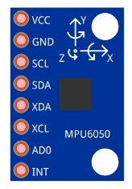
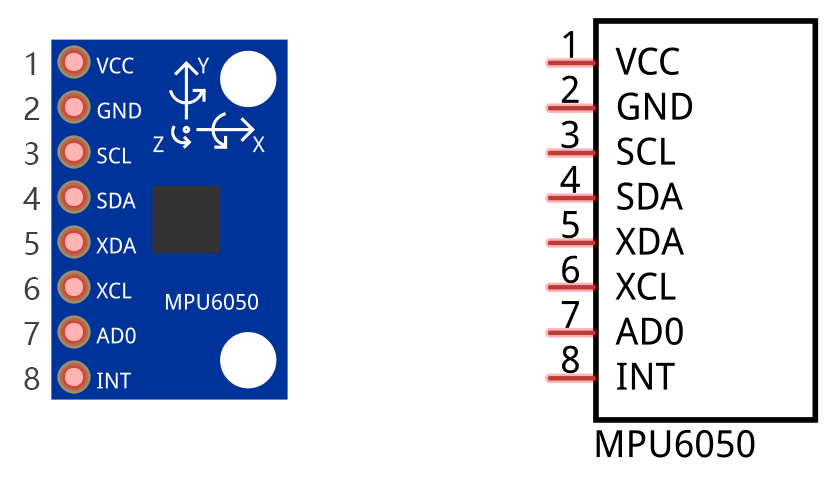
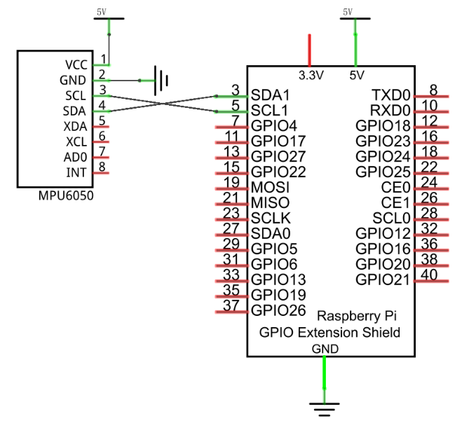
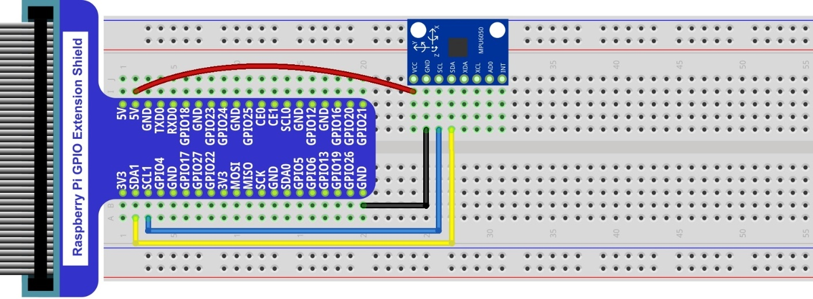
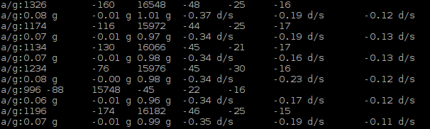

################################################################
Chapter Attitude Sensor MPU6050
################################################################

In this chapter, we will learn about a MPU6050 Attitude sensor, which integrates an Accelerometer and Gyroscope.

Project Read a MPU6050 Sensor Module
****************************************************************

In this project, we will read Acceleration and Gyroscope Data of the MPU6050 Sensor.

Component List
================================================================

+-------------------------------------------------+-------------------------------------------------+
|1. Raspberry Pi (with 40 GPIO) x1                |                                                 |     
|                                                 | Jumper Wires x4                                 |       
|2. GPIO Extension Board & Ribbon Cable x1        |                                                 |       
|                                                 |  |jumper-wire|                                  |                                                            
|3. Breadboard x1                                 |                                                 |                                                                 
+-------------------------------------------------+-------------------------------------------------+
| MPU6050                                                                                           |     
|                                                                                                   |       
|  |MPU6050|                                                                                        |       
+---------------------------------------------------------------------------------------------------+

.. |jumper-wire| image:: ../_static/imgs/jumper-wire.png

Component knowledge
================================================================

MPU6050
----------------------------------------------------------------

MPU6050 Sensor Module is a complete 6-axis Motion Tracking Device. It combines a 3-axis Gyroscope, a 3-axis Accelerometer and a DMP (Digital Motion Processor) all in a small package. The settings of the Accelerometer and Gyroscope of MPU6050 can be changed. A precision wide range digital temperature sensor is also integrated to compensate data readings for changes in temperature, and temperature values can also be read. The MPU6050 Module follows the I2C communication protocol and the default address is 0x68.

The port description of the MPU6050 Module is as follows:

.. list-table::
   :align: center
   :header-rows: 1
   :class: product-table

   * - Pin name
     - Pin number
     - Description

   * - VCC
     - 1
     - Positive pole of power supply with voltage 5V

   * - GND
     - 2
     - Negative pole of power supply
    
   * - SCL
     - 3
     - I2C communication clock pin
     
   * - SDA
     - 4
     - I2C communication data pin

   * - XDA
     - 5
     - I2C host data pin which can be connected to other devices.

   * - XCL
     - 6
     - I2C host clock pin which can be connected to other devices.

   * - AD0
     - 7
     - I2C address bit control pin. 

       **Low level:** the device address is 0x68 

       **High level:** the device address is 0x69

   * - INT
     - 8
     - Output interrupt pin

For more detail, please refer to the MPU6050 datasheet.

MPU6050 is widely used to assist with balancing vehicles, robots and aircraft, mobile phones and other products which require stability to control stability and attitude or which need to sense same.

+------------------------------------------------------------------------------------------------+
|   Schematic diagram                                                                            |
|                                                                                                |
|   |MPU6050_Sc|                                                                                 |
+------------------------------------------------------------------------------------------------+
|   Hardware connection. If you need any support,please feel free to contact us via:             |
|                                                                                                |
|   support@freenove.com                                                                         | 
|                                                                                                |
|   |MPU6050_Fr|                                                                                 |
+------------------------------------------------------------------------------------------------+

Code
================================================================

In this project, we will read the acceleration data and gyroscope data of MPU6050, and print them out.

Python Code 25.1.1 MPU6050RAW
----------------------------------------------------------------

First, observe the project result, and then learn about the code in detail.

.. hint:: 
    :red:`If you have any concerns, please contact us via:`  support@freenove.com

1.	Use ``cd`` command to enter 25.1.1_MPU6050RAW directory of Python code.

.. code-block:: console

    $ cd ~/Freenove_Kit/Code/Python_GPIOZero_Code/25.1.1_MPU6050

2.	Use Python command to execute code ``MPU6050RAW.py``.

.. code-block:: console

    $ python MPU6050RAW.py

After the program is executed, the Terminal will display active accelerometer and gyroscope data of the MPU6050, as well as the conversion to gravity acceleration and angular velocity as units of data. As shown in the following figure:

The following is the program code:

.. literalinclude:: ../../../freenove_Kit/Code/Python_GPIOZero_Code/25.1.1_MPU6050/MPU6050RAW.py
    :linenos: 
    :language: python

A module "MPU6050.py" is used in the code. The module includes a class used to operate MPU6050. When used, first initiate an object.

.. code-block:: python

    mpu = MPU6050.MPU6050()

In the setup function, the MPU6050 is initialized.

.. code-block:: python

    def setup():
        mpu.dmp_initialize()

In the loop function, read the original data of MPU6050, display them and then convert the original data into the corresponding acceleration and angular velocity values, then display the converted data out.

.. literalinclude:: ../../../freenove_Kit/Code/Python_GPIOZero_Code/25.1.1_MPU6050/MPU6050RAW.py
    :linenos: 
    :language: python
    :lines: 17-24

About class MPU6050:

.. c:function:: Class MPU6050

    This is a class library used to operate MPU6050, which can directly read and set MPU6050. Here are some member functions:
    
    **def __init__** (self, a_bus=1, a_address=C.MPU6050_DEFAULT_ADDRESS,

                    a_xAOff=None, a_yAOff=None, a_zAOff=None, a_xGOff=None,

                    a_yGOff=None, a_zGOff=None, a_debug=False):
    
    Constructor

    **def dmp_initialize** (self):

    Initialization function, used to wake up MPU6050. Range of accelerometer is ±2g and range of gyroscope is ±250 degrees/sec.

    **def get_acceleration** (self):   &   **def get_rotation** (self):

    Get the original data of accelerometer and gyroscope.

For details of more relevant member functions, please refer to MPU6050.py in the code folder.