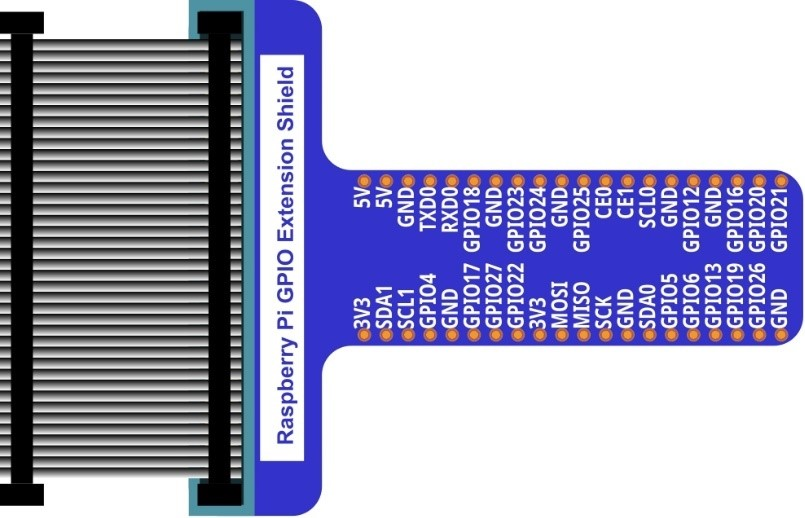
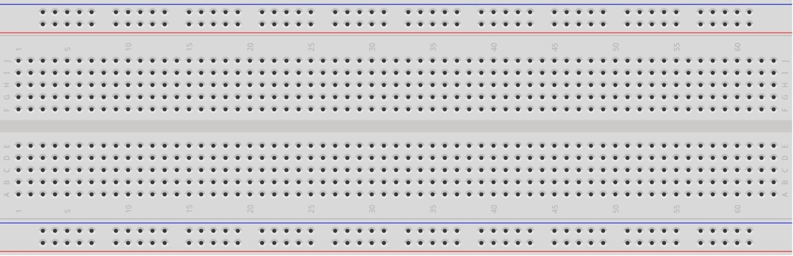
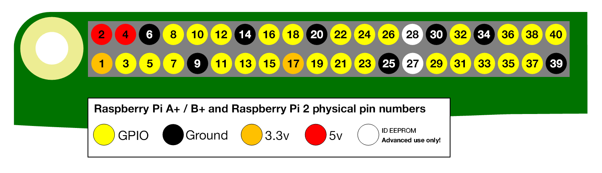
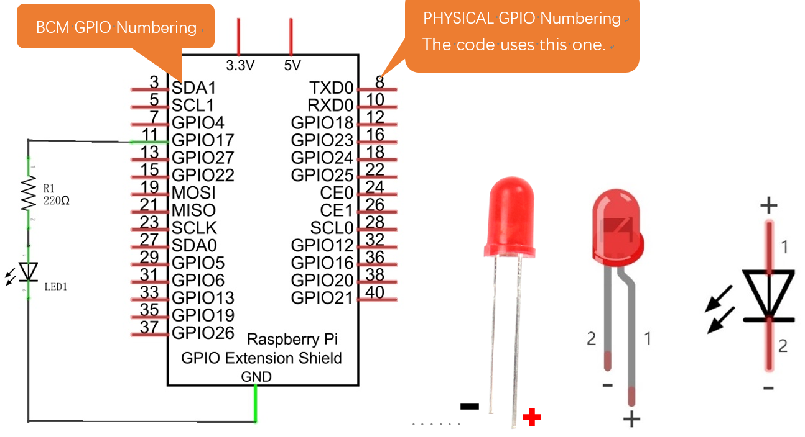
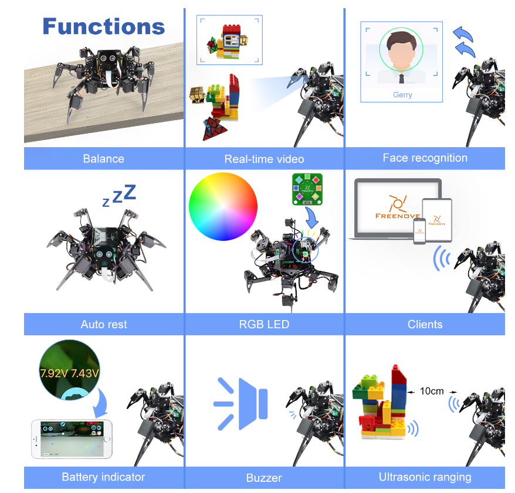

################################################################
Chapter LED
################################################################

This chapter is the Start Point in the journey to build and explore RPi electronic projects. We will start with simple “Blink” project.

Project Blink
****************************************************************

In this project, we will use RPi to control blinking a common LED.

Component List
================================================================

+-----------------------------------------------------------+
|    Raspberry Pi                                           |     
|                                                           |       
|    (Recommended: Raspberry Pi 5 / 4B / 3B+ / 3B)          |       
|                                                           |                                                            
|    (Compatible: 3A+ / 2B / 1B+ / 1A+ / Zero W / Zero)     |                                                                 
|                                                           | 
|     |raspberrypi5|                                        | 
+-----------------------------------------------------------+
| Breadboard x1                                             |
|                                                           |
|  |breadborad-830|                                         |                         
+--------------------------------------+--------------------+
|  GPIO Extension Board & Ribbon Cable | Resistor 220Ω x1   |
|                                      |                    | 
|   |extension-board|                  |  |res-220R|        |
+--------------------------------------+-------+------------+
| Jumper                                       | LED x1     | 
|                                              |            | 
| **Specific quantity depends on the circuit.**| |red-led|  | 
|                                              |            | 
| |jumper-wire|                                |            | 
+----------------------------------------------+------------+

.. |raspberrypi5| image:: ../_static/imgs/raspberrypi5.png
    :width: 60%
.. |jumper-wire| image:: ../_static/imgs/jumper-wire.png
    :width: 60%

.. |red-led| image:: ../_static/imgs/red-led.png
    :width: 30%
.. |res-220R| image:: ../_static/imgs/res-220R.png
    :width: 20%

In the components list, 3B GPIO, Extension Shield Raspberry and Breadboard are necessary for each project. Later, they will be reference by text only (no images as in above).

GPIO
================================================================

GPIO: General Purpose Input/Output. Here we will introduce the specific function of the pins on the Raspberry Pi and how you can utilize them in all sorts of ways in your projects. Most RPi Module pins can be used as either an input or output, depending on your program and its functions.

When programming GPIO pins there are 3 different ways to reference them: **GPIO Numbering**, **Physical Numbering** and **WiringPi GPIO Numbering**.

BCM GPIO Numbering
---------------------------------------------------------------

The Raspberry Pi CPU uses Broadcom (BCM) processing chips BCM2835, BCM2836 or BCM2837. GPIO pin numbers are assigned by the processing chip manufacturer and are how the computer recognizes each pin. The pin numbers themselves do not make sense or have meaning as they are only a form of identification. Since their numeric values and physical locations have no specific order, there is no way to remember them so you will need to have a printed reference or a reference board that fits over the pins.

Each pin's functional assignment is defined in the image below:
    .. image:: ../_static/imgs/raspberrypi5-cc90.png
        :height: 500

    .. image:: ../_static/imgs/raspberrypi-pinout-bcm.png
        :height: 500

.. seealso:: 
    For more details about pin definition of GPIO, please refer to `<http://pinout.xyz/>`_

PHYSICAL Numbering
---------------------------------------------------------------

Another way to refer to the pins is by simply counting across and down from pin 1 at the top left (nearest to the SD card). This is 'Physical Numbering', as shown below:

GPIO Numbering
==========================

You can use the following command to view their correlation.

.. code-block:: console
    
    $ Pinout

Circuit
================================================================

First, disconnect your RPi from the GPIO Extension Shield. Then build the circuit according to the circuit and hardware diagrams. After the circuit is built and verified correct, connect the RPi to GPIO Extension Shield. 

.. caution:: 

    CAUTION: Avoid any possible short circuits (especially connecting 5V or GND, 3.3V and GND)! 

.. warning:: 

    WARNING: A short circuit can cause high current in your circuit, create excessive component heat and cause permanent damage to your RPi!

1. **Schematic diagram**

2. **Hardware connection** 

.. image:: ../_static/imgs/blink-hdc.png
    :height: 400

.. tip:: 
     :red:`If you need any support, please contact us via:` :blue:`support@freenove.com`

.. attention:: 

    Do NOT rotate Raspberry Pi to change the way of this connection.
    
    Please plug T extension fully into breadboard.

.. note:: 
    
    Youtube video: https://www.youtube.com/watch?v=51Y_HjnUZLs

The connection of Raspberry Pi T extension board is as below. **Don't reverse the ribbon**.

.. raw:: html

   <iframe height="500" width="690" src="https://www.youtube.com/embed/51Y_HjnUZLs" frameborder="0" allowfullscreen></iframe>

.. image:: ../_static/imgs/blink-real.png
    :width: 100%

.. note:: 
    
    If you have a fan, you can connect it to 5V GND of breadboard via jumper wires.

**How to distinguish resistors?**

There are only three kind of resistors in this kit.

1. The one with *1 red ring* is 10KΩ \

    .. image:: ../_static/imgs/res-10K-hori.png
        :height: 17

2. The one with *1 red ring* is 10KΩ 

    .. image:: ../_static/imgs/res-220R-hori.png
        :height: 20

#. The one with *1 red ring* is 10KΩ 

    .. image:: ../_static/imgs/res-1K-hori.png
        :height: 20

.. note:: 
    
    Future hardware connection diagrams will only show that part of breadboard and GPIO Extension Shield.

Component knowledge
================================================================

LED
----------------------------------------------------------------

An LED is a type of diode. All diodes only work if current is flowing in the correct direction and have two Poles. An LED will only work (light up) if the longer pin (+) of LED is connected to the positive output from a power source and the shorter pin is connected to the negative (-) output, which is also referred to as Ground (GND). This type of component is known as “Polar” (think One-Way Street).

All common 2 lead diodes are the same in this respect. Diodes work only if the voltage of its positive electrode is higher than its negative electrode and there is a narrow range of operating voltage for most all common diodes of 1.9 and 3.4V. If you use much more than 3.3V the LED will be damaged and burnt out.

.. image:: ../_static/imgs/led-describe.png
    :width: 100%
    :align: center

.. note:: 
    
    Note: LEDs cannot be directly connected to a power supply, which usually ends in a damaged component. A resistor with a specified resistance value must be connected in series to the LED you plan to use.

Resistor
----------------------------------------------------------------

Resistors use Ohms (Ω) as the unit of measurement of their resistance (R). 1MΩ=1000kΩ, 1kΩ=1000Ω.

A resistor is a passive electrical component that limits or regulates the flow of current in an electronic circuit.

On the left, we see a physical representation of a resistor, and the right is the symbol used to represent the presence of a resistor in a circuit diagram or schematic.

.. image:: ../_static/imgs/res-describe.png

The bands of color on a resistor is a shorthand code used to identify its resistance value. For more details of resistor color codes, please refer to the card in the kit package.

With a fixed voltage, there will be less current output with greater resistance added to the circuit. The relationship between Current, Voltage and Resistance can be expressed by this formula: I=V/R known as Ohm’s Law where I = Current, V = Voltage and R = Resistance. Knowing the values of any two of these allows you to solve the value of the third.

In the following diagram, the current through R1 is: 

.. math:: I=U/R=5V/10kΩ=0.0005A=0.5mA.

.. image:: ../_static/imgs/res-current.png
    :align: center

.. warning:: 

    WARNING: Never connect the two poles of a power supply with anything of low resistance value (i.e. a metal object or bare wire) this is a Short and results in high current that may damage the power supply and electronic components.

.. note:: 
    
    Note: Unlike LEDs and Diodes, Resistors have no poles and re non-polar (it does not matter which direction you insert them into a circuit, it will work the same)

Breadboard
----------------------------------------------------------------

Here we have a small breadboard as an example of how the rows of holes (sockets) are electrically attached. The left picture shows the ways the pins have shared electrical connection and the right picture shows the actual internal metal, which connect these rows electrically.

.. image:: ../_static/imgs/breadborad-top-wire.png
    :width: 48%

.. image:: ../_static/imgs/breadborad-bottom-wire.png
    :width: 48%

GPIO Extension Board
----------------------------------------------------------------

GPIO board is a convenient way to connect the RPi I/O ports to the breadboard directly. The GPIO pin sequence on Extension Board is identical to the GPIO pin sequence of RPi. 

.. image:: ../_static/imgs/raspberrypi-extension-describe.png
    :width: 90%
    :align: center

Code
================================================================

According to the circuit, when the GPIO17 of RPi output level is high, the LED turns ON. Conversely, when the GPIO17 RPi output level is low, the LED turns OFF. Therefore, we can let GPIO17 cycle output high and output low level to make the LED blink. We will use Python code to achieve the target.

Python Code Blink
----------------------------------------------------------------

Now, we will use Python language to make a LED blink.

First, observe the project result, and then learn about the code in detail. 

.. hint:: 
    
    :red:`If you have any concerns, please contact us via:`  support@freenove.com
    
1.	Use cd command to enter 01.1.1_Blink directory of Python code.

.. code-block:: console

    $ cd ~/Freenove_Kit/Code/Python_GPIOZero_Code/01.1.1_Blink

2.	Use python command to execute python code blink.py.

.. code-block:: console

    $ python Blink.py

The LED starts blinking.

.. image:: ../_static/imgs/py_blink.png
    :align: center

You can press “Ctrl+C” to end the program. The following is the program code:

.. literalinclude:: ../../../freenove_Kit/Code/Python_GPIOZero_Code/01.1.1_Blink/Blink.py
    :linenos: 
    :language: python
    :dedent:

Import the LED class from the gpiozero library.

.. code-block:: python
    :linenos:

    from gpiozero import LED

Create an LED assembly for controlling the LED.

.. code-block:: python
    :linenos:

    led = LED(17)           # define LED pin according to BCM Numbering

Turn on LED device.

.. code-block:: python
    :linenos:
    
    led.on()    # turn on LED

Turn off LED devices.

.. code-block:: python
    :linenos:
    
    led.off()   # turn off LED

The main function turns on the LED for one second and then turns it off for one second, which repeats endless.

.. literalinclude:: ../../../freenove_Kit/Code/Python_GPIOZero_Code/01.1.1_Blink/Blink.py
    :linenos: 
    :language: python
    :lines: 22-29
    :dedent:

Reference
----------------------------------------------------------------

About GPIO Zero:

.. py:function:: GPIO Zero

    A simple interface to GPIO devices with Raspberry Pi, Using the GPIO Zero library makes it easy to get started with controlling GPIO devices with Python. The library is comprehensively documented at 
    
    https://gpiozero.readthedocs.io/en/stable/

    https://github.com/gpiozero/gpiozero

For more information about the methods used by the LED class in the GPIO Zero library,please refer to: https://gpiozero.readthedocs.io/en/stable/api_output.html#led

For more information about the methods used by the DigitalOutputDevice class in the GPIO Zero library,please refer to: https://gpiozero.readthedocs.io/en/stable/api_output.html#digitaloutputdevice 

“import time” time is a module of python. https://docs.python.org/2/library/time.html?highlight=time%20time#module-time

In Python, libraries and functions used in a script must be imported by name at the top of the file, with the exception of the functions built into Python by default.

For example, to use the LED interface from GPIO Zero, it should be explicitly imported:

.. code-block:: python
    :linenos:

    from gpiozero import LED

.. code-block:: python
    :linenos:

    led = LED(17)           # define LED pin according to BCM Numbering
    #led = LED("J8:11")     # BOARD Numbering

Alternatively, the whole GPIO Zero library can be imported:

.. code-block:: python
    :linenos:

    import gpiozero

In this case, all references to items within GPIO Zero must be prefixed: 

.. code-block:: python
    :linenos:

    led = gpiozero.LED(17)           # define LED pin according to BCM Numbering
    #led = gpiozero.LED("J8:11")     # BOARD Numbering

**Pin Numbering**

This library uses Broadcom (BCM) pin numbering for the GPIO pins, as opposed to physical (BOARD)
numbering. Unlike in the RPi.GPIO library, this is not configurable. However, translation from other
schemes can be used by providing prefixes to pin numbers (see below).

Any pin marked “GPIO” in the diagram below can be used as a pin number. For example, if an LED
was attached to “GPIO17” you would specify the pin number as 17 rather than 11:

If you wish to use physical (BOARD) numbering you can specify the pin number as “BOARD11”. If you
are familiar with the wiringPi pin numbers (another physical layout) you could use “WPI0” instead.

Finally, you can specify pins as “header:number”, e.g. “J8:11” meaning physical pin 11 on header J8
(the GPIO header on modern Pis). Hence, the following lines are all equivalent:

.. code-block:: python

    led = LED(17)
    led = LED("GPIO17")
    led = LED("BCM17")
    led = LED("BOARD11")
    led = LED("WPI0")
    led = LED("J8:11")

.. note::

    Note that these alternate schemes are merely translations. If you request the state of a device on thecommand line, the associated pin number will always be reported in the Broadcom (BCM) scheme:

.. code-block:: python
    :linenos:

        led = LED("BOARD11")
        led
    <gpiozero.LED object on pin GPIO17, active_high=True, is_active=False>

:red:`In this tutorial, we will use the default integer pin number in the Broadcom (BCM) layout.`

**GPIO Numbering Relationship**

.. list-table::
   :align: center
   :header-rows: 1
   :class: product-table

   * - WingOi
     - BCM(Extension)
     - Physical
     - Physical
     - BCM(Extension)
     - WingPi

   * - 3.3V
     - 3.3V
     - 1
     - 2
     - 5V
     - 5V

   * - 8
     - GPIO2/SDA1
     - 3
     - 4
     - 5V
     - 5V
    
   * - 9
     - GPIO3/SCL1
     - 5
     - 6
     - GND
     - GND
     
   * - 7
     - GPIO4
     - 7
     - 8
     - GPIO14/TXD0
     - 15

   * - GND
     - GND
     - 9
     - 10
     - GPIO15/RXD0
     - 16

   * - 0
     - GPIO17
     - 11
     - 12
     - GPIO18
     - 1

   * - 2
     - GPIO27
     - 13
     - 14
     - GND
     - GND   

   * - 3
     - GPIO22
     - 15
     - 16
     - GPIO23
     - 4

   * - 3.3V
     - 3.3V
     - 17
     - 18
     - GPIO24
     - 5

   * - 12
     - GPIO10/MOSI
     - 19
     - 20
     - GND
     - GND
    
   * - 13
     - GPIO9/MOIS
     - 21
     - 22
     - GPIO25
     - 6
     
   * - 14
     - GPIO11/SCLK
     - 23
     - 24
     - GPIO8/CE0
     - 10

   * - GND
     - GND
     - 25
     - 26
     - GPIO7/CE1
     - 11  

   * - 30
     - GPIO0/SDA0
     - 27
     - 28
     - BGPIO1/SCL0
     - 31

   * - 21
     - GPIO5
     - 29
     - 30
     - GND
     - GND  

   * - 22
     - GPIO6
     - 31
     - 32
     - GPIO12
     - 26

   * - 23
     - GPIO13
     - 33
     - 34
     - GND
     - GND  

   * - 24
     - GPIO19
     - 35
     - 36
     - GPIO16
     - 27

   * - 25
     - GPIO26
     - 37
     - 38
     - GPIO20
     - 28    
    
   * - GND
     - GND
     - 39
     - 40
     - GPIO21
     - 29   

In loop(), there is a while loop, which is an endless loop (a while loop). That is, the program will always be executed in this loop, unless it is ended because of external factors. In this loop, set LED output high level, then the LED turns ON. After a period of time delay, set LED output low level, then the LED turns OFF, which is followed by a delay. Repeat the loop, then LED will start blinking. 

.. literalinclude:: ../../../freenove_Kit/Code/Python_GPIOZero_Code/01.1.1_Blink/Blink.py
    :linenos: 
    :language: python
    :lines: 22-29
    :dedent:

In gpiozero, at the end of your script, cleanup is run automatically, restoring your GPIO pins to the state they were found.To explicitly close a connection to a pin, you can manually call the close() method on a device object:

.. code-block:: python

        led = LED(17)
        led.on()
        led
    <gpiozero.LED object on pin GPIO17, active_high=True, is_active=True>
        led.close()
        led
    <gpiozero.LED object closed>

This means that you can reuse the pin for another device, and that despite turning the LED on (and hence, the pin high), after calling close() it is restored to its previous state (LED off, pin low).

In this tutorial, most projects have added an active run cleanup program to restore the GPIO pin to the found default state.

Freenove Car, Robot and other products for Raspberry Pi
================================================================

We also have car and robot kits for Raspberry Pi. You can visit our website for details.

https://www.amazon.com/freenove

**FNK0043**--:green:`Freenove 4WD Smart Car Kit for Raspberry Pi`

.. image:: ../_static/imgs/43_1.png

.. image:: ../_static/imgs/43_2.png

.. raw:: html

   <iframe height="500" width="690" src="https://www.youtube.com/embed/4Zv0GZUQjZc" frameborder="0" allowfullscreen></iframe>
  
**FNK0050**--:green:`Freenove Robot Dog Kit for Raspberry Pi`

.. image:: ../_static/imgs/50_1.png

.. image:: ../_static/imgs/50_2.png

.. raw:: html

   <iframe height="500" width="690" src="https://www.youtube.com/embed/7BmIZ8_R9d4" frameborder="0" allowfullscreen></iframe>

**FNK0052**--:green:`Freenove_Big_Hexapod_Robot_Kit_for_Raspberry_Pi`

.. image:: ../_static/imgs/52_1.png
    :width: 50%

.. raw:: html

   <iframe height="500" width="690" src="https://www.youtube.com/embed/LvghnJ2DNZ0" frameborder="0" allowfullscreen></iframe>