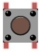

################################################################
Chapter Button and leds
################################################################

Usually, there are three essential parts in a complete automatic control device: INPUT, OUTPUT, and CONTROL. In last section, the LED module was the output part and RPI was the control part. In practical applications, we not only make LEDs flash, but also make a device sense the surrounding environment, receive instructions and then take the appropriate action such as turn on LEDs, make a buzzer beep and so on.

.. image:: ../_static/imgs/button-led-flow-chart.png
    :width: 80%

Next, we will build a simple control system to control an LED through a push button switch.

Project Push Button Switch & LED
****************************************************************

In the project, we will control the LED state through a Push Button Switch. When the button is pressed, our LED will turn ON, and when it is released, the LED will turn OFF. This describes a Momentary Switch.

Component List
================================================================

+-----------------------------------------------------------+
|    Raspberry Pi                                           |     
|                                                           |       
|    (Recommended: Raspberry Pi 5 / 4B / 3B+ / 3B)          |       
|                                                           |                                                            
|    (Compatible: 3A+ / 2B / 1B+ / 1A+ / Zero W / Zero)     |                                                                 
|                                                           | 
|     |raspberrypi5|                                        | 
+---------------------------+-------------------------------+
| LED x1                    | Breadboard x1                 |
|                           |                               |
|  |red-led|                |  |breadborad-830|             |                         
+---------------------------+----------+--------------------+
|  GPIO Extension Board & Ribbon Cable | Resistor 220Ω x1   |
|                                      |                    | 
|   |extension-board|                  |  |res-220R|        |
+---------------------------+----------+--------------------+
| Push Button Switch x1     | Resistor 10KΩ x2              |
|                           |                               |
|  |button-small|           |  |res-10k|                    |                         
+---------------------------+-------------------------------+
| Jumper (some)                                             |
|                                                           |
|  |jumper-wire|                                            |
+-----------------------------------------------------------+

.. |raspberrypi5| image:: ../_static/imgs/raspberrypi5.png
    :width: 60%
.. |jumper-wire| image:: ../_static/imgs/jumper-wire.png
    :width: 60%
.. |extension-board| image:: ../_static/imgs/raspberrypi-extension-board.jpg
    :width: 70%
.. |breadborad-830| image:: ../_static/imgs/breadborad-830.jpg
    :width: 80%
.. |red-led| image:: ../_static/imgs/red-led.png
    :width: 15%
.. |res-220R| image:: ../_static/imgs/res-220R.png
    :width: 10%

.. note:: 
    Please Note: In the code “button” represents switch action.

Component knowledge
================================================================

Push Button Switch
----------------------------------------------------------------
This type of Push Button Switch has 4 pins (2 Pole Switch). Two pins on the left are connected, and both left and right sides are the same per the illustration:

    .. image:: ../_static/imgs/button-small-img-sch.jpg

When the button on the switch is pressed, the circuit is completed (your project is Powered ON).

Circuit
================================================================
1. **Schematic diagram**

    .. image:: ../_static/imgs/button-led-sch1.jpg
        :height: 400

    .. note:: 
        R3 is used to limit current to protect GPIO 18, if you set it to output HIGH level by mistake.

2. **Hardware connection** 

.. image:: ../_static/imgs/button-led-hdc1.jpg
    :width: 100%

.. note::
    | There are two kinds of push button switch in this kit. 
    | :red:`The smaller push button switches are contained in a plastic bag.` 
.. note:: 
    Youtube video: https://youtu.be/_5ge1d6f1nM

.. raw:: html

   <iframe height="500" width="690" src="https://www.youtube.com/embed/_5ge1d6f1nM" frameborder="0" allowfullscreen></iframe>

.. hint:: 
    If you need any support, please feel free to contact us via: support@freenove.com

3. This is how it works. When button switch is released:

.. image:: ../_static/imgs/button-led-released.png
    :width: 100%
    
4. This is how it works. When button switch is released:

.. image:: ../_static/imgs/button-led-pressed.png
    :width: 100%

Code
================================================================

This project is designed for learning how to use Push Button Switch to control an LED. We first need to read the state of switch, and then determine whether to turn the LED ON in accordance to the state of the switch.

Python Code 2.1.1 ButtonLED
----------------------------------------------------------------

First, observe the project result, then learn about the code in detail. Remember in code “button” = switch function

.. hint:: 
    :red:`If you have any concerns, please contact us via:`  support@freenove.com

1.	Use cd command to enter 02.1.1_ButtonLED directory of Python code.

.. code-block:: console

    $ cd ~/Freenove_Kit/Code/Python_GPIOZero_Code/02.1.1_ButtonLED

2.	Use Python command to execute btnLED.py.

.. code-block:: console

    $ python ButtonLED.py

Then the Terminal window continues to show the characters “led off…”, press the switch button and the LED turns ON and then Terminal window shows "led on…". Release the button, then LED turns OFF and then the terminal window text "led off…" appears. You can press "Ctrl+C" at any time to terminate the program. 

The following is the program code:

.. literalinclude:: ../../../freenove_Kit/Code/Python_GPIOZero_Code/02.1.1_ButtonLED/ButtonLED.py
    :linenos: 
    :language: python

Import the Button class that controls Button from the gpiozero library.

.. code-block:: python

    from gpiozero import LED, Button

Define GPIO17 as the LED control pin and GPIO18 as the button control pin. The button is set to the input mode with a pull-up resistor by default.

.. code-block:: python

    led = LED(17)       # define LED pin according to BCM Numbering
    button = Button(18) # define Button pin according to BCM Numbering

The loop continuously determines whether the key is pressed. When the button is pressed, the variable button.is_pressed has a value of 1 and the LED lights up. Otherwise, the LED will be off.

.. literalinclude:: ../../../freenove_Kit/Code/Python_GPIOZero_Code/02.1.1_ButtonLED/ButtonLED.py
    :linenos: 
    :language: python
    :lines: 13-20

For more information about GPIOZero, please refer to the link below:

https://gpiozero.readthedocs.io/en/stable/

For more information about the methods used by the Button class in the GPIO Zero library,please refer to:

https://gpiozero.readthedocs.io/en/stable/api_input.html#button

Project 2.2 MINI Table Lamp
****************************************************************

We will also use a Push Button Switch, LED and RPi to make a MINI Table Lamp but this will function differently: Press the button, the LED will turn ON, and pressing the button again, the LED turns OFF. The ON switch action is no longer momentary (like a door bell) but remains ON without needing to continually press on the Button Switch.

First, let us learn something about the push button switch.

Debounce a Push Button Switch
================================================================

When a Momentary Push Button Switch is pressed, it will not change from one state to another state immediately. Due to tiny mechanical vibrations, there will be a short period of continuous buffeting before it stabilizes in a new state too fast for Humans to detect but not for computer microcontrollers. The same is true when the push button switch is released. This unwanted phenomenon is known as “bounce”.

.. image:: ../_static/imgs/Button_switch.png
    :width: 50%
    :align: center

Therefore, if we can directly detect the state of the Push Button Switch, there are multiple pressing and releasing actions in one pressing cycle. This buffeting will mislead the high-speed operation of the microcontroller to cause many false decisions. Therefore, we need to eliminate the impact of buffeting. Our solution: to judge the state of the button multiple times. Only when the button state is stable (consistent) over a period of time, can it indicate that the button is actually in the ON state (being pressed).

This project needs the same components and circuits as we used in the previous section.

Code
================================================================

In this project, we still detect the state of Push Button Switch to control an LED. Here we need to define a variable to define the state of LED. When the button switch is pressed once, the state of LED will be changed once. This will allow the circuit to act as a virtual table lamp.

Python Code 2.2.1 Tablelamp
----------------------------------------------------------------

First, observe the project result, and then learn about the code in detail.

.. hint:: 
    :red:`If you have any concerns, please contact us via:`  support@freenove.com

1.	Use cd command to enter 02.2.1_Tablelamp directory of Python code

.. code-block:: console

    $ cd ~/Freenove_Kit/Code/Python_GPIOZero_Code/02.2.1_Tablelamp

2.	Use python command to execute python code “Tablelamp.py”.

.. code-block:: console

    $ python Tablelamp.py

.. literalinclude:: ../../../freenove_Kit/Code/Python_GPIOZero_Code/02.2.1_Tablelamp/Tablelamp.py
    :linenos: 
    :language: python

In GPIO Zero, you assign the when_pressed and when_released properties to set up callbacks on those actions. 

Once it detects that the button is pressed, it executes the specified function onButtonPressed().In the onButtonPressed function, the led. toggle () function reverses the state of the LED device.If it's on, turn it off; If it's off, turn it on.Each time the key is pressed, the state of the LED will change once.

.. literalinclude:: ../../../freenove_Kit/Code/Python_GPIOZero_Code/02.2.1_Tablelamp/Tablelamp.py
    :linenos: 
    :language: python
    :lines: 14-24

To explicitly close a connection to a pin, you can manually call the close() method on a device object:

.. literalinclude:: ../../../freenove_Kit/Code/Python_GPIOZero_Code/02.2.1_Tablelamp/Tablelamp.py
    :linenos: 
    :language: python
    :lines: 25-34

For more information about the methods used by the Button class in the GPIO Zero library,please refer to: https://gpiozero.readthedocs.io/en/stable/api_input.html#button
