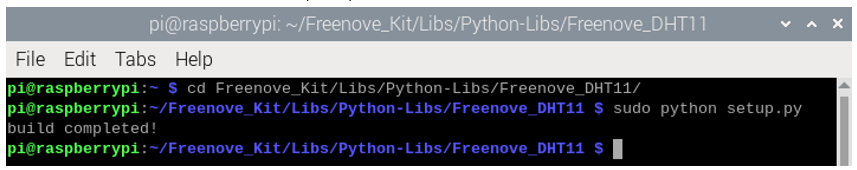
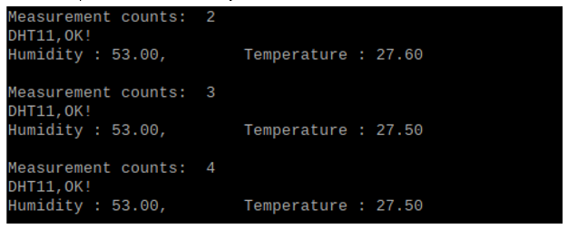

################################################################
Chapter Hygrothermograph DHT11
################################################################

In this chapter, we will learn about a commonly used sensor called a Hygrothermograph DHT11.

Project Hygrothermograph
****************************************************************

Hygrothermograph is an important tool in our lives to give us data on the temperature and humidity in our environment. In this project, we will use the RPi to read Temperature and Humidity data of the DHT11 Module.

Component List
================================================================

+-------------------------------------------------+-------------------------------------------------+
|1. Raspberry Pi (with 40 GPIO) x1                |                                                 |     
|                                                 | Jumper Wires x4                                 |       
|2. GPIO Extension Board & Ribbon Cable x1        |                                                 |       
|                                                 |  |jumper-wire|                                  |                                                            
|3. Breadboard x1                                 |                                                 |                                                                 
+-------------------------------------------------+-------------------------------------------------+
| DHT11 x1                                        | Resistor 10kΩ x1                                |
|                                                 |                                                 |
|  |DHT11|                                        |  |Resistor-10kΩ|                                |
+-------------------------------------------------+-------------------------------------------------+

.. |jumper-wire| image:: ../_static/imgs/jumper-wire.png
.. |Resistor-10kΩ| image:: ../_static/imgs/Resistor-10kΩ.png
    :width: 10%
.. |DHT11| image:: ../_static/imgs/DHT11.png
    :width: 50%

Component knowledge
================================================================

The Temperature & Humidity Sensor DHT11 is a compound temperature & humidity sensor, and the output digital signal has been calibrated by its manufacturer.

.. image:: ../_static/imgs/DHT11_1.png
    :align: center

After being powered up, it will initialize in 1 second. Its operating voltage is within the range of 3.3V-5.5V.

The SDA pin is a data pin, which is used to communicate with other devices. 

The NC pin (Not Connected Pin) are a type of pin found on various integrated circuit packages. Those pins have no functional purpose to the outside circuit (but may have an unknown functionality during manufacture and test). Those pins should not be connected to any of the circuit connections.

Circuit
================================================================

+------------------------------------------------------------------------------------------------+
|   Schematic diagram                                                                            |
|                                                                                                |
|   |DHT11_Sc|                                                                                   |
+------------------------------------------------------------------------------------------------+
|   Hardware connection. If you need any support,please feel free to contact us via:             |
|                                                                                                |
|   support@freenove.com                                                                         |
|                                                                                                |
|   |DHT11_Fr|                                                                                   | 
+------------------------------------------------------------------------------------------------+

.. |DHT11_Sc| image:: ../_static/imgs/DHT11_Sc.png
.. |DHT11_Fr| image:: ../_static/imgs/DHT11_Fr.png

.. note:: 
        **Youtube video:** https://youtu.be/vTeuLWiXUTA

.. raw:: html

   <iframe height="500" width="690" src="https://www.youtube.com/embed/vTeuLWiXUTA" frameborder="0" allowfullscreen></iframe>

Code
================================================================

The code is used to read the temperature and humidity data of DHT11, and display them.

Python Code DHT11
----------------------------------------------------------------

First, observe the project result, and then learn about the code in detail.

.. hint:: 
    :red:`If you have any concerns, please contact us via:`  support@freenove.com

1.	Use ``cd`` command to enter folder of the ADC Device library.

.. code-block:: console

    $ cd ~/Freenove_Kit/Libs/Python-Libs/Freenove_DHT11

2.	Execute command below to install the library.

.. code-block:: console

    $ sudo python setup.py

A successful installation, without error prompts, is shown below:

Next, we will execute the code for this project. 

1.	Use ``cd`` command to enter 21.1.1_DHT11 directory of Python code.

.. code-block:: console

    $ cd ~/Freenove_Kit/Code/Python_GPIOZero_Code/21.1.1_DHT11

2.	Use Python command to execute code ``DHT11.py``.

.. code-block:: console

    $ python DHT11.py

After the program is executed, the Terminal window will display the current total number of read times, the read state, as well as temperature and humidity values as is shown below:

Since gpiozero does not support DHT11 sensors, RPi.GPIO is used here for control.

The following is the program code:

.. literalinclude:: ../../../freenove_Kit/Code/Python_GPIOZero_Code/21.1.1_DHT11/DHT11.py
    :linenos: 
    :language: python
    :dedent:

In this project code, we use a module "Freenove_DHT.py", which provides the method of reading the DHT Sensor. It is located in the same directory with program files "DHT11.py". By using this library, we can easily read the DHT Sensor. First, we create a DHT class object in the code.

.. code-block:: python

    dht = DHT.DHT(DHTPin)   #create a DHT class object

Then in the "while" loop, use chk = dht.readDHT11() to read the DHT11, and determine whether the data read is normal according to the return value "chk". Then use variable sumCnt to record the number of times read.

.. literalinclude:: ../../../freenove_Kit/Code/Python_GPIOZero_Code/21.1.1_DHT11/DHT11.py
    :linenos: 
    :language: python
    :lines: 17-28
    :dedent:

Finally display the results:

.. code-block:: python

    print("Humidity : %.2f, \t Temperature : %.2f \n"%( dht.getHumidity(), dht.getTemperature()))

Module "Freenove_DHT.py" contains a DHT class. The class function of the def readDHT11 (pin) is used to read the DHT11 Sensor and store the temperature and humidity data read to member variables humidity and temperature. 

.. py:function:: Freenove_DHT Module

    This is a Python module for reading the temperature and humidity data of the DHT Sensor. Partial functions and variables are described as follows:
    
    getHumidity(): store humidity data read from sensor
    
    getTemperature(): store temperature data read from sensor
    
    readDHT11(): read the temperature and humidity of sensor DHT11, and return values used to determine whether the data is normal.