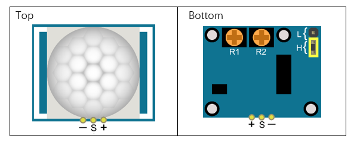
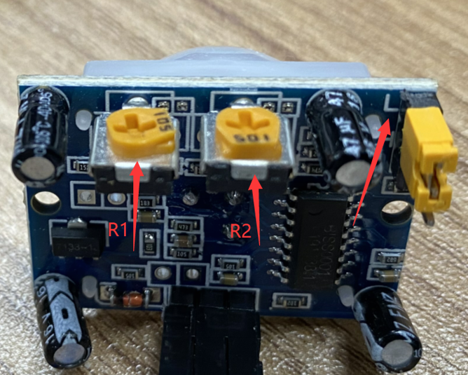

################################################################
Chapter Infrared Motion Sensor
################################################################

In this chapter, we will learn a widely used sensor, Infrared Motion Sensor. 

Project PIR Infrared Motion Detector with LED Indicator
****************************************************************

In this project, we will make a Motion Detector, with the human body infrared pyroelectric sensors.

When someone is in close proximity to the Motion Detector, it will automatically light up and when there is no one close by, it will be out.

This Infrared Motion Sensor can detect the infrared spectrum (heat signatures) emitted by living humans and animals.

Component List
================================================================

+-------------------------------------------------+-------------------------------------------------+
|1. Raspberry Pi (with 40 GPIO) x1                |                                                 |     
|                                                 |   Jumper Wires x5                               |       
|2. GPIO Extension Board & Ribbon Cable x1        |                                                 |       
|                                                 |     |jumper-wire|                               |                                                            
|3. Breadboard x1                                 |                                                 |                                                                 
+-----------------------------+-------------------+--------------+----------------------------------+
| HC SR501 x1                 | LED x1                           | Resistor 220Ω x1                 |
|                             |                                  |                                  |
|  |HC_SR501|                 |  |red-led|                       |  |res-220R|                      |
+-----------------------------+----------------------------------+----------------------------------+

.. |jumper-wire| image:: ../_static/imgs/jumper-wire.png
.. |red-led| image:: ../_static/imgs/red-led.png
    :width: 50%
.. |HC_SR501| image:: ../_static/imgs/HC_SR501.png
    :width: 70%
.. |res-220R| image:: ../_static/imgs/res-220R.png
    :width: 15%

Component Knowledge
================================================================

==============  ======================  ==========================

|HC_SR501|        |HC_SR501_bottom|       |HC_SR501_Schematic|

==============  ======================  ==========================

.. |HC_SR501| image:: ../_static/imgs/HC_SR501.png
.. |HC_SR501_bottom| image:: ../_static/imgs/HC_SR501_bottom.png
.. |HC_SR501_Schematic| image:: ../_static/imgs/HC_SR501_Schematic.png

Description: 

1.	Working voltage: 5v-20v(DC) Static current: 65uA.

2.	Automatic Trigger. When a living body enters into the active area of sensor, the module will output high level (3.3V). When the body leaves the sensor’s active detection area, it will output high level lasting for time period T, then output low level(0V). Delay time T can be adjusted by the potentiometer R1.

3.	Induction block time: the induction will stay in block condition and does not induce external signal at lesser time intervals (less than delay time) after outputting high level or low level 

4.	Initialization time: the module needs about 1 minute to initialize after being powered ON. During this period, it will alternately output high or low level. 

5.	One characteristic of this sensor is when a body moves close to or moves away from the sensor's dome edge, the sensor will work at high sensitively. When a body moves close to or moves away from the sensor’s dome in a vertical direction (perpendicular to the dome), the sensor cannot detect well (please take note of this deficiency). Actually this makes sense when you consider that this sensor is usually placed on a celling as part of a security product. Note: The Sensing Range (distance before a body is detected) is adjusted by the potentiometer.

We can regard this sensor as a simple inductive switch when in use.

Circuit
================================================================

.. table:: 
    :width: 100%
    :class: product-table

+-------------------------------------------------------------------------------------------------+
|   Schematic diagram                                                                             |
|                                                                                                 |
|   |HC_SR501_Sc|                                                                                 |
+-------------------------------------------------------------------------------------------------+
|   Hardware connection. If you need any support,please feel free to contact us via:              |
|                                                                                                 |
|   support@freenove.com                                                                          |
|                                                                                                 |
|   |HC_SR501_Fr|                                                                                 |
|                                                                                                 |
| :xx-large:`How to use this sensor?`                                                             |
|                                                                                                 |
|   |HC_SR501_T_B|                                                                                |
| Description:                                                                                    |
|                                                                                                 |
| 1. You can choose non-repeatable trigger modes or repeatable modes.                             |
|                                                                                                 |
|   L: non-repeatable trigger mode. The module output high level after sensing a body, then when  |
|   the delay                                                                                     | 
|                                                                                                 |   
|   time is over, the module will output low level. During high level time, the sensor            |
|   no longer actively                                                                            |
|                                                                                                 |
|   senses bodies.                                                                                |
|                                                                                                 |    
|   H: repeatable trigger mode. The distinction from the L                                        |
|   mode is that it can sense a body until that body                                              |
|                                                                                                 |
|   leaves. After this, it starts to time and                                                     |
|   output low level after delaying T time.                                                       |
|                                                                                                 |
| 2. R1 is used to adjust HIGH level lasting time when sensor detects human motion, 1.2s\-320s.   |
|                                                                                                 |
| 3. R2 is used to adjust the maxmum distance the sensor can detect, 3~5m.                        |
|                                                                                                 |
| :red:`Here we connect L and adjust R1 and R2 like below to do this project.`                    |
|                                                                                                 |
| :red:`Put you hand close and away from the sensor slowly. Obsever the LED in previous circuit.` |
|                                                                                                 |
| :red:`It need some time between two detections.`                                                |
|                                                                                                 |
| |HC_SR501_1|                                                                                    |
+-------------------------------------------------------------------------------------------------+

.. |HC_SR501_Sc| image:: ../_static/imgs/HC_SR501_Sc.png
.. |HC_SR501_Fr| image:: ../_static/imgs/HC_SR501_Fr.png

.. note:: 
        **Youtube video:** https://youtu.be/0GerHlINURk

.. raw:: html

   <iframe height="500" width="690" src="https://www.youtube.com/embed/0GerHlINURk" frameborder="0" allowfullscreen></iframe>

Code
================================================================

In this project, we will use the Infrared Motion Sensor to trigger an LED, essentially making the Infrared Motion sensor act as a Motion Switch. Therefore, the code is very similar to the earlier project "Push Button Switch and LED”. The difference is that, when Infrared Motion Sensor detects change, it will output high level; when button is pressed, it will output low level. When the sensor output high level, the LED turns ON, or it will turn OFF.

Python Code SenseLED
----------------------------------------------------------------

First, observe the project result, and then learn about the code in detail.

.. hint:: 
    
    :red:`If you have any concerns, please contact us via:`  support@freenove.com

1.	Use cd command to enter 22.1.1_MatrixKeypad directory of Python code.

.. code-block:: console

    $ cd ~/Freenove_Kit/Code/Python_GPIOZero_Code/23.1.1_SenseLED

2.	Use Python command to execute code "SenseLED.py".

.. code-block:: console

    $ python SenseLED.py

After the program is executed, wait 1 minute for initialization. Then move away from or move closer to the Infrared Motion Sensor and observe whether the LED turns ON or OFF. The Terminal window will continuously display the state of LED. As is shown below:

The following is the program code:

.. literalinclude:: ../../../freenove_Kit/Code/Python_GPIOZero_Code/23.1.1_SenseLED/SenseLED.py
    :linenos: 
    :language: python
    :dedent:

For more information about the methods used by the MotionSensor class in the GPIO Zero library,please refer to: https://gpiozero.readthedocs.io/en/stable/api_input.html#motionsensor-d-sun-pir