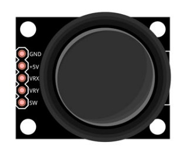
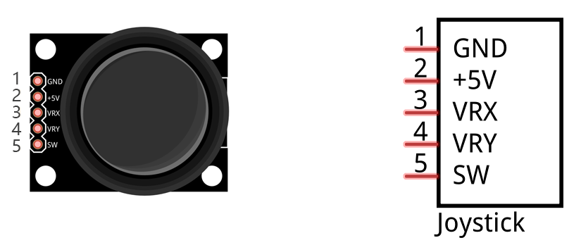
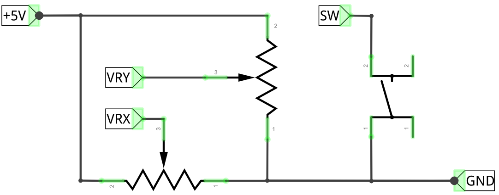
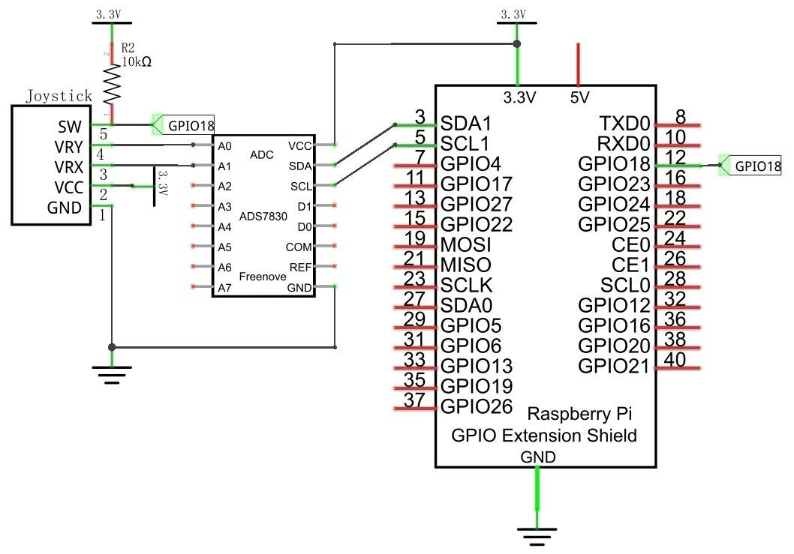
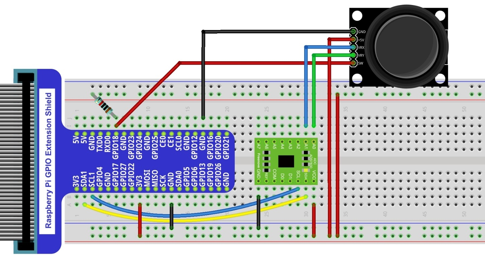
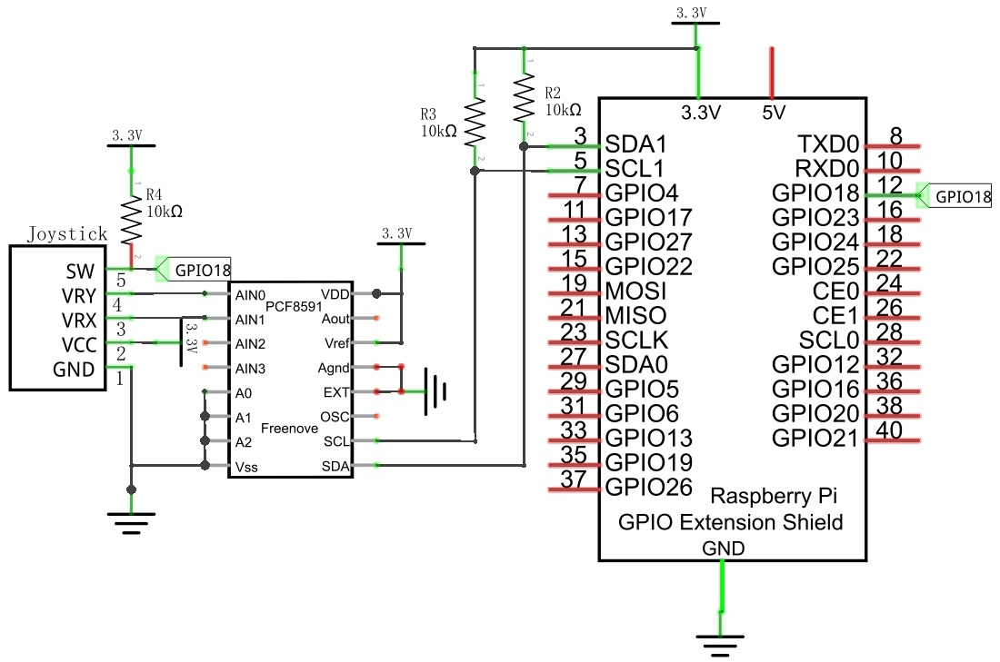
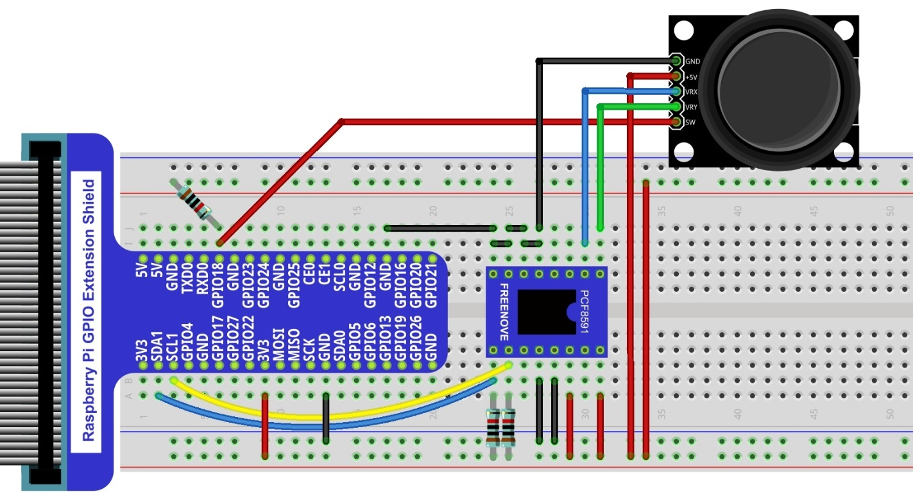

################################################################
Chapter Joystick
################################################################

In an earlier chapter, we learned how to use Rotary Potentiometer. We will now learn about joysticks, which are electronic modules that work on the same principle as the Rotary Potentiometer.

Project Joystick
****************************************************************

In this project, we will read the output data of a joystick and display it to the Terminal screen.

Component List
================================================================

+---------------------------------------------------------------+
|1. Raspberry Pi x1                                             |
|                                                               |
|2. GPIO Extension Board & Ribbon Cable x1                      |
|                                                               |
|3. Breadboard x1                                               |
+-------------------------------+-------------------------------+
| Joystick  x1                  |   Resistor 10kΩ x3            |
|                               |                               |
| |joystick|                    |  |Resistor-10kΩ|              |
+-------------------------------+-------------------------------+
| ADC module x1                                                 |
|                                                               |
|   |ADC-module-1|   :xx-large:`or`  |ADC-module-2|             |
|                                                               |
+---------------------------------------------------------------+
|   Jumper x18                                                  |
|                                                               |
|      |jumper-wire|                                            |
+---------------------------------------------------------------+

.. |jumper-wire| image:: ../_static/imgs/jumper-wire.png
.. |Resistor-10kΩ| image:: ../_static/imgs/Resistor-10kΩ.png
     :width: 15%

.. |ADC-module-1| image:: ../_static/imgs/ADC-module-1.png
.. |ADC-module-2| image:: ../_static/imgs/ADC-module-2.png

Component knowledge
================================================================

Joystick
----------------------------------------------------------------

A Joystick is a kind of input sensor used with your fingers. You should be familiar with this concept already as they are widely used in gamepads and remote controls. It can receive input on two axes (Y and or X) at the same time (usually used to control direction on a two dimensional plane). And it also has a third direction capability by pressing down (Z axis/direction).

This is accomplished by incorporating two rotary potentiometers inside the Joystick Module at 90 degrees of each other, placed in such a manner as to detect shifts in direction in two directions simultaneously and with a Push Button Switch in the “vertical” axis, which can detect when a User presses on the Joystick.

When the Joystick data is read, there are some differences between the axes: data of X and Y axes is analog, which needs to use the ADC. The data of the Z axis is digital, so you can directly use the GPIO to read this data or you have the option to use the ADC to read this.

Circuit with ADS7830
================================================================

+------------------------------------------------------------------------------------------------+
|   Schematic diagram                                                                            |
|                                                                                                |
|   |ADS7830-Schematic-6|                                                                        |
+------------------------------------------------------------------------------------------------+
|   Hardware connection. If you need any support,please feel free to contact us via:             |
|                                                                                                |
|   support@freenove.com                                                                         |
|                                                                                                |
|   |ADS7830-fritizing-7|                                                                        |
|                                                                                                |
|    **Video:** https://youtu.be/qjP3HpbPJTM                                                     |
+------------------------------------------------------------------------------------------------+

.. raw:: html

   <iframe height="500" width="690" src="https://www.youtube.com/embed/qjP3HpbPJTM" frameborder="0" allowfullscreen></iframe>

Circuit with PCF8591
================================================================

+------------------------------------------------------------------------------------------------+
|   Schematic diagram                                                                            |
|                                                                                                |
|   |PCF8591-Schematic-6|                                                                        |
+------------------------------------------------------------------------------------------------+
|   Hardware connection. If you need any support,please feel free to contact us via:             |
|                                                                                                |
|   support@freenove.com                                                                         |
|                                                                                                |
|   |PCF8591-fritizing-6|                                                                        |
+------------------------------------------------------------------------------------------------+

Code
================================================================

In this project's code, we will read the ADC values of X and Y axes of the Joystick, and read digital quality of the Z axis, then display these out in Terminal.

Python Code Joystick
----------------------------------------------------------------

If you did not configure I2C, please refer to :doc:`Chapter 7 <ADC>`. If you did, please continue.

First, observe the project result, and then learn about the code in detail.

.. hint:: 
    :red:`If you have any concerns, please contact us via:`  support@freenove.com

1.	Use cd command to enter 12.1.1_Joystick directory of Python code.

.. code-block:: console

    $ cd ~/Freenove_Kit/Code/Python_GPIOZero_Code/12.1.1_Joystick

2.	Use Python command to execute Python code "Joystick.py". 

.. code-block:: console

    $ python Joystick.py

The following is the program code:

.. literalinclude:: ../../../freenove_Kit/Code/Python_GPIOZero_Code/12.1.1_Joystick/Joystick.py
    :linenos: 
    :language: python

In the code, configure Z_Pin as pull-up input mode. In the while loop, use analogRead() to read the values of the axes X and Y and use the variable val_Z to save the value of the button.value variable for the Z axis, and then display them. When the button is pressed, the value of the variable button.value is 1, otherwise the value is 0.

.. literalinclude:: ../../../freenove_Kit/Code/Python_GPIOZero_Code/12.1.1_Joystick/Joystick.py
    :linenos: 
    :language: python
    :lines: 28-34

For more information about the methods used by the Button class in the GPIO Zero library,please refer to: https://gpiozero.readthedocs.io/en/stable/api_input.html#button