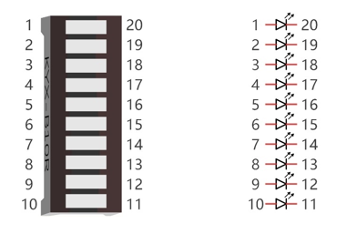

################################################################
Chapter LED Bar Graph
################################################################

We have learned how to control one LED to blink. Next, we will learn how to control a number of LEDs

Project Flowing Water Light
****************************************************************

In this project, we use a number of LEDs to make a flowing water light.

Component List
================================================================

+--------------------------------------------------+---------------------------------------------------+
|1. Raspberry Pi (with 40 GPIO) x1                 |                                                   |
|                                                  | Jumper Wires x6                                   |
|2. GPIO Extension Board & Ribbon Cable x1         |                                                   |
|                                                  |  |jumper-wire|                                    |
|3. Breadboard x1                                  |                                                   |
+--------------------------------------------------+---------------------------------------------------+
|  Bar Graph LED x1                                | Resistor 220Ω x10                                 |
|                                                  |                                                   |
|   |LED-BAR|                                      |  |res-220R-hori|                                  |
+--------------------------------------------------+---------------------------------------------------+

.. |jumper-wire| image:: ../_static/imgs/jumper-wire.png
.. |LED-BAR| image:: ../_static/imgs/LED-BAR.png
    :width: 60%
.. |res-220R-hori| image:: ../_static/imgs/res-220R-hori.png
    :width: 60%

Component knowledge
================================================================

Let us learn about the basic features of these components to use and understand them better.

Bar Graph LED
----------------------------------------------------------------

A Bar Graph LED has 10 LEDs integrated into one compact component. The two rows of pins at its bottom are paired to identify each LED like the single LED used earlier. 

Circuit
================================================================

A reference system of labels is used in the circuit diagram below. Pins with the same network label are connected together.

Schematic diagram             

.. image:: ../_static/imgs/LED-Graph-Sch.png                                                                
        :width: 100% 
                   
Hardware connection. If you need any support, please feel free to contact us via: support@freenove.com

.. image:: ../_static/imgs/LED-Graph-Fritzing.png                                                                
        :width: 100%   

.. note:: 
        :red:`If LEDbar doesn't work, rotate LEDbar 180° to try. The label is random.`

.. note:: 
        **Youtube video:** https://youtu.be/3rh-b05VoiU

.. raw:: html

   <iframe height="500" width="690" src="https://www.youtube.com/embed/3rh-b05VoiU" frameborder="0" allowfullscreen></iframe>

In this circuit, the cathodes of the LEDs are connected to the GPIO, which is different from the previous circuit. The LEDs turn ON when the GPIO output is low level in the program. 

Code
================================================================

This project is designed to make a flowing water lamp, which are these actions: First turn LED #1 ON, then turn it OFF. Then turn LED #2 ON, and then turn it OFF... and repeat the same to all 10 LEDs until the last LED is turns OFF. This process is repeated to achieve the “movements” of flowing water.

Python Code 3.1.1 LightWater
----------------------------------------------------------------

First observe the project result, and then view the code.

.. hint:: 
    :red:`If you have any concerns, please contact us via:`  support@freenove.com

1. Use cd command to enter 03.1.1_LightWater directory of Python code.

.. code-block:: console

    $ cd ~/Freenove_Kit/Code/Python_GPIOZero_Code/03.1.1_LightWater

2. Use Python command to execute Python code “LightWater.py”.

.. code-block:: console

    $ python LightWater.py

After the program is executed, you will see that LED Bar Graph starts with the flowing water way to be turned on from left to right, and then from right to left.

The following is the program code:

.. literalinclude:: ../../../freenove_Kit/Code/Python_GPIOZero_Code/03.1.1_LightWater/LightWater.py
    :linenos: 
    :language: python

Import the LED class that controls LED Bar Graph from the gpiozero library.

.. code-block:: python

    from gpiozero import LED

Create the LED class for controlling the LEDBarGraph.

.. code-block:: python

    ledPins = [17, 18, 27, 22, 23, 24, 25, 2, 3, 8]
    leds = [LED(pin=pin) for pin in ledPins] 

The LED is turned on or off by specifying the index of the LED, if no parameter is specified, the same Settings are applied to all leds.  leds.off() means that all leds are turned off.

.. literalinclude:: ../../../freenove_Kit/Code/Python_GPIOZero_Code/03.1.1_LightWater/LightWater.py
    :linenos: 
    :language: python
    :lines: 16-23

For more information about the methods used by the LEDBoard class in the GPIO Zero library,please refer to: https://gpiozero.readthedocs.io/en/stable/api_boards.html#ledboard

For more information about the methods used by the LEDBarGraph class in the GPIO Zero library,please refer to: https://gpiozero.readthedocs.io/en/stable/api_boards.html#ledbargraph

In this experiment you can use the LEDBoard and LEDBarGraph classes to control the LEDBarGraph 

