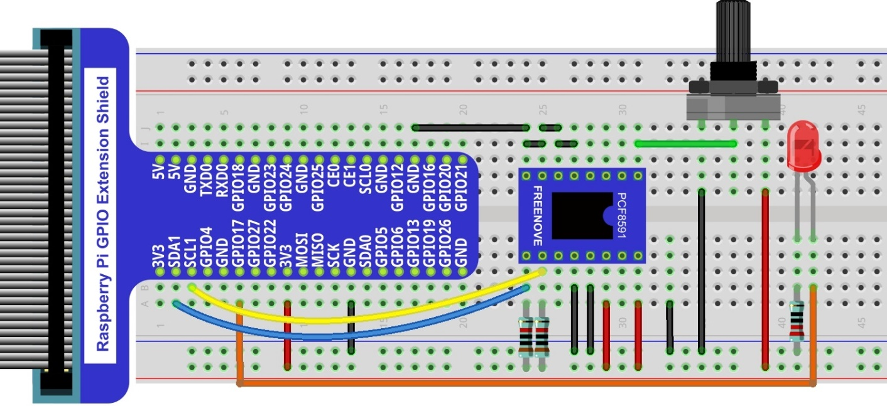

################################################################
Chapter Potentiometer & LED
################################################################

Earlier we learned how to use ADC and PWM. In this chapter, we learn to control the brightness of an LED by using a potentiometer.

Project Soft Light
****************************************************************

In this project, we will make a soft light. We will use an ADC Module to read ADC values of a potentiometer and map it to duty cycle ratio of the PWM used to control the brightness of an LED. Then you can change the brightness of an LED by adjusting the potentiometer.

Component List
================================================================

+---------------------------------------------------------------------------------+
|1. Raspberry Pi (with 40 GPIO) x1                                                |     
|                                                                                 |       
|2. GPIO Extension Board & Ribbon Cable x1                                        |       
|                                                                                 |                                                            
|3. Breadboard x1                                                                 |                                                                 
+=================================================+===============================+
| Rotary potentiometer x1                         |   Resistor 10kΩ x2            |
|                                                 |                               |
| |Rotary-potentiometer|                          |  |Resistor-10kΩ|              |                           
+-------------------------------------------------+-------------------------------+
| ADC module x1 (Only one)                        |   LED x1                      |
|                                                 |                               |
| |ADC-module-1|   :xx-large:`or`  |ADC-module-2| |   |red-led|                   |                   
|                                                 |                               |  
+-------------------------------------------------+-------------------------------+
|   Jumper Wire M/M x17                                                           |
|                                                                                 | 
|      |jumper-wire|                                                              |
+---------------------------------------------------------------------------------+

.. |jumper-wire| image:: ../_static/imgs/jumper-wire.png
    :width: 70%
.. |Resistor-10kΩ| image:: ../_static/imgs/Resistor-10kΩ.png
    :width: 20%
.. |Rotary-potentiometer| image:: ../_static/imgs/Rotary-potentiometer.png
    :width: 25%
.. |ADC-module-1| image:: ../_static/imgs/ADC-module-1.png
.. |ADC-module-2| image:: ../_static/imgs/ADC-module-2.png
.. |red-led| image:: ../_static/imgs/red-led.png
    :width: 30%

Circuit with ADS7830
================================================================

+------------------------------------------------------------------------------------------------+
|   Schematic diagram                                                                            |
|                                                                                                |
|   |ADS7830-Schematic-2|                                                                        |
+------------------------------------------------------------------------------------------------+
|   Hardware connection. If you need any support,please feel free to contact us via:             |
|                                                                                                |
|   support@freenove.com                                                                         |
|                                                                                                |
|   |ADS7830-fritizing-2|                                                                        |
|                                                                                                |
|    **Video:** https://youtu.be/YMEfe9IWU6I                                                     |
+------------------------------------------------------------------------------------------------+

.. |ADS7830-Schematic-2| image:: ../_static/imgs/ADS7830-Schematic-2.png
.. |ADS7830-fritizing-2| image:: ../_static/imgs/ADS7830-fritizing-2.png

.. raw:: html

   <iframe height="500" width="690" src="https://www.youtube.com/embed/YMEfe9IWU6I" frameborder="0" allowfullscreen></iframe>

Circuit with PCF8591
================================================================

+------------------------------------------------------------------------------------------------+
|   Schematic diagram                                                                            |
|                                                                                                |
|   |PCF8591-Schematic-2|                                                                        |
+------------------------------------------------------------------------------------------------+
|   Hardware connection.                                                                         |
|                                                                                                |
|   |PCF8591-fritizing-2|                                                                        |
+------------------------------------------------------------------------------------------------+

.. |PCF8591-Schematic-2| image:: ../_static/imgs/PCF8591-Schematic-2.png

Code
================================================================

Python Code 8.1.1 Softlight
----------------------------------------------------------------

If you did not configure I2C, please refer to :doc:`Chapter 7 ADC <ADC>`. If you did, please continue.

First, observe the project result, and then learn about the code in detail.

.. hint:: 
    :red:`If you have any concerns, please contact us via:` support@freenove.com

1.	Use cd command to enter 08.1.1_Softlight directory of Python code

.. code-block:: console

    $ cd ~/Freenove_Kit/Code/Python_GPIOZero_Code/08.1.1_Softlight

2.	Use the python command to execute the Python code “Softlight.py”.

.. code-block:: console

    $ python Softlight.py

After the program is executed, adjusting the potentiometer will display the voltage values of the potentiometer in the Terminal window and the converted digital quantity. As a consequence, the brightness of LED will be changed.

The following is the code:

.. literalinclude:: ../../../freenove_Kit/Code/Python_GPIOZero_Code/08.1.1_Softlight/Softlight.py
    :linenos: 
    :language: python

In the code, read ADC value of potentiometers and map it to the duty cycle of the PWM to control LED brightness.

.. code-block:: python

    value = adc.analogRead(0)      # read the ADC value of channel 0
    led.value = value / 255.0      # Mapping to PWM duty cycle

