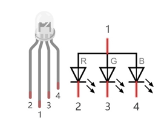

################################################################
Chapter RGB LED
################################################################

In this chapter, we will learn how to control a RGB LED.

An RGB LED has 3 LEDs integrated into one LED component. It can respectively emit Red, Green and Blue light. In order to do this, it requires 4 pins (this is also how you identify it). The long pin (1) is the common which is the Anode (+) or positive lead, the other 3 are the Cathodes (-) or negative leads. A rendering of a RGB LED and its electronic symbol are shown below. We can make RGB LED emit various colors of light and brightness by controlling the 3 Cathodes (2, 3 & 4) of the RGB LED

Red, Green, and Blue light are called 3 Primary Colors when discussing light (Note: for pigments such as paints, the 3 Primary Colors are Red, Blue and Yellow). When you combine these three Primary Colors of light with varied brightness, they can produce almost any color of visible light. Computer screens, single pixels of cell phone screens, neon lamps, etc. can all produce millions of colors due to phenomenon.

.. image:: ../_static/imgs/RGB.png
        :width: 50%
        :align: center

.. container:: centered
    
    :x-large:`RGB`

If we use a three 8 bit PWM to control the RGB LED, in theory, we can create 28*28*28=16777216 (16 million) colors through different combinations of RGB light brightness.

Next, we will use RGB LED to make a multicolored LED. 

Project Multicolored LED
****************************************************************

Component List
================================================================
    
+------------------------------------------------------+------------------------------------------------------+
|    Raspberry Pi (with 40 GPIO) x1                    |        RGB LED                                       |
|                                                      |                                                      |   
|    GPIO Extension Board & Ribbon Cable x1            |       |RGB-LED-real|                                 |
|                                                      |                                                      |
|    Breadboard x1                                     |                                                      |
+------------------------------------------------------+------------------------------------------------------+
|                    Jumper Wire                       |                   Resistor 220Ω x3                   |
|                                                      |                                                      |
|   |jumper-wire|                                      |    |res-220R-hori|                                   |        
+------------------------------------------------------+------------------------------------------------------+

.. |jumper-wire| image:: ../_static/imgs/jumper-wire.png
.. |res-220R-hori| image:: ../_static/imgs/res-220R-hori.png

Circuit
================================================================

+------------------------------------------------------------------------------------------------+
|   Schematic diagram                                                                            |
|                                                                                                |
|   |RGB-LED-Scbematic|                                                                          |
+------------------------------------------------------------------------------------------------+
|   Hardware connection. If you need any support,please feel free to contact us via:             |
|                                                                                                |
|   support@freenove.com                                                                         | 
|                                                                                                |
|   |RGB-LED-fritizing|                                                                          |
|                                                                                                |
|    **Video:** https://youtu.be/tbnX2AsX2y4                                                     |
+------------------------------------------------------------------------------------------------+

.. |RGB-LED-Scbematic| image:: ../_static/imgs/RGB-LED-Scbematic.png
    :width: 80%
.. |RGB-LED-fritizing| image:: ../_static/imgs/RGB-LED-fritizing.png

.. note:: 
    In this kit, the RGB led is Common anode. The voltage difference between LED will make it work. There is no visible GND. The GPIO ports can also receive current while in output mode.If circuit above doesn’t work, the RGB LED may be common cathode. Please try following wiring.There is no need to modify code for random color.

.. image:: ../_static/imgs/RGB-LED-fritizing2.png
    :width: 100%
    :align: center

.. raw:: html

   <iframe height="500" width="690" src="https://www.youtube.com/embed/tbnX2AsX2y4" frameborder="0" allowfullscreen></iframe>

Code
================================================================

We need to use RGBLED class to control RGBLED. The parameters for setting the RGBLED as common cathode or common anode are provided in the RGBLED class. You can set it according to the type of your RGB LED, and the default setting in our example code is based on common anode.

Python Code ColorfulLED
----------------------------------------------------------------

First, observe the project result, and then learn about the code in detail.

.. hint:: 

    :red:`If you have any concerns, please contact us via:`  support@freenove.com

1.	Use cd command to enter 05.1.1_ColorfulLED directory of Python code.

.. code-block:: console

    $ cd ~/Freenove_Kit/Code/Python_GPIOZero_Code/05.1.1_ColorfulLED

2.	Use python command to execute python code “ColorfulLED.py”.

.. code-block:: console

    $ python ColorfulLED.py

After the program is executed, you will see that the RGB LED randomly lights up different colors.

The following is the program code:

.. literalinclude:: ../../../freenove_Kit/Code/Python_GPIOZero_Code/05.1.1_ColorfulLED/ColorfulLED.py
    :linenos: 
    :language: python
    :dedent:

Import the RGBLED class that controls RGBLED from the gpiozero library.

.. code-block:: python
    :linenos:
    
    from gpiozero import RGBLED

Create the RGBLED class for controlling the RGBLED.

.. code-block:: python
    :linenos:
    
    led = RGBLED(red=17, green=18, blue=27, active_high=False) # define the pins for R:GPIO17,G:GPIO18,B:GPIO2

In the previous chapter, we learned how to make a pin output PWM using the Python language. In this project, we output to three pins via PWM. In the "while" loop of the "loop" function, we first generate three random numbers and then assign these three random numbers to the PWM values of the three pins, which will make the RGB LED randomly produce multiple colors.

.. literalinclude:: ../../../freenove_Kit/Code/Python_GPIOZero_Code/05.1.1_ColorfulLED/ColorfulLED.py
    :linenos: 
    :language: python
    :lines: 21-28
    :dedent:

For more information about the methods used by the RGBLED class in the GPIO Zero library,please refer to: https://gpiozero.readthedocs.io/en/stable/api_output.html#rgbled