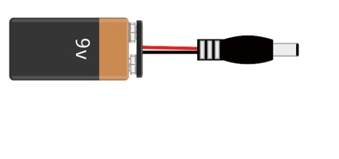
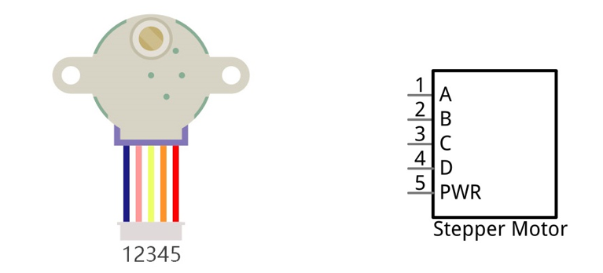
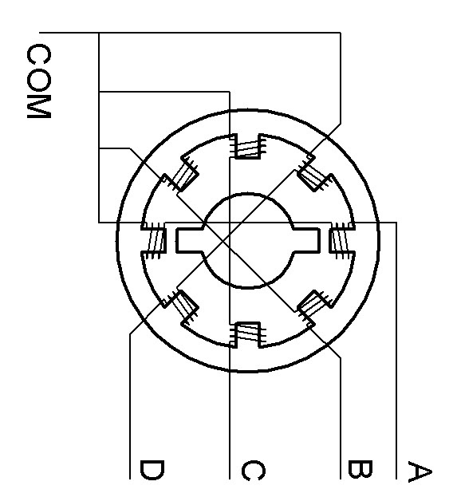
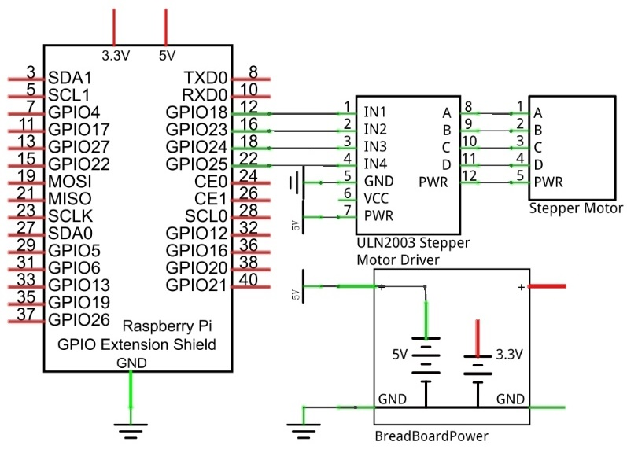
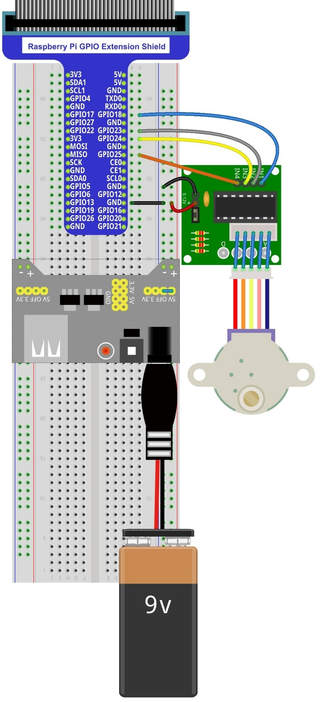

################################################################
Chapter Stepper Motor
################################################################

Thus far, we have learned about DC Motors and Servos. A DC motor can rotate constantly in on direction but we cannot control the rotation to a specific angle. On the contrary, a Servo can rotate to a specific angle but cannot rotate constantly in one direction. In this chapter, we will learn about a Stepper Motor which is also a type of motor. A Stepper Motor can rotate constantly and also to a specific angle. Using a Stepper Motor can easily achieve higher accuracies in mechanical motion.

Project Stepper Motor
****************************************************************

In this project, we will learn how to drive a Stepper Motor, and understand its working principle.

Component List
================================================================

+--------------------------------------------------+-------------------------------------------------+
|1. Raspberry Pi (with 40 GPIO) x1                 |                                                 |     
|                                                  | Jumper Wires x12                                |       
|2. GPIO Extension Board & Ribbon Cable x1         |                                                 |       
|                                                  |  |jumper-wire|                                  |                                                            
|3. Breadboard x1                                  |                                                 |                                                                 
+--------------------------------------------------+-------------------------------------------------+
| Stepper Motor x1                                 | ULN2003 Stepper Motor Driver x1                 |
|                                                  |                                                 |
|  |stepper_Motor|                                 |  |stepper_Motor_Driver|                         |                           
+--------------------------------------------------+-------------------------------------------------+
| 9V battery (prepared by yourself) & battery line | Breadboard Power module x1                      |
|                                                  |                                                 |
|  |Battery_cable|                                 |  |power-module|                                 |                           
+--------------------------------------------------+-------------------------------------------------+

.. |jumper-wire| image:: ../_static/imgs/jumper-wire.png
.. |stepper_Motor_Driver| image:: ../_static/imgs/stepper_Motor_Driver.png
    :width: 70%
.. |stepper_Motor| image:: ../_static/imgs/stepper_Motor.png
    :width: 70%

.. |power-module| image:: ../_static/imgs/power-module.png

Component knowledge
================================================================

Stepper Motor
----------------------------------------------------------------

Stepper Motors are an open-loop control device, which converts an electronic pulse signal into angular displacement or linear displacement. In a non-overload condition, the speed of the motor and the location of the stops depends only on the pulse signal frequency and number of pulses and is not affected by changes in load as with a DC Motor. A small Four-Phase Deceleration Stepper Motor is shown here:

The electronic schematic diagram of a Four-Phase Stepper Motor is shown below:

The outside case or housing of the Stepper Motor is the Stator and inside the Stator is the Rotor. There is a specific number of individual coils, usually an integer multiple of the number of phases the motor has, when the Stator is powered ON, an electromagnetic field will be formed to attract a corresponding convex diagonal groove or indentation in the Rotor’s surface. The Rotor is usually made of iron or a permanent magnet. Therefore, the Stepper Motor can be driven by powering the coils on the Stator in an ordered sequence (producing a series of “steps” or stepped movements).

A common driving sequence is shown here:

.. image:: ../_static/imgs/stepper_Motor_3.png
    :align: center

In the sequence above, the Stepper Motor rotates by a certain angle at once, which is called a “step”. By controlling the number of rotational steps, you can then control the Stepper Motor’s rotation angle. By defining the time between two steps, you can control the Stepper Motor’s rotation speed. When rotating clockwise, the order of coil powered on is: A  B  C  D  A …… . And the rotor will rotate in accordance with this order, step by step, called four-steps, four-part. If the coils is powered ON in the reverse order, D  C  B  A  D … , the rotor will rotate in counter-clockwise direction.

There are other methods to control Stepper Motors, such as: connect A phase, then connect A B phase, the stator will be located in the center of A B, which is called a half-step. This method can improve the stability of the Stepper Motor and reduces noise. Tise sequence of powering the coils looks like this: A  AB  B  BC  C  CD  D  DA  A ……, the rotor will rotate in accordance to this sequence ar, a half-step at a time, called four-steps, eight-part. Conversely, if the coils are powered ON in the reverse order the Stepper Motor will rotate in the opposite direction.

The stator in the Stepper Motor we have supplied has 32 magnetic poles. Therefore, to complete one full revolution requires 32 full steps. The rotor (or output shaft) of the Stepper Motor is connected to a speed reduction set of gears and the reduction ratio is 1:64. Therefore, the final output shaft (exiting the Stepper Motor’s housing) requires 32 X 64 = 2048 steps to make one full revolution.

ULN2003 Stepper Motor driver
----------------------------------------------------------------

A ULN2003 Stepper Motor Driver is used to convert weak signals into more powerful control signals in order to drive the Stepper Motor. In the illustration below, the input signal IN1-IN4 corresponds to the output signal A-D, and 4 LEDs are integrated into the board to indicate the state of these signals. The PWR interface can be used as a power supply for the Stepper Motor. By default, PWR and VCC are connected.

.. image:: ../_static/imgs/stepper_Motor_Driver_1.png
    :align: center

Circuit
================================================================

When building the circuit, note that rated voltage of the Stepper Motor is 5V, and we need to use the breadboard power supply independently, (Caution do not use the RPi power supply). Additionally, the breadboard power supply needs to share Ground with Rpi.

+------------------------------------------------------------------------------------------------+
|   Schematic diagram                                                                            |
|                                                                                                |
|   |stepper_Motor_Sc|                                                                           |
+------------------------------------------------------------------------------------------------+
|   Hardware connection. If you need any support,please feel free to contact us via:             |
|                                                                                                |
|   support@freenove.com                                                                         |
|                                                                                                |
|   |stepper_Motor_Fr|                                                                           |
|                                                                                                |
|    **Video:** https://youtu.be/leptbJh32ZI                                                     |
|                                                                                                |
|    **Sorry latter chapters don't have videos yet.**                                            |
+------------------------------------------------------------------------------------------------+

.. raw:: html

   <iframe height="500" width="690" src="https://www.youtube.com/embed/leptbJh32ZI" frameborder="0" allowfullscreen></iframe>

Code
================================================================

Python Code 16.1.1 SteppingMotor
----------------------------------------------------------------

First, observe the project result, and then learn about the code in detail.

.. hint:: 
    :red:`If you have any concerns, please contact us via:`  support@freenove.com

1.	Use cd command to enter 16.1.1_SteppingMotor directory of Python code.

.. code-block:: console

    $ cd ~/Freenove_Kit/Code/Python_GPIOZero_Code/16.1.1_SteppingMotor

2.	Use Python command to execute code "SteppingMotor.py".

.. code-block:: console

    $ python SteppingMotor.py

After the program is executed, the Stepper Motor will rotate 360° clockwise and then 360° anticlockwise and repeat this action in an endless loop.

The following is the program code:

.. literalinclude:: ../../../freenove_Kit/Code/Python_GPIOZero_Code/16.1.1_SteppingMotor/SteppingMotor.py
    :linenos: 
    :language: python

In the code we define the four pins of the Stepper Motor and the order to supply power to the coils for a four-step rotation mode.

.. literalinclude:: ../../../freenove_Kit/Code/Python_GPIOZero_Code/16.1.1_SteppingMotor/SteppingMotor.py
    :linenos: 
    :language: python
    :lines: 11-15

Subfunction **moveOnePeriod** ((int dir, int ms) will drive the Stepper Motor rotating four-step clockwise or anticlockwise, four-step as a cycle. Where parameter "dir" indicates the rotation direction, if "dir" is 1, the servo will rotate clockwise, otherwise it rotates to anticlockwise. Parameter "ms" indicates the time between each two steps. The "ms" of Stepper Motor used in this project is 3ms (the shortest time period), a value of less than 3ms will exceed the limits of the Stepper Motor with a result that it does not rotate.

.. literalinclude:: ../../../freenove_Kit/Code/Python_GPIOZero_Code/16.1.1_SteppingMotor/SteppingMotor.py
    :linenos: 
    :language: python
    :lines: 18-27

Subfunction **moveSteps** (direction, ms, steps) is used to specify the cycle number of Stepper Motor.

.. code-block:: python

    def moveSteps(direction, ms, steps):
        for i in range(steps):
            moveOnePeriod(direction, ms)

Subfunction **motorStop** () is used to stop the Stepper Motor.

.. code-block:: python

    def motorStop():
        for i in range(0,4,1):
            motors.off()

Finally, in the while loop of main function, rotate one revolution clockwise, and then one revolution anticlockwise. According to the previous material covered, the Stepper Motor one revolution requires 2048 steps, that is, 2048/4=512 cycle.

.. code-block:: python

    while True:
        moveSteps(0,3,512)  # rotating 360 deg clockwise, a total of 2048 steps in a circle, 512 cycles
        time.sleep(0.5)
        moveSteps(1,3,512)  # rotating 360 deg anticlockwise
        time.sleep(0.5)

For more information about the methods used by the OutputDevice class in the GPIO Zero library,please refer to:  https://gpiozero.readthedocs.io/en/stable/api_output.html#outputdevice