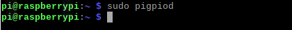

################################################################
Chapter Ultrasonic Ranging
################################################################

In this chapter, we learn a module which use ultrasonic to measure distance.

Project Ultrasonic Ranging
****************************************************************

In this project, we use ultrasonic ranging module to measure distance, and print out the data in the terminal.

Component List
================================================================

+-------------------------------------------------+-------------------------------------------------+
|1. Raspberry Pi (with 40 GPIO) x1                |                                                 |     
|                                                 | Jumper Wires x4                                 |       
|2. GPIO Extension Board & Ribbon Cable x1        |                                                 |       
|                                                 |  |jumper-wire|                                  |                                                            
|3. Breadboard x1                                 |                                                 |                                                                 
+-------------------------------------------------+-------------------------------------------------+
| Ultrasonic Module x1                            | Resistor 1kΩ x3                                 |     
|                                                 |                                                 |       
|  |Ultrasonic_Module|                            |  |res-1K-hori|                                  |       
+-------------------------------------------------+-------------------------------------------------+

.. |jumper-wire| image:: ../_static/imgs/jumper-wire.png
.. |Ultrasonic_Module| image:: ../_static/imgs/Ultrasonic_Module.png
.. |res-1K-hori| image:: ../_static/imgs/res-1K-hori.png
      :width: 65%

Component Knowledge
================================================================

The Ultrasonic Ranging Module uses the principle that ultrasonic waves will be reflected when they encounter any obstacles. This is possible by counting the time interval between when the ultrasonic wave is transmitted to when the ultrasonic wave reflects back after encountering an obstacle. Time interval counting will end after an ultrasonic wave is received, and the time difference (delta) is the total time of the ultrasonic wave’s journey from being transmitted to being received. Because the speed of sound in air is a constant, and is about v=340m/s, we can calculate the distance between the Ultrasonic Ranging Module and the obstacle: s=vt/2.

.. image:: ../_static/imgs/Ultrasonic_knowledge.png
    :align: center

.. container:: centered
    
    2S=V·t.

The Ultrasonic Ranging Module integrates a both an ultrasonic transmitter and a receiver. The transmitter is used to convert electrical signals (electrical energy) into high frequency (beyond human hearing) sound waves (mechanical energy) and the function of the receiver is opposite of this. The picture and the diagram of the Ultrasonic Ranging Module are shown below:

.. list-table::
   :widths: 50 50
   :align: center

   * - |Ultrasonic_Module|
     - |HC_SR04|

.. |Ultrasonic_Module| image:: ../_static/imgs/Ultrasonic_Module.png
.. |HC_SR04| image:: ../_static/imgs/HC_SR04.png

Pin description:

.. list-table::
   :widths: 50 50
   :align: center

   * - VCC
     - power supply pin

   * - Trig
     - trigger pin

   * - Echo
     - Echo pin
    
   * - GND
     - GND

Technical specs:

.. list-table::
   :widths: 50 50
   :align: center

   * - Working voltage: 5V 
     - Working current: 12mA

   * - Minimum measured distance: 2cm
     - Maximum measured distance: 200cm

Instructions for Use: output a high-level pulse in Trig pin lasting for least 10uS, the module begins to transmit ultrasonic waves. At the same time, the Echo pin is pulled up. When the module receives the returned ultrasonic waves from encountering an obstacle, the Echo pin will be pulled down. The duration of high level in the Echo pin is the total time of the ultrasonic wave from transmitting to receiving, s=vt/2. This is done constantly.

.. image:: ../_static/imgs/signal.png
    :align: center

Circuit
================================================================

Note that the voltage of ultrasonic module is 5V in this circuit.

+------------------------------------------------------------------------------------------------+
|   Schematic diagram                                                                            |
|                                                                                                |
|   |Ultrasonic_Sc|                                                                              |
+------------------------------------------------------------------------------------------------+
|   Hardware connection. If you need any support,please feel free to contact us via:             |
|                                                                                                |
|   support@freenove.com                                                                         | 
|                                                                                                |
|   |Ultrasonic_Fr|                                                                              |
+------------------------------------------------------------------------------------------------+

.. |Ultrasonic_Sc| image:: ../_static/imgs/Ultrasonic_Sc.png
.. |Ultrasonic_Fr| image:: ../_static/imgs/Ultrasonic_Fr.png

.. note:: 
        **Youtube video:** https://youtu.be/6nffzlN-lUE

.. raw:: html

   <iframe height="500" width="690" src="https://www.youtube.com/embed/6nffzlN-lUE" frameborder="0" allowfullscreen></iframe>

Code
================================================================

Python Code UltrasonicRanging
----------------------------------------------------------------

First, observe the project result, and then learn about the code in detail.

.. hint:: 
    
    :red:`If you have any concerns, please contact us via:`  support@freenove.com

1.	Use cd command to enter 24.1.1_UltrasonicRanging directory of Python code.

.. code-block:: console

    $ cd ~/Freenove_Kit/Code/Python_GPIOZero_Code/24.1.1_UltrasonicRanging

2.	Use Python command to execute code "UltrasonicRanging.py".

.. code-block:: console

    $ python UltrasonicRanging.py

After the program is executed, aim the Ultrasonic Ranging Module's detectors (“eyes”) perpendicular to the surface of an object (try using your hand). The distance between the ultrasonic module and the object will be displayed in the terminal. As is shown below:

.. image:: ../_static/imgs/distance.png
    :align: center

The following is the program code:

.. literalinclude:: ../../../freenove_Kit/Code/Python_GPIOZero_Code/24.1.1_UltrasonicRanging/UltrasonicRanging.py
    :linenos: 
    :language: python

First, define the pins and the maximum measurement distance.

.. literalinclude:: ../../../freenove_Kit/Code/Python_GPIOZero_Code/24.1.1_UltrasonicRanging/UltrasonicRanging.py
    :linenos: 
    :language: python
    :lines: 11-13
    :dedent:

Finally, in the while loop of main function, get the measurement distance and display it continually. 

.. literalinclude:: ../../../freenove_Kit/Code/Python_GPIOZero_Code/24.1.1_UltrasonicRanging/UltrasonicRanging.py
    :linenos: 
    :language: python
    :lines: 15-18
    :dedent:

For more information about the methods used by the DistanceSensor class in the GPIO Zero library,please refer to: https://gpiozero.readthedocs.io/en/stable/api_input.html#distancesensor-hc-sr04

In the above experiments, you can see that the measurement data is unstable.

.. note::

    For improved accuracy, use the pigpio pin driver rather than the default RPi.GPIO driver (pigpio uses DMA sampling for much more precise edge timing). This is particularly relevant if you’re using Pi 1 or Pi Zero. 

You can refer to UltrasonicRanging2.py for detailed code. 

1.  Use cd command to enter 15.1.1_Sweep directory of Python code.

.. code-block:: console

    $ cd ~/Freenove_Kit/Code/Python_GPIOZero_Code/24.1.1_UltrasonicRanging

1.  Use python command to execute code "Sweep.py".

.. code-block:: console

    $ python UltrasonicRanging2.py

After the program is executed, the distance between the ultrasonic module and the measured object will be displayed on the terminal. At this point, the data is more accurate and stable.

This code is based on pigpio libarary. In the latest Raspberry Pi OS, “pigpio” library has been installed. You only need to run the command to enable it.

.. code-block:: console

    $ sudo pigpiod

If the “pigpio” library has not yet been installed, please follow the steps to install it.

Run the command to install “pigpio” library.

.. code-block:: console

    $ sudo apt-get update
    $ sudo apt-get install pigpio python-pigpio python3-pigpio

The following is the program code:

.. literalinclude:: ../../../freenove_Kit/Code/Python_GPIOZero_Code/24.1.1_UltrasonicRanging/UltrasonicRanging2.py
    :linenos: 
    :language: python

.. seealso::

    See Changing the pin factory for further information:
    https://gpiozero.readthedocs.io/en/stable/api_pins.html#changing-pin-factory
