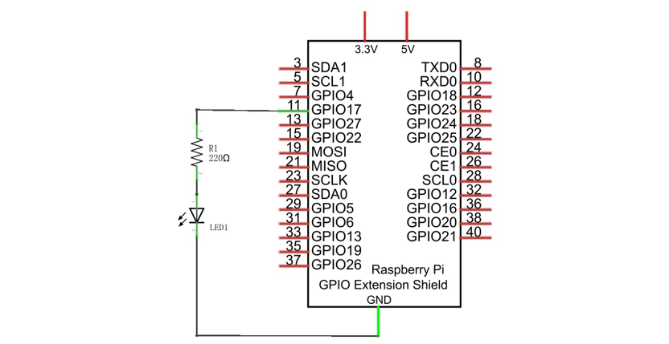
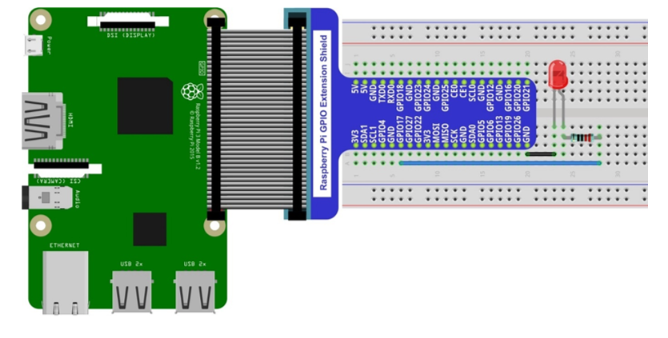
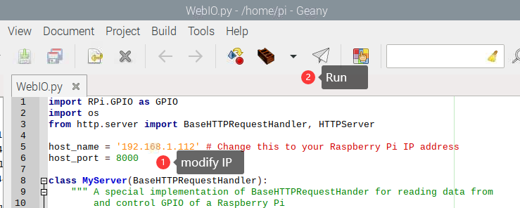
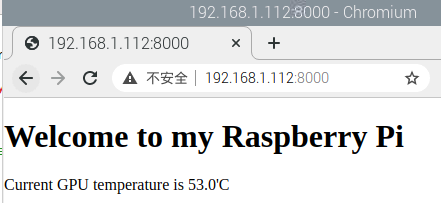
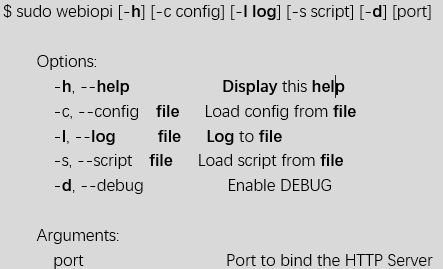
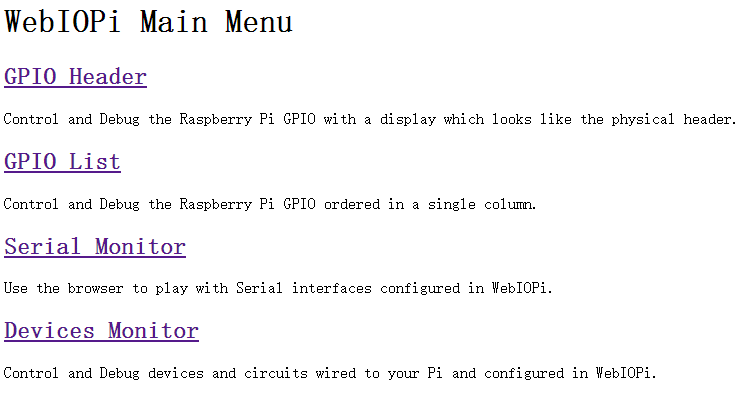
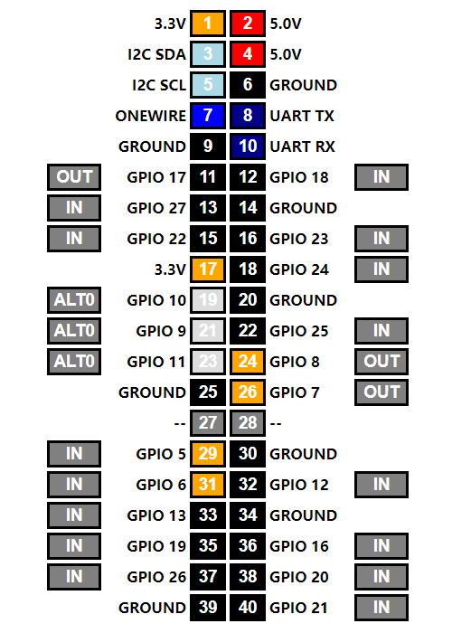

################################################################
Chapter Web IoT
################################################################

In this chapter, we will learn how to use GPIO to control the RPi remotely via a network and how to build a WebIO service on the RPi.

This concept is known as “IoT” or Internet of Things. The development of IoT will greatly change our habits and make our lives more convenient and efficient

Project Remote LED
****************************************************************

In this project, we need to build a WebIOPi service, and then use the RPi GPIO to control an LED through the web browser of phone or PC.

Component List
================================================================

+-------------------------------------------------+-------------------------------------------------+
|1. Raspberry Pi (with 40 GPIO) x1                |                                                 |     
|                                                 | Jumper M/M x2                                   |       
|2. GPIO Extension Board & Ribbon Cable x1        |                                                 |       
|                                                 |  |jumper-wire|                                  |                                                            
|3. Breadboard x1                                 |                                                 |                                                                 
+-------------------------------------------------+-------------------------------------------------+
|  LED x1                                         | Resistor 220Ω x1                                |   
|                                                 |                                                 |     
|  |red-led|                                      | |res-220R|                                      |     
+-------------------------------------------------+-------------------------------------------------+

.. |jumper-wire| image:: ../_static/imgs/jumper-wire.png
.. |res-220R| image:: ../_static/imgs/res-220R.png
    :width: 10%
.. |red-led| image:: ../_static/imgs/red-led.png
    :width: 15%

Circuit
================================================================

+------------------------------------------------------------------------------------------------+
|   Schematic diagram                                                                            |
|                                                                                                |
|   |TTP223_Sc|                                                                                  |
+------------------------------------------------------------------------------------------------+
|   Hardware connection. If you need any support,please feel free to contact us via:             |
|                                                                                                |
|   support@freenove.com                                                                         | 
|                                                                                                |
|   |TTP223_Fr|                                                                                  |
+------------------------------------------------------------------------------------------------+

Solution from E-Tinkers
================================================================

Here is a solution fromblog E-Tinkers, author Henry Cheung. For more details, please refer to link below: https://www.e-tinkers.com/2018/04/how-to-control-raspberry-pi-gpio-via-http-web-server/

1. Make sure you have set python3 as default python. Then run following command in terminal to install http.server in your Raspberry Pi.

.. code-block:: console

    $ sudo apt-get install http.server

2. Open WebIO.py

.. code-block:: console

    $ cd ~/Freenove_Kit/Code/Python_GPIOZero_Code/37.1.1_WebIO
    $ geany WebIO.py

3. Change the host_name into your Raspberry Pi IP address.

.. code-block:: python
    
    host_name = '192.168.1.112'    # Change this to your Raspberry Pi IP address

Then run the code WebIO.py

3, Visit http://192.168.1.112:8000/ in web brower on compter under local area networks. :green:`Change IP to your Raspberry Pi IP address.`

WebIOPi Service Framework
================================================================

.. note::

    :red:`If you have a Raspberry Pi 4B, you may have some trouble. The reason for changing the file in the configuration process is that the newer generation models of the RPi CPUs are different form the older ones and you may not be able to access the GPIO Header at the end of this tutorial.` A solution to this is given in an online tutorial by from E-Tinkers blogger Henry Cheung. For more details, please refer to previouse section.

The following is the key part of this chapter. The installation steps refer to WebIOPi official. And you also can directly refer to the official installation steps. The latest version (in 2016-6-27) of WebIOPi is 0.7.1. So, you may encounter some issues in using it. We will explain these issues and provide the solution in the following installation steps.

Here are the steps to build a WebIOPi:

Installation
----------------------------------------------------------------

1.	Get the installation package. You can use the following command to obtain. 

.. code-block:: console

    $ wget https://github.com/Freenove/WebIOPi/archive/master.zip -O WebIOPi.zip

2.	Extract the package and generate a folder named "WebIOPi-master". Then enter the folder.

.. code-block:: console

    $ unzip WebIOPi.zip
    $ cd WebIOPi-master/WebIOPi-0.7.1

3.	Patch for Raspberry Pi B+, 2B, 3B, 3B+.

.. code-block:: console

    $ patch -p1 -i webiopi-pi2bplus.patch

4.	Run setup.sh to start the installation, the process takes a while and you will need to be patient.

.. code-block:: console

    $ sudo ./setup.sh

5.	If setup.sh does not have permission to execute, execute the following command

.. code-block:: console

    $ sudo sh ./setup.sh

Run
----------------------------------------------------------------

After the installation is completed, you can use the webiopi command to start running.

Run webiopi with verbose output and the default config file:

.. code-block:: console

    $ sudo webiopi -d -c /etc/webiopi/config

The Port is 8000 in default. Now WebIOPi has been launched. Keep it running.

Access WebIOPi over local network
----------------------------------------------------------------

Under the same network, use a mobile phone or PC browser to open your RPi IP address, and add a port number like 8000. For example, my personal Raspberry Pi IP address is 192.168.1.109. Then, in the browser, I then should input: http://192.168.1.109:8000/ 

Default user is "webiopi" and password is "raspberry"。

Then, enter the main control interface:

Click on GPIO Header to enter the GPIO control interface.

Control methods:

- Click/Tap the OUT/IN button to change GPIO direction.

- Click/Tap pins to change the GPIO output state.

Completed
----------------------------------------------------------------

According to the circuit we build, set GPIO17 to OUT, then click Header11 to control the LED.

You can end the webioPi in the terminal by “Ctr+C”.
