################################################################
Chapter LED
################################################################

This chapter is the Start Point in the journey to build and explore RPi electronic projects. We will start with simple “Blink” project.

Project 01.0_Blink, 01.1_Keyboard_LED and 01.2 Sprite_LED 
****************************************************************

In this project, we will use RPi to control blinking a common LED.

Component List
================================================================

+-----------------------------------------------------------+
|    Raspberry Pi                                           |     
|                                                           |       
|    (Recommended: Raspberry Pi 5 / 4B / 3B+ / 3B)          |       
|                                                           |                                                            
|    (Compatible: 3A+ / 2B / 1B+ / 1A+ / Zero W / Zero)     |                                                                 
|                                                           | 
|     |raspberrypi5|                                        | 
+---------------------------+-------------------------------+
| LED x1                    | Breadboard x1                 |
|                           |                               |
|  |red-led|                |  |breadborad-830|             |                         
+---------------------------+----------+--------------------+
|  GPIO Extension Board & Ribbon Cable | Resistor 220Ω x1   |
|                                      |                    | 
|   |extension-board|                  |  |res-220R|        |
+--------------------------------------+--------------------+

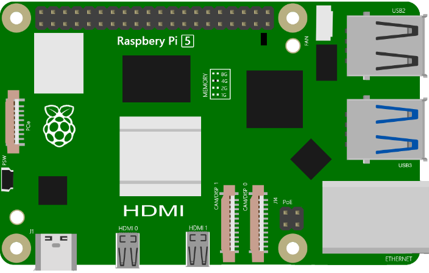
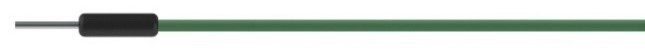
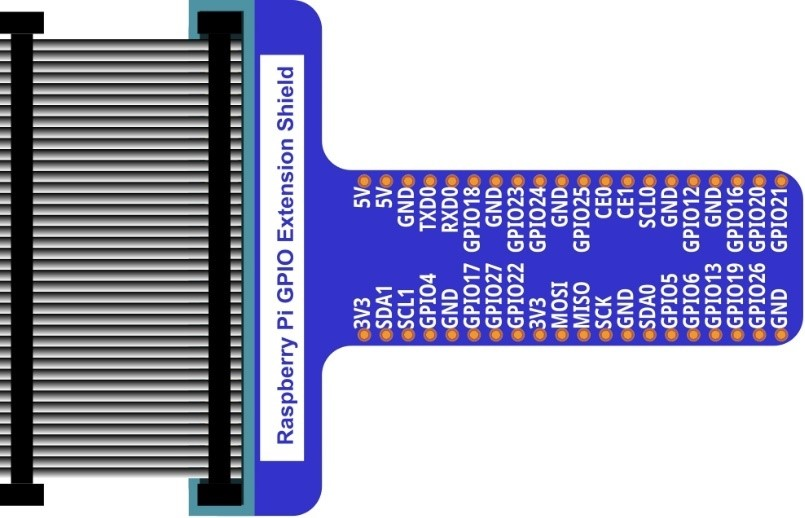
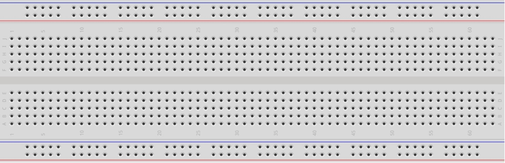
.. |red-led| image:: ../_static/imgs/red-led.png
    :width: 15%

In the components list, 3B GPIO, Extension Shield Raspberry and Breadboard are necessary for each project. Later, they will be reference by text only (no images as in above).

GPIO
================================================================

GPIO: General Purpose Input/Output. Here we will introduce the specific function of the pins on the Raspberry Pi and how you can utilize them in all sorts of ways in your projects. Most RPi Module pins can be used as either an input or output, depending on your program and its functions.

When programming GPIO pins there are 3 different ways to reference them: GPIO Numbering, Physical Numbering and WiringPi GPIO Numbering.

BCM GPIO Numbering
================================================================

The Raspberry Pi CPU uses Broadcom (BCM) processing chips BCM2835, BCM2836 or BCM2837. GPIO pin numbers are assigned by the processing chip manufacturer and are how the computer recognizes each pin. The pin numbers themselves do not make sense or have meaning as they are only a form of identification. Since their numeric values and physical locations have no specific order, there is no way to remember them so you will need to have a printed reference or a reference board that fits over the pins.

Each pin's functional assignment is defined in the image below:

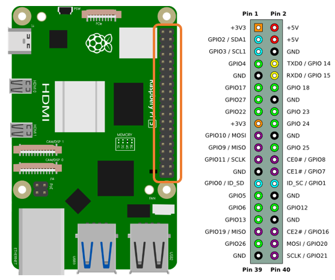

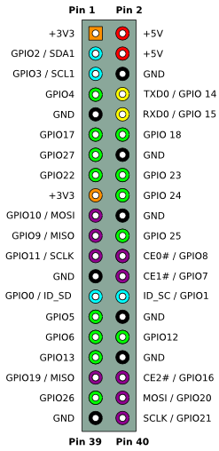

.. seealso:: 
    For more details about pin definition of GPIO, please refer to `<http://pinout.xyz/>`_

PHYSICAL Numbering
---------------------------------------------------------------
Another way to refer to the pins is by simply counting across and down from pin 1 at the top left (nearest to the SD card). This is 'Physical Numbering', as shown below:

.. image:: ../_static/imgs/PHYSICAL-Numbering.png
    :height: 200
    :align: center

Circuit
================================================================
First, disconnect your RPi from the GPIO Extension Shield. Then build the circuit according to the circuit and hardware diagrams. After the circuit is built and verified correct, connect the RPi to GPIO Extension Shield. 

.. caution:: 
    CAUTION: Avoid any possible short circuits (especially connecting 5V or GND, 3.3V and GND)! 

.. warning:: 
    WARNING: A short circuit can cause high current in your circuit, create excessive component heat and cause permanent damage to your RPi!

1. **Schematic diagram**

.. image:: ../_static/imgs/blink-sch.png
    :height: 400
    :align: center

2. **Hardware connection** 

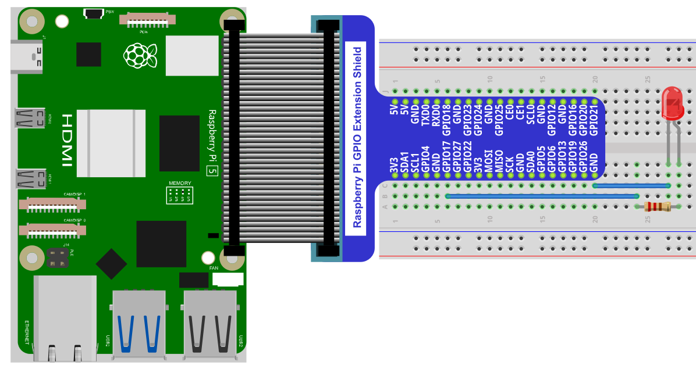

.. tip:: 
     :red:`If you need any support, please contact us via:` :blue:`support@freenove.com`

.. attention:: 
    Do NOT rotate Raspberry Pi to change the way of this connection.
    Please plug T extension fully into breadboard.

The connection of Raspberry Pi T extension board is as below. **Don't reverse the ribbon**.

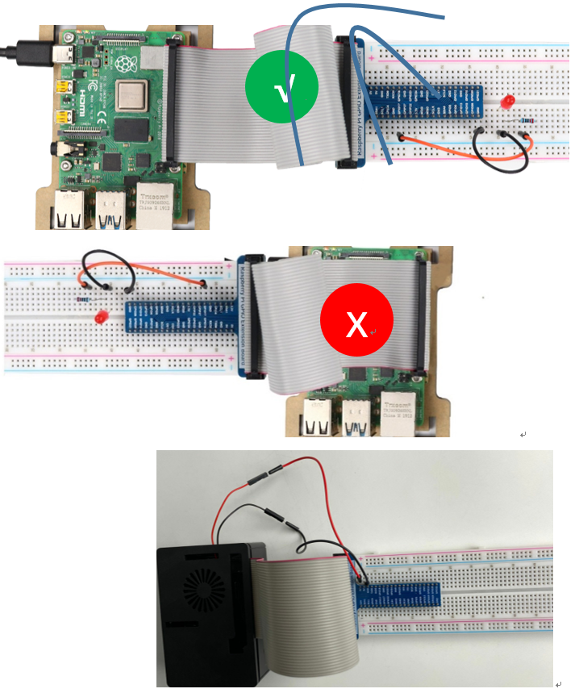

.. note:: 
    If you have a fan, you can connect it to 5V GND of breadboard via jumper wires.

**How to distinguish resistors?**

There are only three kind of resistors in this kit.

1. The one with *1 red ring* is 10KΩ \

    .. image:: ../_static/imgs/res-10K-hori.png
        :height: 17

2. The one with *1 red ring* is 10KΩ 

    .. image:: ../_static/imgs/res-220R-hori.png
        :height: 20

#. The one with *1 red ring* is 10KΩ 

    .. image:: ../_static/imgs/res-1K-hori.png
        :height: 20

.. note:: 
    Future hardware connection diagrams will only show that part of breadboard and GPIO Extension Shield.

Component knowledge
================================================================

LED
----------------------------------------------------------------

An LED is a type of diode. All diodes only work if current is flowing in the correct direction and have two Poles. An LED will only work (light up) if the longer pin (+) of LED is connected to the positive output from a power source and the shorter pin is connected to the negative (-) output, which is also referred to as Ground (GND). This type of component is known as “Polar” (think One-Way Street).

All common 2 lead diodes are the same in this respect. Diodes work only if the voltage of its positive electrode is higher than its negative electrode and there is a narrow range of operating voltage for most all common diodes of 1.9 and 3.4V. If you use much more than 3.3V the LED will be damaged and burnt out.

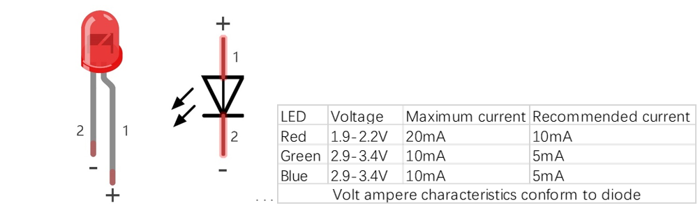

.. note:: 
    Note: LEDs cannot be directly connected to a power supply, which usually ends in a damaged component. A resistor with a specified resistance value must be connected in series to the LED you plan to use.

Resistor
----------------------------------------------------------------

Resistors use Ohms (Ω) as the unit of measurement of their resistance (R). 1MΩ=1000kΩ, 1kΩ=1000Ω.
A resistor is a passive electrical component that limits or regulates the flow of current in an electronic circuit.
On the left, we see a physical representation of a resistor, and the right is the symbol used to represent the presence of a resistor in a circuit diagram or schematic.

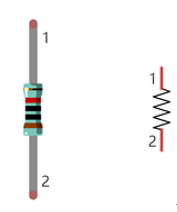

The bands of color on a resistor is a shorthand code used to identify its resistance value. For more details of resistor color codes, please refer to the card in the kit package.
With a fixed voltage, there will be less current output with greater resistance added to the circuit. The relationship between Current, Voltage and Resistance can be expressed by this formula: I=V/R known as Ohm’s Law where I = Current, V = Voltage and R = Resistance. Knowing the values of any two of these allows you to solve the value of the third.

In the following diagram, the current through R1 is: 

.. math:: I=U/R=5V/10kΩ=0.0005A=0.5mA.

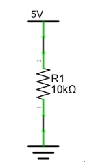

.. warning:: 
    WARNING: Never connect the two poles of a power supply with anything of low resistance value (i.e. a metal object or bare wire) this is a Short and results in high current that may damage the power supply and electronic components.

.. note:: 
    Note: Unlike LEDs and Diodes, Resistors have no poles and re non-polar (it does not matter which direction you insert them into a circuit, it will work the same)

Resistor
----------------------------------------------------------------

Here we have a small breadboard as an example of how the rows of holes (sockets) are electrically attached. The left picture shows the ways the pins have shared electrical connection and the right picture shows the actual internal metal, which connect these rows electrically.

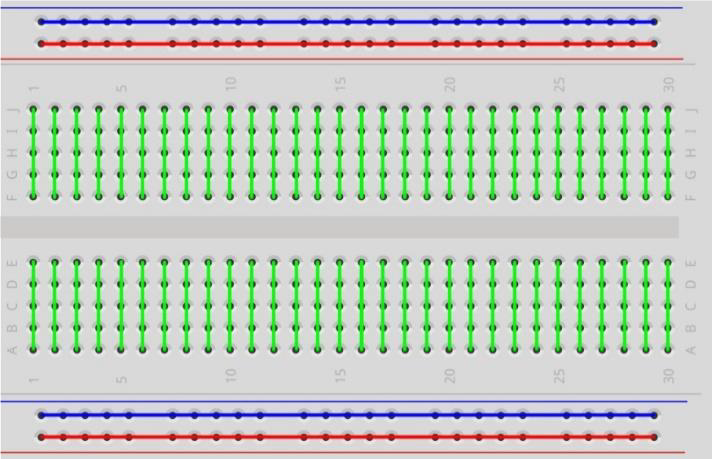

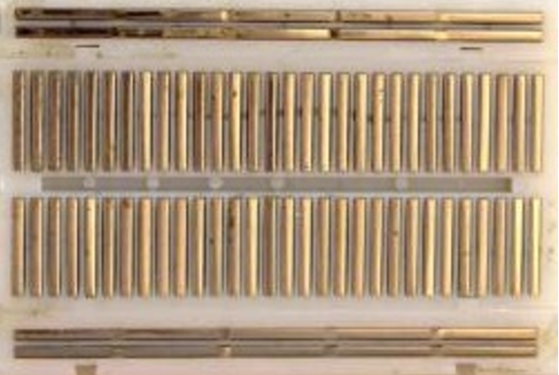

GPIO Extension Board
----------------------------------------------------------------

GPIO board is a convenient way to connect the RPi I/O ports to the breadboard directly. The GPIO pin sequence on Extension Board is identical to the GPIO pin sequence of RPi. 

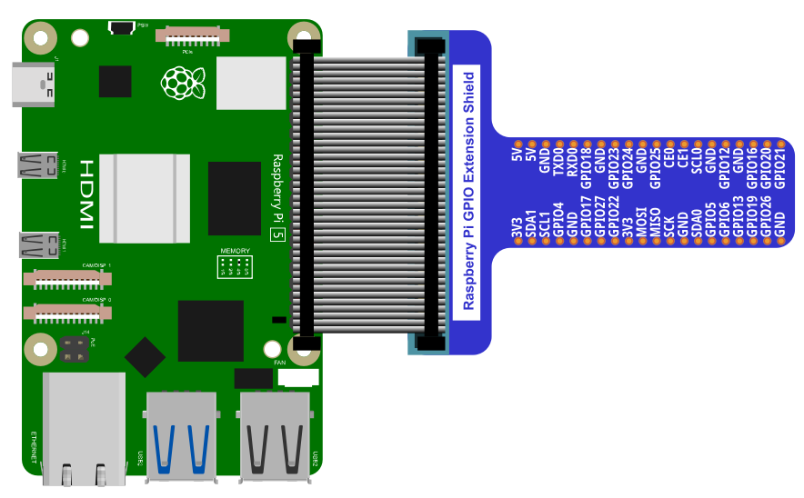

Code
================================================================

According to the circuit, when the GPIO17 of RPi output level is high, the LED turns ON. Conversely, when the GPIO17 RPi output level is low, the LED turns OFF. Therefore, we can let GPIO17 cycle output high and output low level to make the LED blink. We will use both C code and Python code to achieve the target.

Blink
----------------------------------------------------------------

.. hint:: 
    :red:`If you have any concerns, please contact us via:` support@freenove.com

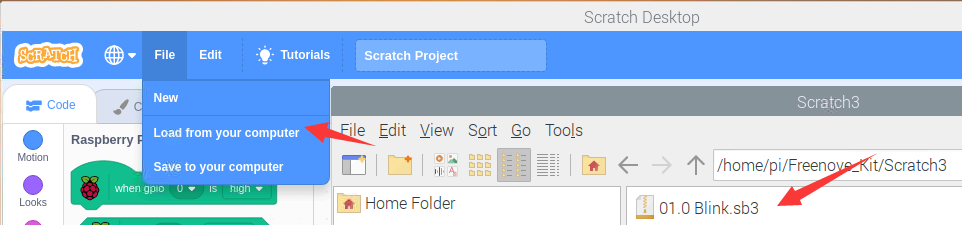

Load the code.

.. code-block:: console

    Freenove_Kit/Scratch3/01.0_Blink

Click the green flag, then the led will keep blinking until you click stop.

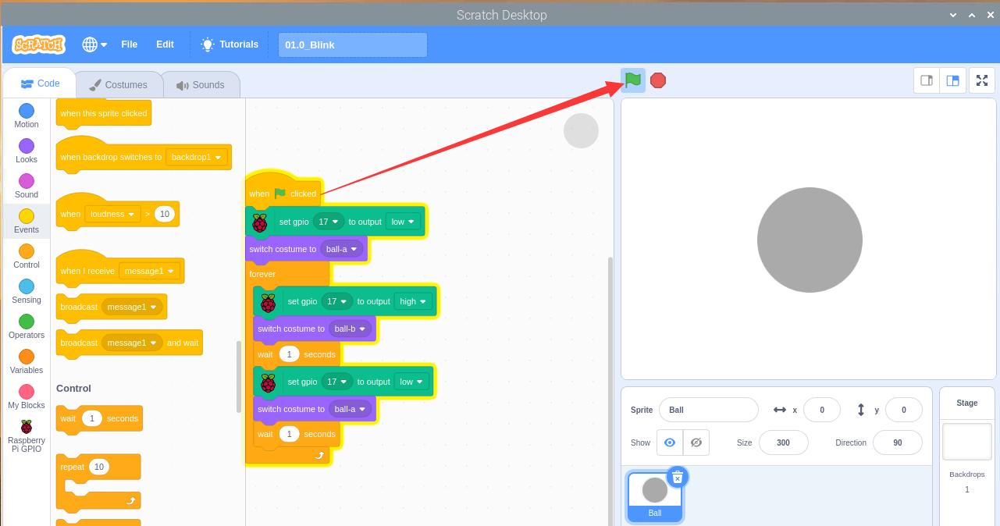

Usuall we make program from

which you can click on right. 

There four modules in scratch for Raspberry Pi.

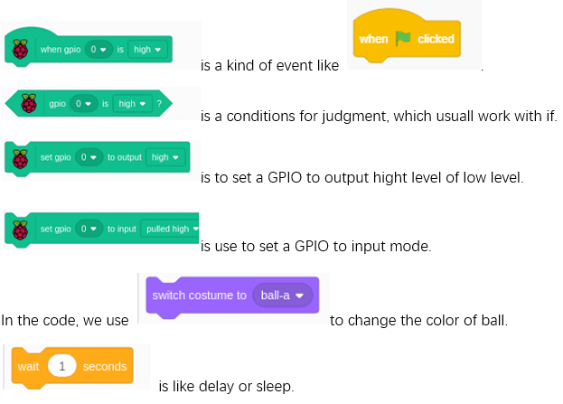

Click constumes, we will see there are two ball constume. We can also defin me more costumes. We will define three constume in RGB section.

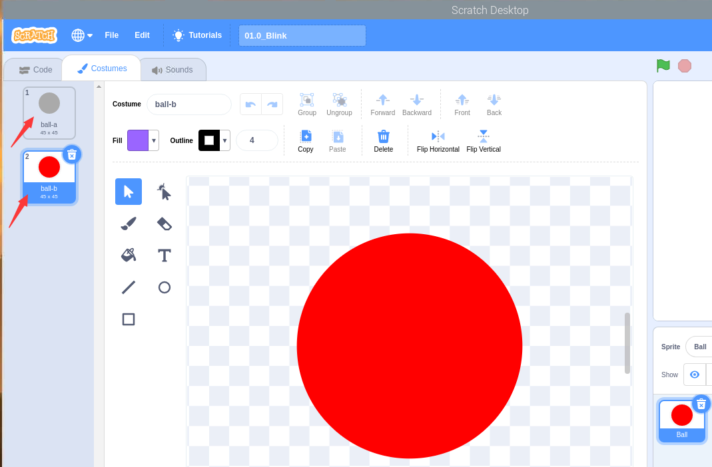

Click this we can choose to use other sprites or upload a sprite.

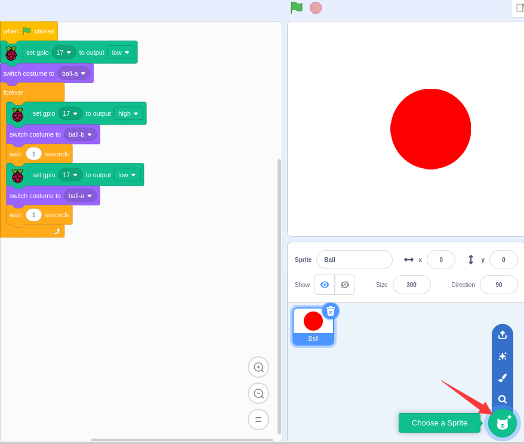

Keyboard_LED 
----------------------------------------------------------------

The circuit is same as previous section.

.. tip:: 
     :red:`If you need any support, please contact us via:` :blue:`support@freenove.com`
    
Load the code to scratch3.

.. code-block:: console

    Freenove_Kit/Code/Scratch3/01.0_Keyboard_LED.sb3

Click the green flag. Then when you press space key on your keyboard, the LED will be turned on. Otherwise, the LED will be turned off.

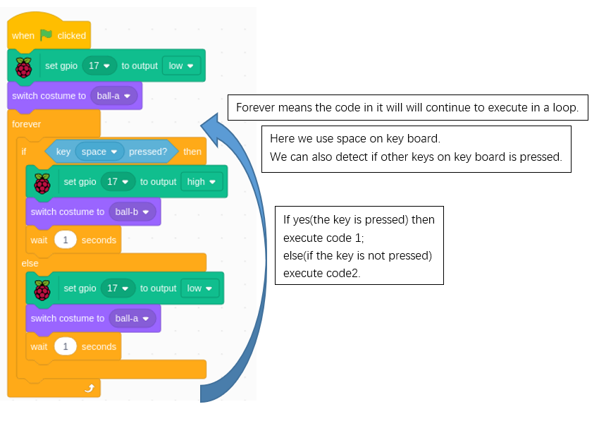

Sprite_LED 
----------------------------------------------------------------

The circuit is same as previous section.

.. tip:: 
     :red:`If you need any support, please contact us via:` :blue:`support@freenove.com`

Load the code to scratch3.

.. code-block:: console

    Freenove_Kit/Code/Scratch3/01.2_Sprite_LED.sb3

Click the green flag. Then click the ball. The LED will be turned on or turned off.

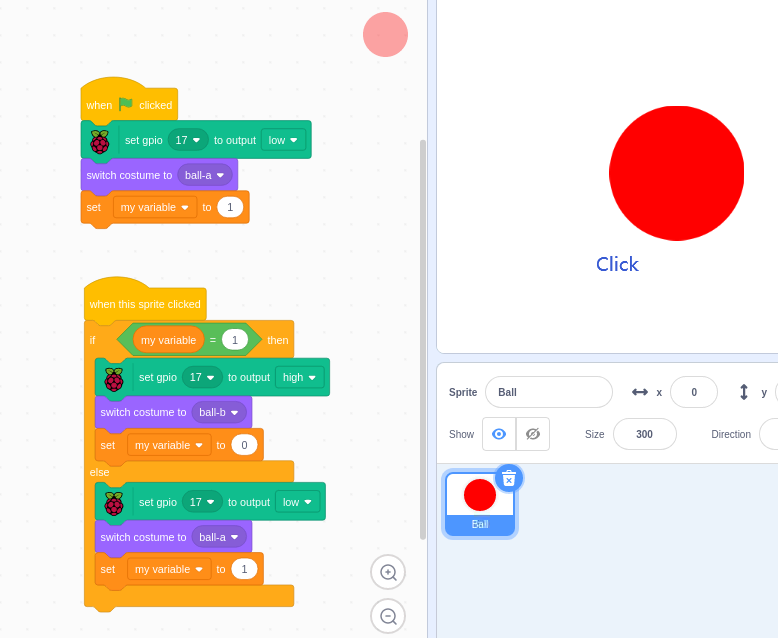

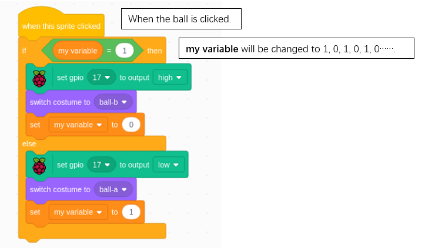

So every time we click the ball the LED status will be changed.

Freenove Car, Robot and other products for Raspberry Pi
================================================================

We also have car and robot kits for Raspberry Pi. You can visit our website for details.

:xx-large:`https://www.amazon.com/freenove`

**FNK0043**--:green:`Freenove 4WD Smart Car Kit for Raspberry Pi`

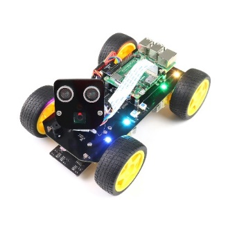
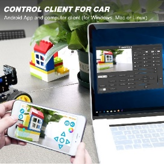

.. raw:: html

   <iframe height="500" width="690" src="https://www.youtube.com/embed/4Zv0GZUQjZc" frameborder="0" allowfullscreen></iframe>
  
**FNK0050**--:green:`Freenove Robot Dog Kit for Raspberry Pi`

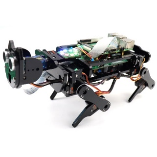
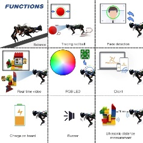

.. raw:: html

   <iframe height="500" width="690" src="https://www.youtube.com/embed/7BmIZ8_R9d4" frameborder="0" allowfullscreen></iframe>

**FNK0052**--:green:`Freenove_Big_Hexapod_Robot_Kit_for_Raspberry_Pi`

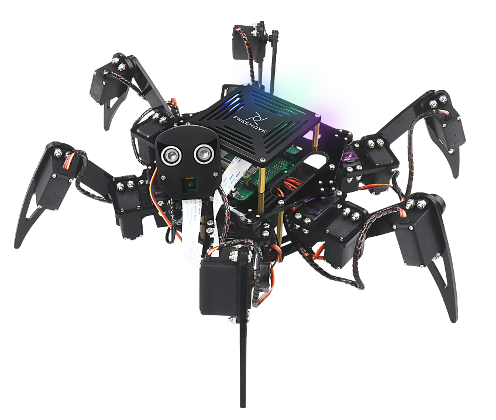
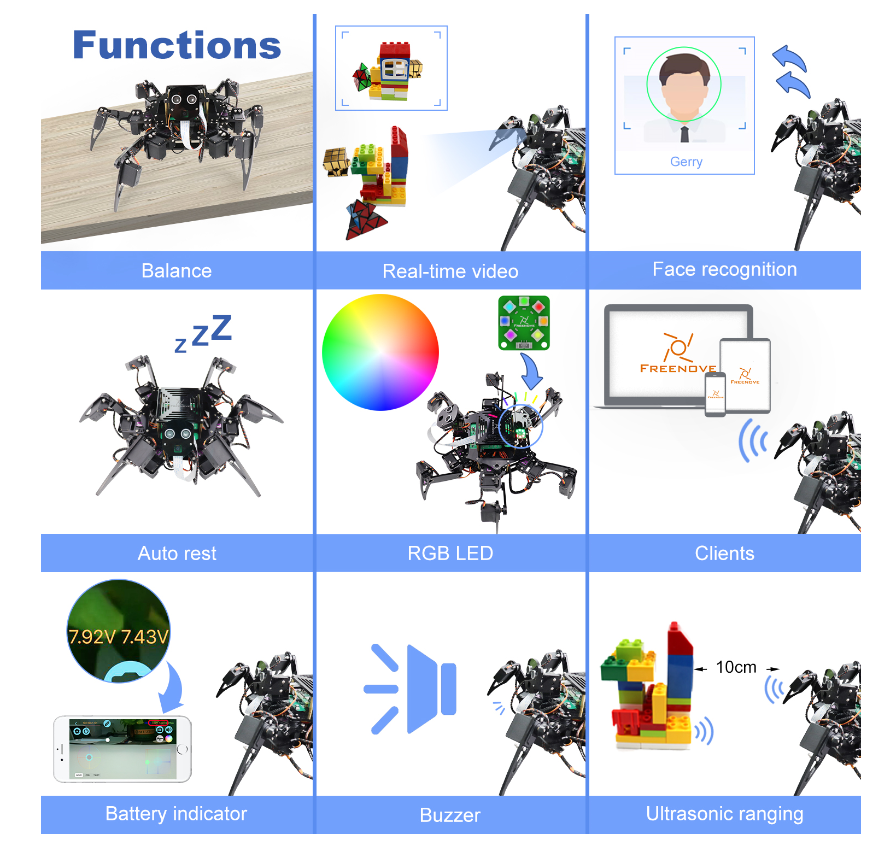

.. raw:: html

   <iframe height="500" width="690" src="https://www.youtube.com/embed/LvghnJ2DNZ0" frameborder="0" allowfullscreen></iframe>Freenove Car, Robot and other products for Raspberry Pi

We also have car and robot kits for Raspberry Pi. You can visit our website for details.

:xx-large:`https://www.amazon.com/freenove`

**FNK0043**--:green:`Freenove 4WD Smart Car Kit for Raspberry Pi`

.. raw:: html

   <iframe height="500" width="690" src="https://www.youtube.com/embed/4Zv0GZUQjZc" frameborder="0" allowfullscreen></iframe>
  
**FNK0050**--:green:`Freenove Robot Dog Kit for Raspberry Pi`

.. raw:: html

   <iframe height="500" width="690" src="https://www.youtube.com/embed/7BmIZ8_R9d4" frameborder="0" allowfullscreen></iframe>

**FNK0052**--:green:`Freenove_Big_Hexapod_Robot_Kit_for_Raspberry_Pi`

    

.. raw:: html

   <iframe height="500" width="690" src="https://www.youtube.com/embed/LvghnJ2DNZ0" frameborder="0" allowfullscreen></iframe>