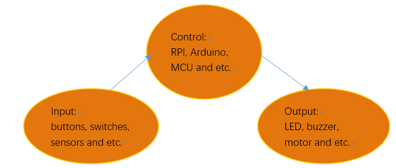
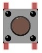
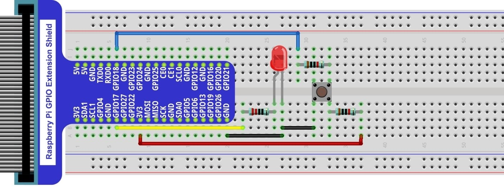
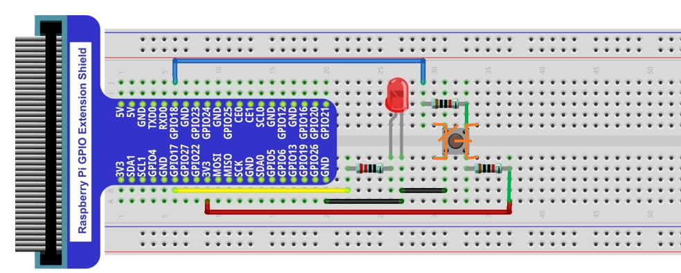
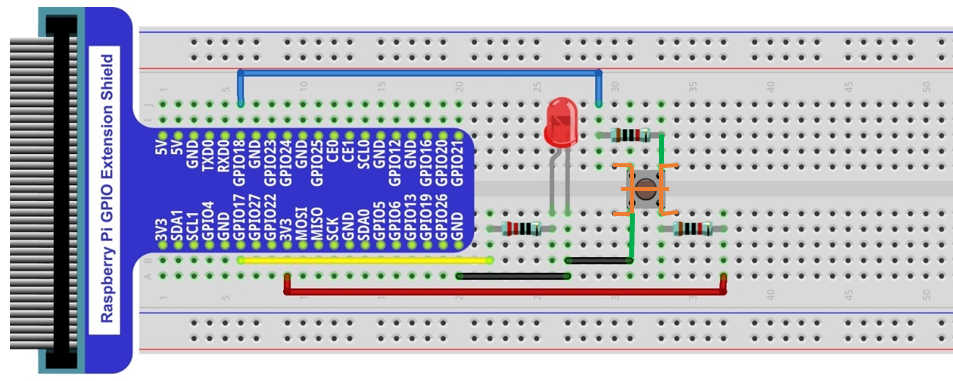
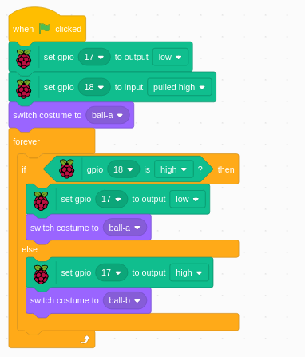
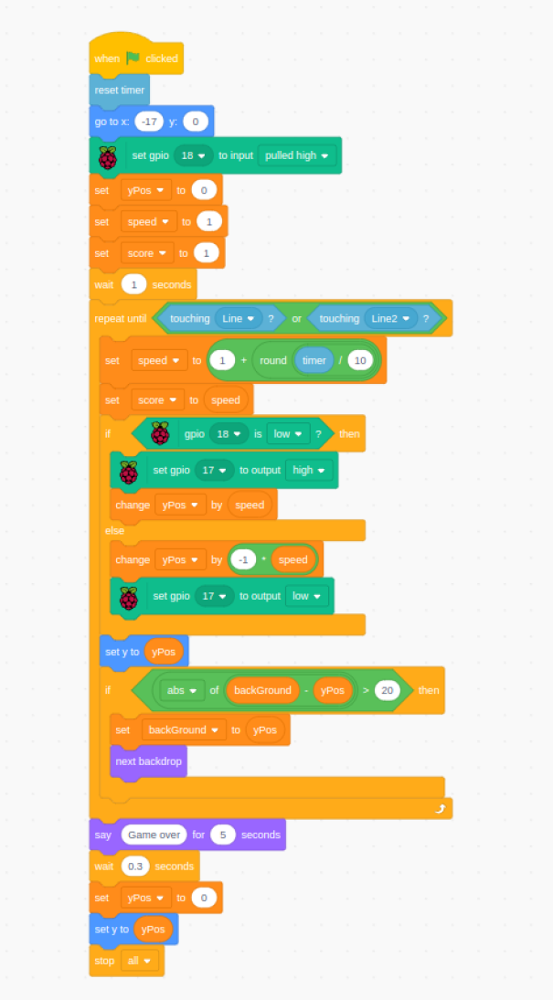
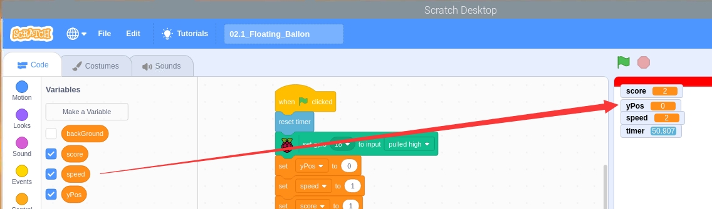
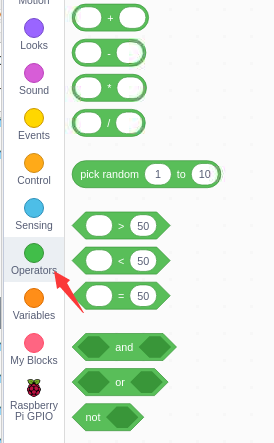

################################################################
Chapter Button and leds
################################################################

Usually, there are three essential parts in a complete automatic control device: INPUT, OUTPUT, and CONTROL. In last section, the LED module was the output part and RPI was the control part. In practical applications, we not only make LEDs flash, but also make a device sense the surrounding environment, receive instructions and then take the appropriate action such as turn on LEDs, make a buzzer beep and so on.

Next, we will build a simple control system to control an LED through a push button switch.

Project Push Button Switch & LED
****************************************************************

In the project, we will control the LED state through a Push Button Switch. When the button is pressed, our LED will turn ON, and when it is released, the LED will turn OFF. This describes a Momentary Switch.

Component List
================================================================

+-----------------------------------------------------------+
|  1. Raspberry Pi (with 40 GPIO) x1                        |     
|                                                           |       
|  2. GPIO Extension Board & Ribbon Cable x1                |       
|                                                           |                                                            
|  3. Breadboard x1                                         |                                                                 
+---------------------------+-------------------------------+
| LED x1                    | Resistor 220Ω x1              |
|                           |                               |
|  |red-led|                |  |res-220R|                   |                         
+---------------------------+-------------------------------+
| Push Button Switch x1     | Resistor 10KΩ x2              |
|                           |                               |
|  |button-small|           |  |res-10k|                    |                         
+---------------------------+-------------------------------+
| Jumper Wire                                               |
|                                                           |
|  |jumper-wire|                                            |
+-----------------------------------------------------------+

.. |jumper-wire| image:: ../_static/imgs/jumper-wire.png
    :width: 60%
.. |red-led| image:: ../_static/imgs/red-led.png
    :width: 30%
.. |res-220R| image:: ../_static/imgs/res-220R.png
    :width: 7%

Please Note: In the code “button” represents switch action.

Component knowledge
================================================================

Push Button Switch
----------------------------------------------------------------
This type of Push Button Switch has 4 pins (2 Pole Switch). Two pins on the left are connected, and both left and right sides are the same per the illustration:

    .. image:: ../_static/imgs/button-small-img-sch.jpg

When the button on the switch is pressed, the circuit is completed (your project is Powered ON).

Circuit
================================================================
1. **Schematic diagram**

    .. image:: ../_static/imgs/button-led-sch1.jpg
        :height: 400

    .. note:: 
        R3 is used to limit current to protect GPIO 18, if you set it to output HIGH level by mistake.

2. **Hardware connection** 

.. note::
    | There are two kinds of push button switch in this kit. 
    | :red:`The smaller push button switches are contained in a plastic bag.` 

.. hint:: 
    If you need any support, please feel free to contact us via: support@freenove.com

1. This is how it works. When button switch is released:

    
2. This is how it works. When button switch is released:

Code
================================================================

This project is designed for learning how to use Push Button Switch to control an LED. We first need to read the state of switch, and then determine whether to turn the LED ON in accordance to the state of the switch.

Electronic_Button_LED
----------------------------------------------------------------

.. hint:: 
    :red:`If you have any concerns, please contact us via:`  support@freenove.com

Load the code to scratch3.

.. code-block:: console

    Freenove_Kit/Code/Scratch3/02.0_Electronic_Button_LED.sb3

Click the green flag. Then when you press **button swtich**, the LED will be turned on. Otherwise, the LED will be turned off.

is to set a GPIO to input mode, which is used to detect button swtich condition.

Floating_Ballon
----------------------------------------------------------------

The circuit is same as previous section.

Load the code to scratch3.

.. code-block:: console

    Freenove_Kit/Code/Scratch3/02.1_Floating_Ballon.sb3

Click the green flag. Then when you press button switch, the ballon will rise. Otherwise, the ballon will fall. When the ballon is too high or too low, game is over. The falling speed will increase over time.

If we select varianle of left, they will be shown on right.

Operators are used in this code.

