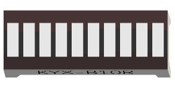
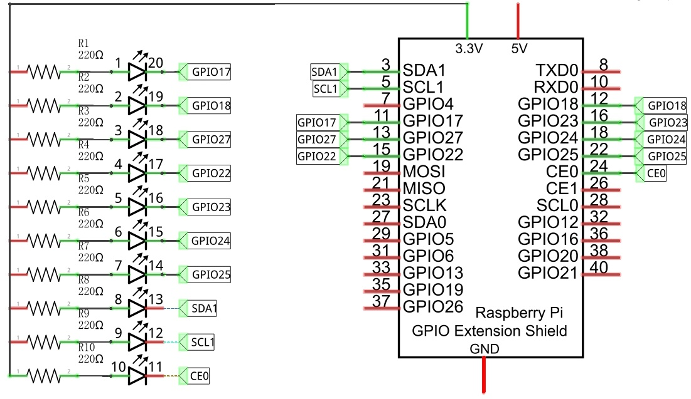
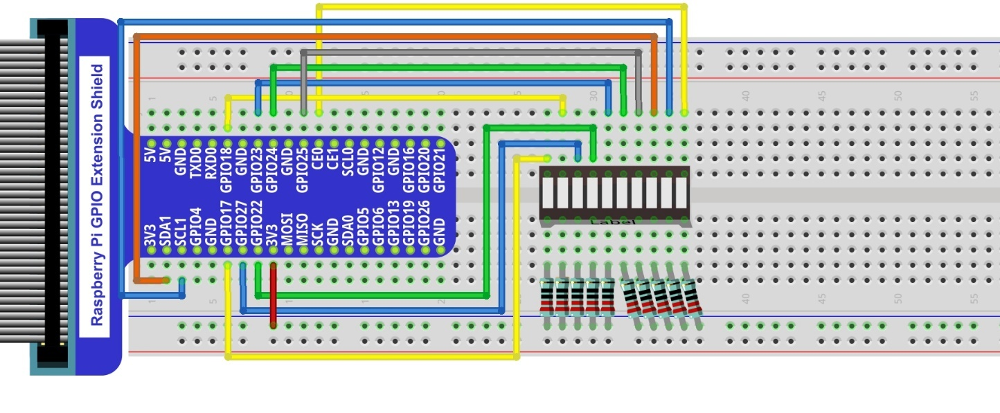
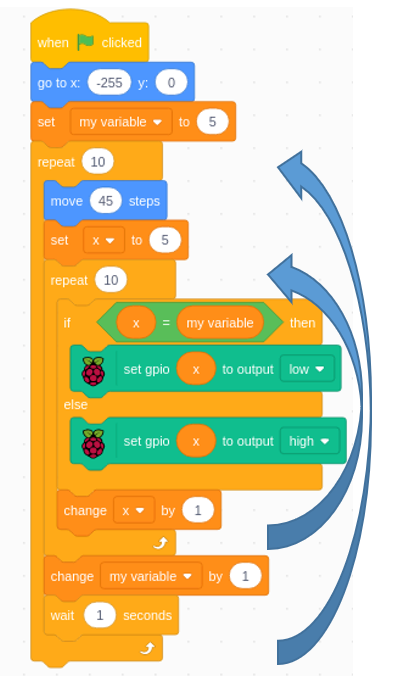

################################################################
Chapter LED Bar Graph
################################################################

We have learned how to control one LED to blink. Next, we will learn how to control a number of LEDs.

Project LED_Bar_Graph
****************************************************************

Component List
================================================================

+--------------------------------------------------+---------------------------------------------------+
|1. Raspberry Pi (with 40 GPIO) x1                 |                                                   |
|                                                  | Jumper Wires x1                                   |
|2. GPIO Extension Board & Ribbon Cable x1         |                                                   |
|                                                  |  |jumper-wire|                                    |
|3. Breadboard x1                                  |                                                   |
+--------------------------------------------------+---------------------------------------------------+
|  Bar Graph LED x1                                | Resistor 220Ω x10                                 |
|                                                  |                                                   |
|   |LED-BAR|                                      |  |res-220R-hori|                                  |
+--------------------------------------------------+---------------------------------------------------+

.. |jumper-wire| image:: ../_static/imgs/jumper-wire.png

.. |res-220R-hori| image:: ../_static/imgs/res-220R-hori.png
    :width: 60%

Component knowledge
================================================================

Let us learn about the basic features of these components to use and understand them better.

Bar Graph LED
----------------------------------------------------------------

A Bar Graph LED has 10 LEDs integrated into one compact component. The two rows of pins at its bottom are paired to identify each LED like the single LED used earlier. 

.. image:: ../_static/imgs/LED_BAR_NUM.png
        :align: center

Circuit
================================================================

A reference system of labels is used in the circuit diagram below. Pins with the same network label are connected together.

Schematic diagram             

                   
Hardware connection. If you need any support, please feel free to contact us via: support@freenove.com

.. note:: 
        :red:`If LEDbar doesn't work, rotate LEDbar 180° to try. The label is random.`

In this circuit, the cathodes of the LEDs are connected to the GPIO, which is different from the previous circuit. The LEDs turn ON when the GPIO output is low level in the program. 

Code
================================================================

This project is designed to make a flowing water lamp, which are these actions: First turn LED #1 ON, then turn it OFF. Then turn LED #2 ON, and then turn it OFF... and repeat the same to all 10 LEDs until the last LED is turns OFF. This process is repeated to achieve the “movements” of flowing water.

LED_Bar_Graph
----------------------------------------------------------------

First, observe the project result, and then learn about the code in detail.

.. hint:: 
    :red:`If you have any concerns, please contact us via:`  support@freenove.com

The circuit is same as previous section.

Load the code to scratch3.

.. code-block:: console

    Freenove_Kit/Code/Scratch3/03.0_LED_Bar_Graph.sb3

Click the green flag. The the sprite will move from number 0 to 9.

Here are two repeat functions.
