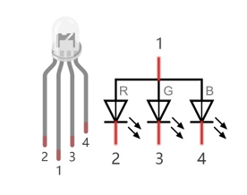
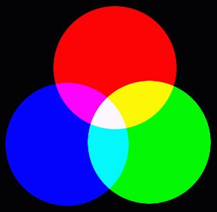
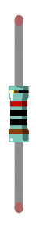
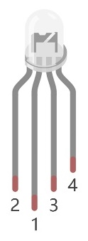
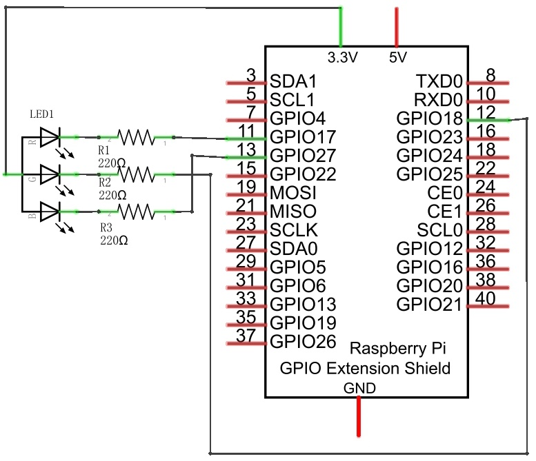
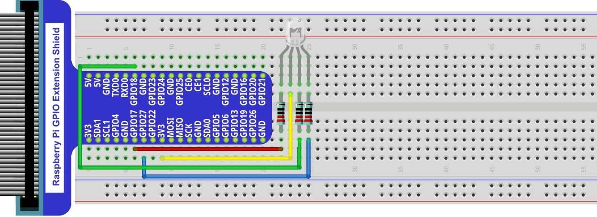
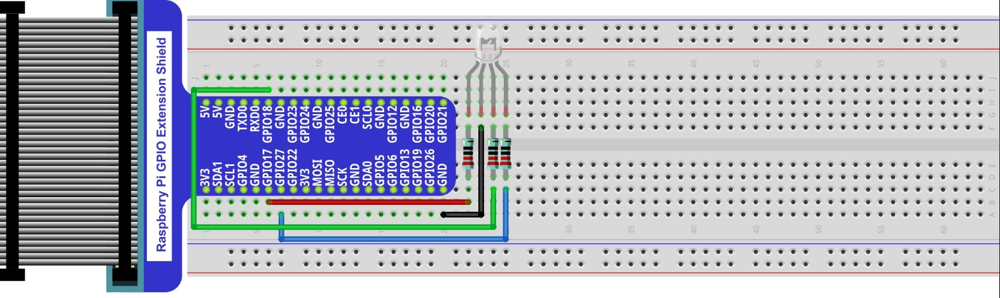
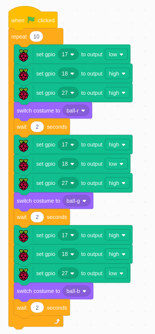
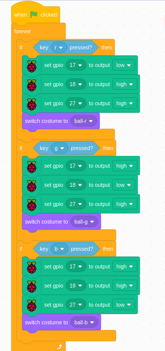

################################################################
Chapter RGB LED
################################################################

In this chapter, we will learn how to control a RGB LED.

An RGB LED has 3 LEDs integrated into one LED component. It can respectively emit Red, Green and Blue light. In order to do this, it requires 4 pins (this is also how you identify it). The long pin (1) is the common which is the Anode (+) or positive lead, the other 3 are the Cathodes (-) or negative leads. A rendering of a RGB LED and its electronic symbol are shown below. We can make RGB LED emit various colors of light and brightness by controlling the 3 Cathodes (2, 3 & 4) of the RGB LED

Red, Green, and Blue light are called 3 Primary Colors when discussing light (Note: for pigments such as paints, the 3 Primary Colors are Red, Blue and Yellow). When you combine these three Primary Colors of light with varied brightness, they can produce almost any color of visible light. Computer screens, single pixels of cell phone screens, neon lamps, etc. can all produce millions of colors due to phenomenon.

.. container:: centered
    
    :x-large:`RGB`

If we use a three 8 bit PWM to control the RGB LED, in theory, we can create 28*28*28=16777216 (16 million) colors through different combinations of RGB light brightness.

Next, we will use RGB LED to make a multicolored LED. 

Project Multicolored LED
****************************************************************

Component List
================================================================
    
+------------------------------------------------------+------------------------------------------------------+
|    Raspberry Pi (with 40 GPIO) x1                    |        RGB LED x1                                    |
|                                                      |                                                      |   
|    GPIO Extension Board & Ribbon Cable x1            |       |RGB-LED-real|                                 |
|                                                      |                                                      |
|    Breadboard x1                                     |                                                      |
+------------------------------------------------------+------------------------------------------------------+
|   Jumper Wire                                        |  Resistor 220Ω x3                                    |
|                                                      |                                                      |
|   |jumper-wire|                                      |    |res-220R-hori|                                   |        
+------------------------------------------------------+------------------------------------------------------+

.. |jumper-wire| image:: ../_static/imgs/jumper-wire.png

.. |res-220R-hori| image:: ../_static/imgs/res-220R-hori.png

Circuit
================================================================

+------------------------------------------------------------------------------------------------+
|   Schematic diagram                                                                            |
|                                                                                                |
|   |RGB-LED-Scbematic|                                                                          |
+------------------------------------------------------------------------------------------------+
|   Hardware connection. If you need any support,please feel free to contact us via:             |
|                                                                                                |
|   support@freenove.com                                                                         | 
|                                                                                                |
|   |RGB-LED-fritizing|                                                                          |
+------------------------------------------------------------------------------------------------+

.. note:: 

    In this kit, the RGB led is Common anode. The voltage difference between LED will make it work. There is no visible GND. The GPIO ports can also receive current while in output mode.If circuit above doesn’t work, the RGB LED may be common cathode. Please try following wiring.There is no need to modify code for random color.

Code
================================================================

RGBLED
----------------------------------------------------------------

Load the code to scratch3.

.. code-block:: console

    Freenove_Kit/Code/Scratch3/04.0_RGBLED.sb3

Click the green flag. Then the LED and the ball will show red, green and blue color in turn.

The code is for common anode RGB LED. One low and two high.

Keyboard_RGBLED
----------------------------------------------------------------

Load the code to scratch3.

.. code-block:: console

    Freenove_Kit/Code/Scratch3/04.1_Keyboard_RGBLED.sb3

Click the green flag. Then click “r”, “g” and “b” randomly and observe the color change.

**“r”, “g” and “b” on key board will be used and detect.**

