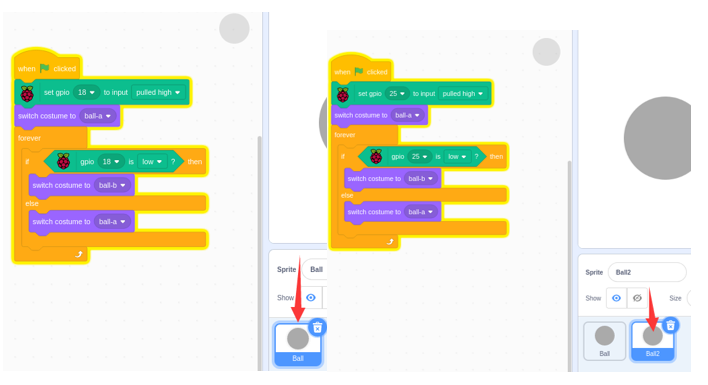
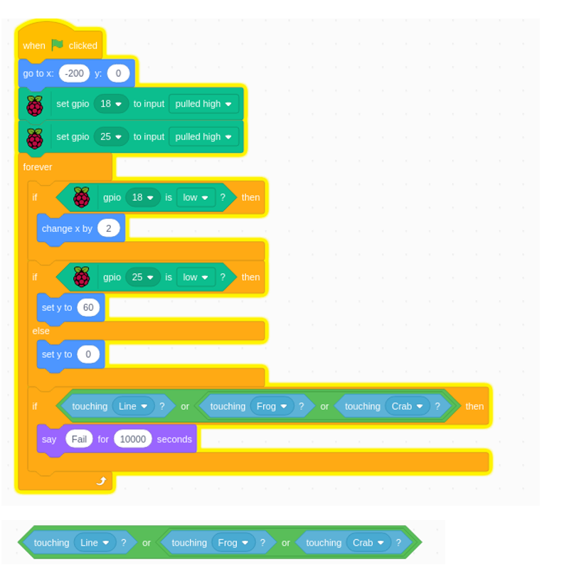

################################################################
Chapter Two Electronic Button Switch
################################################################

Project 05.0_Two_Electronic_Button_LED
****************************************************************

Project 05.1_Squash0 and 5.2_Jump
****************************************************************

Components
================================================================

+------------------------------------------------------+------------------------------------------------------+
|    Raspberry Pi (with 40 GPIO) x1                    |   RGB LED x1                                         |
|                                                      |                                                      |   
|    GPIO Extension Board & Ribbon Cable x1            |       |button-small|                                 |
|                                                      |                                                      |
|    Breadboard x1                                     |                                                      |
+------------------------------------------------------+------------------------------------------------------+
|   Jumper Wire                                        |  Resistor 10kΩ x4                                    |
|                                                      |                                                      |
|   |jumper-wire|                                      |    |res-10k|                                         |        
+------------------------------------------------------+------------------------------------------------------+

.. |jumper-wire| image:: ../_static/imgs/jumper-wire.png
.. |res-10k| image:: ../_static/imgs/res-10K-hori.png
.. |button-small| image:: ../_static/imgs/button-small.jpg
    :width: 30%

Circuit 
================================================================

+------------------------------------------------------------------------------------------------+
|   Schematic diagram                                                                            |
|                                                                                                |
|   |scratch_t_button_Sc|                                                                        |
+------------------------------------------------------------------------------------------------+
|   Hardware connection. If you need any support,please feel free to contact us via:             |
|                                                                                                |
|   support@freenove.com                                                                         |
|                                                                                                |
|   |scratch_t_button_Fr|                                                                        |
+------------------------------------------------------------------------------------------------+

Code
================================================================

Two_Electronic_Button_LED
----------------------------------------------------------------

Load the code to scratch3.

.. code-block:: console

    Freenove_Kit/Code/Scratch3/04.1_Keyboard_RGBLED.sb3

Click the green flag. Then press two button switches to observe the change. 

There are two balls. We need write two sections of code for two GPIOs.

Squash
----------------------------------------------------------------

Load the code to scratch3.

.. code-block:: console

    Freenove_Kit/Code/Scratch3/05.1_Squash.sb3

Click the green flag. Press the two button swtiches to move the green paddle.

There are two sprites moveing. So we need write two section of code. One is for ball. Another is for paddle.

.. image:: ../_static/imgs/scratch_t_button_code1.png
    :align: center

Pick random “range”. It can ne any one of 145~180, like: 145 150 180 146.

Jump
----------------------------------------------------------------

Load the code to scratch3.

.. code-block:: console

    Freenove_Kit/Code/Scratch3/05.2_Jump.sb3

Click the green flag. Press the two button swtiches to make the sprite go through the line and not touch the other items..

A or B or C. One of them is true. The whold result would be true. It mean the sprite1 cannot tounch any of others.

