################################################################
Chapter Buzzer
################################################################

In this chapter, we will learn about buzzers and the sounds they make. And in our next project, we will use an active buzzer to make a doorbell and a passive buzzer to make an alarm.

Project 06.0_Buzzer
****************************************************************

We will make a doorbell with this functionality: when the Push Button Switch is pressed the buzzer sounds and when the button is released, the buzzer stops. This is a momentary switch function.

+-----------------------------------------------------------+
|    Raspberry Pi (with 40 GPIO) x1                         |     
|                                                           |       
|    GPIO Extension Board & Ribbon Cable x1                 |       
|                                                           |                                                            
|    Breadboard x1                                          |                                                                 
+---------------------------+-------------------------------+
| NPN transistorx1 (S8050)  |   Active buzzer x1            |
|                           |                               |
|   |NPN-transistor|        |  |Active-buzzer|              |                   
|                           |                               |          
+----------------------+----+------------+------------------+
|Push Button Switch x1 | Resistor 1kΩ x1 | Resistor 10kΩ x2 |
|                      |                 |                  |
| |button-small|       | |Resistor-1kΩ|  | |Resistor-10kΩ|  |
|                      |                 |                  |
+----------------------+-----------------+------------------+
|   Jumper Wire                                             |
|                                                           | 
|      |jumper-wire|                                        |
+-----------------------------------------------------------+

.. |jumper-wire| image:: ../_static/imgs/jumper-wire.png
    :width: 60%
.. |Resistor-1kΩ| image:: ../_static/imgs/Resistor-1kΩ.png
    :width: 18%
.. |Resistor-10kΩ| image:: ../_static/imgs/Resistor-10kΩ.png
    :width: 16%
.. |button-small| image:: ../_static/imgs/button-small.jpg
    :width: 30%
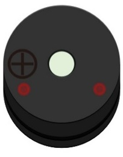
.. |NPN-transistor| image:: ../_static/imgs/NPN-transistor.png
    :width: 25%

Component knowledge
================================================================

Buzzer
----------------------------------------------------------------

A buzzer is an audio component. They are widely used in electronic devices such as calculators, electronic alarm clocks, automobile fault indicators, etc. There are both active and passive types of buzzers. Active buzzers have oscillator inside, these will sound as long as power is supplied. Passive buzzers require an external oscillator signal (generally using PWM with different frequencies) to make a sound.

.. container:: centered
    
    Active buzzer

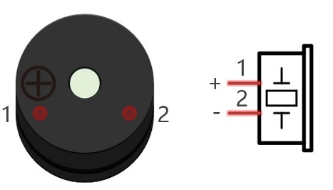

.. container:: centered
    
    Passive buzzer

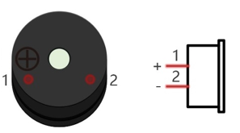

Active buzzers are easier to use. Generally, they only make a specific sound frequency. Passive buzzers require an external circuit to make sounds, but passive buzzers can be controlled to make sounds of various frequencies. The resonant frequency of the passive buzzer in this Kit is 2kHz, which means the passive buzzer is the loudest when its resonant frequency is 2kHz.

:red:`How to identify active and passive buzzer?`

1.	As a rule, there is a label on an active buzzer covering the hole where sound is emitted, but there are exceptions to this rule.
2.	Active buzzers are more complex than passive buzzers in their manufacture. There are many circuits and crystal oscillator elements inside active buzzers; all of this is usually protected with a waterproof coating (and a housing) exposing only its pins from the underside. On the other hand, passive buzzers do not have protective coatings on their underside. From the pin holes, view of a passive buzzer, you can see the circuit board, coils, and a permanent magnet (all or any combination of these components depending on the model.

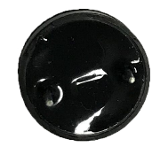

.. container:: centered
    
    Passive buzzer

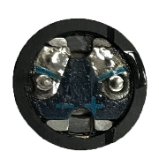

.. container:: centered
    
    Passive buzzer

Transistors
----------------------------------------------------------------

A transistor is required in this project due to the buzzer's current being so great that GPIO of RPi's output capability cannot meet the power requirement necessary for operation. A NPN transistor is needed here to amplify the current. 
Transistors, full name: semiconductor transistor, is a semiconductor device that controls current think of a transistor as an electronic “amplifying or switching device”. Transistors can be used to amplify weak signals, or to work as a switch. Transistors have three electrodes (PINs): base (b), collector (c) and emitter (e). When there is current passing between "be" then "ce" will have a several-fold current increase (transistor magnification), in this configuration the transistor acts as an amplifier. When current produced by "be" exceeds a certain value, "ce" will limit the current output. at this point the transistor is working in its saturation region and acts like a switch. Transistors are available as two types as shown below: PNP and NPN,

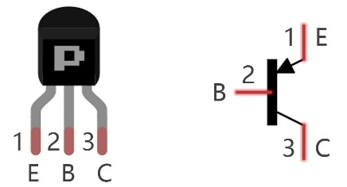

.. container:: centered
    
    PNP transistor

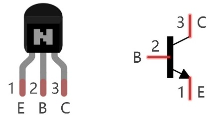

.. container:: centered
    
    NPN transistor

.. note:: 
    In our kit, the PNP transistor is marked with 8550, and the NPN transistor is marked with 8050.

Thanks to the transistor's characteristics, they are often used as switches in digital circuits. As micro-controllers output current capacity is very weak, we will use a transistor to amplify its current in order to drive components requiring higher current.
When we use a NPN transistor to drive a buzzer, we often use the following method. If GPIO outputs high level, current will flow through R1 (Resistor 1), the transistor conducts current and the buzzer will make sounds. If GPIO outputs low level, no current will flow through R1, the transistor will not conduct currentand buzzer will remain silent (no sounds).
When we use a PNP transistor to drive a buzzer, we often use the following method. If GPIO outputs low level, current will flow through R1. The transistor conducts current and the buzzer will make sounds. If GPIO outputs high level, no current flows through R1, the transistor will not conduct current and buzzer will remain silent (no sounds). Below are the circuit schematics for both a NPN and PNP transistor to power a buzzer.

======================================  ================================================
NPN transistor to drive buzzer            PNP transistor to drive buzzer

|NPN-Drive|                               |PNP-Drive|

======================================  ================================================

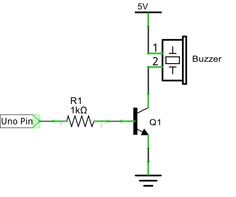
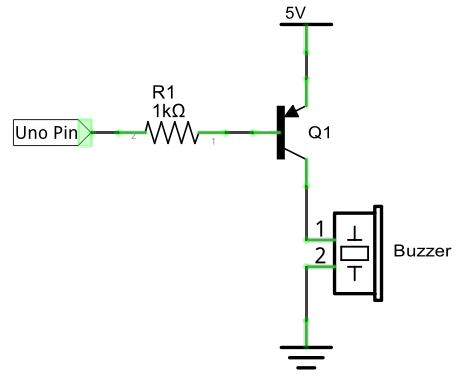

Circuit
================================================================

+------------------------------------------------------------------------------------------------+
|  Schematic diagram with RPi GPIO Extension Shield                                              |
|                                                                                                |
|   |Buzzer-Schematic|                                                                           |
+------------------------------------------------------------------------------------------------+
|   Hardware connection. If you need any support,please feel free to contact us via:             |
|                                                                                                |
|   support@freenove.com                                                                         | 
|                                                                                                |
|   |Buzzer-Fritizing|                                                                           |
|                                                                                                |
|    **Video:** https://youtu.be/R_dmi3YwY-U                                                     |
+------------------------------------------------------------------------------------------------+

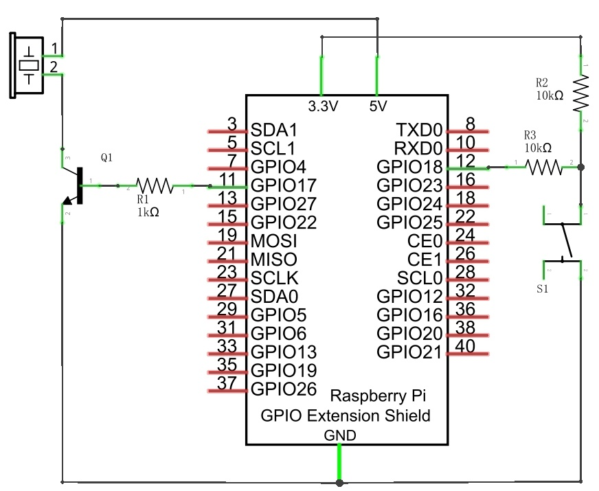
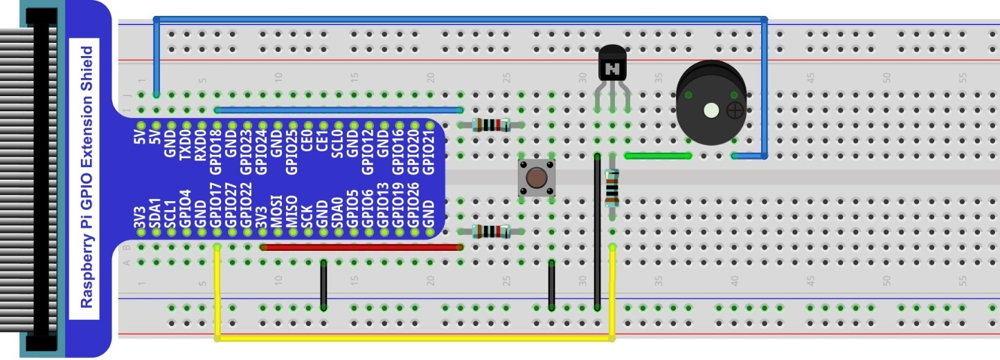

.. note:: 
    in this circuit, the power supply for the buzzer is 5V, and pull-up resistor of the push button switch is connected to the 3.3V power feed. Actually, the buzzer can work when connected to the 3.3V power feed but this will produce a weak sound from the buzzer (not very loud).

Code
================================================================

Load the code to scratch3.

Freenove_Kit/Code/Scratch3/06.0_Buzzer.sb3

Click the green flag. Press the button swtiches. Buzzer will beep. The tra.

The principle is same to let a button switch control a LED.

Here we use active buzzer. For use of passive buzzer. Please refer to Tuttoiral.pdf

