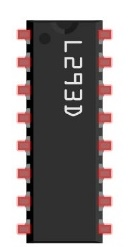

################################################################
Chapter Motor
################################################################

In this project, a potentiometer will be used to control a DC Motor. When the Potentiometer is at the midpoint position, the DC Motor will STOP, and when the Potentiometer is turned in either direction of this midpoint, the DC Motor speed increases until it reached the endpoint where the DC Motor achieves its maximum speed. When the Potentiometer is turned “Left” of the midpoint the DC Motor will ROTATE in one direction and when turned “Right” the DC Motor will ROTATE in the opposite direction. 

Component List
================================================================

Breadboard Power Module 

+-------------------------------------------------+-------------------------------------------------+
|1. Raspberry Pi (with 40 GPIO) x1                |                                                 |     
|                                                 |   Jumper Wires x23                              |       
|2. GPIO Extension Board & Ribbon Cable x1        |                                                 |       
|                                                 |     |jumper-wire|                               |                                                            
|3. Breadboard x1                                 |                                                 |                                                                 
+-------------------------------------------------+-------------------------------------------------+
| Breadboard Power Module x1                      | 9V Battery (you provide) & 9V Battery Cable     |
|                                                 |                                                 |
|  |power-module|                                 |  |Battery_cable|                                |                           
+-------------------------------------------------+-------------------------------------------------+
| ADC module x1                                   | L293D IC Chip                                   |
|                                                 |                                                 |
|  |ADC-module-1|   :xx-large:`or`  |ADC-module-2|| |L2983_chip|                                    |
+-----------------------------+-------------------+--------------+----------------------------------+
| DC Motor x1                 | Rotary Potentiometer x1          | Resistor 10kΩ x2                 |
|                             |                                  |                                  |
|  |DC_Motor_Module|          |  |Rotary-potentiometer|          |  |Resistor-10kΩ|                 |
+-----------------------------+----------------------------------+----------------------------------+

.. |jumper-wire| image:: ../_static/imgs/jumper-wire.png
.. |Resistor-10kΩ| image:: ../_static/imgs/Resistor-10kΩ.png
    :width: 25%
.. |power-module| image:: ../_static/imgs/power-module.png
    :width: 60%
.. |ADC-module-1| image:: ../_static/imgs/ADC-module-1.png
    :width: 30%
.. |ADC-module-2| image:: ../_static/imgs/ADC-module-2.png
    :width: 30%
.. |Battery_cable| image:: ../_static/imgs/Battery_cable.png
.. |Rotary-potentiometer| image:: ../_static/imgs/Rotary-potentiometer.png
    :width: 70%

.. |DC_Motor_Module| image:: ../_static/imgs/DC_Motor_Module.png
    :width: 50%

Component knowledge
================================================================

Breadboard Power Module 
----------------------------------------------------------------

Breadboard Power Module is an independent circuit board, which can provide independent 5V or 3.3V power to the breadboard when building circuits. It also has built-in power protection to avoid damaging your RPi module. The schematic diagram below identifies the important features of this Power Module:

.. image:: ../_static/imgs/power-mode.png
    :align: center

Here is an acceptable connection between Breadboard Power Module and Breadboard using a 9V battery and the provided power harness:

.. image:: ../_static/imgs/power-mode-2.png
    :width: 70%
    :align: center

DC Motor
----------------------------------------------------------------

DC Motor is a device that converts electrical energy into mechanical energy. DC Motors consist of two major parts, a Stator and the Rotor. The stationary part of a DC Motor is the Stator and the part that Rotates is the Rotor. The Stator is usually part of the outer case of motor (if it is simply a pair of permanent magnets), and it has terminals to connect to the power if it is made up of electromagnet coils. Most Hobby DC Motors only use Permanent Magnets for the Stator Field. The Rotor is usually the shaft of motor with 3 or more electromagnets connected to a commutator where the brushes (via the terminals 1 & 2 below) supply electrical power, which can drive other mechanical devices. The diagram below shows a small DC Motor with two terminal pins.

When a DC Motor is connected to a power supply, it will rotate in one direction. If you reverse the polarity of the power supply, the DC Motor will rotate in opposite direction. This is important to note.

Circuit
================================================================

Use caution when connecting this circuit because the DC Motor is a high-power component. :red:`Do not use the power provided by the RPi to power the motor directly, as this may cause permanent damage to your RPi!`` The logic circuit can be powered by the RPi's power or an external power supply, which should share a common ground with RPi.

+------------------------------------------------------------------------------------------------+
|   Schematic diagram                                                                            |
|                                                                                                |
|   |scratch_motor_Sc|                                                                           |
+------------------------------------------------------------------------------------------------+
|   Hardware connection. If you need any support,please feel free to contact us via:             |
|                                                                                                |
|   support@freenove.com                                                                         |
|                                                                                                |
|   |scratch_motor_Fr|                                                                           |
+------------------------------------------------------------------------------------------------+

Code
================================================================

Motor
----------------------------------------------------------------

Load the code to scratch3.

.. code-block:: console

    Freenove_Kit/Code/Scratch3/07.0_Motor.sb3

Click the green flag. Press the button swtiches. The motor will rotate or stop.

