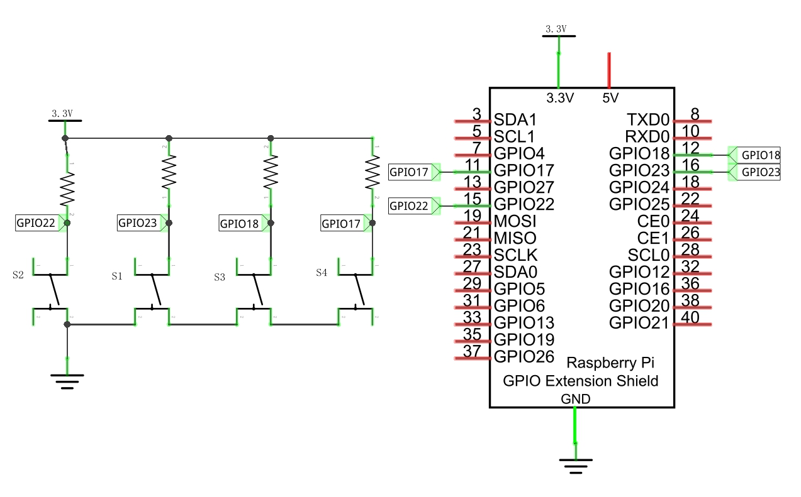
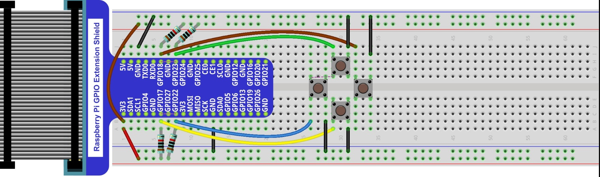
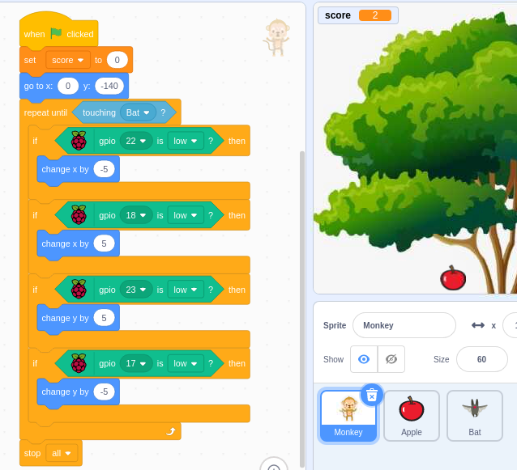
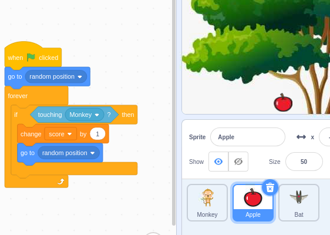
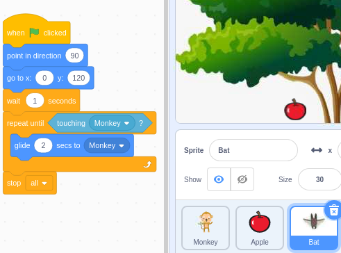
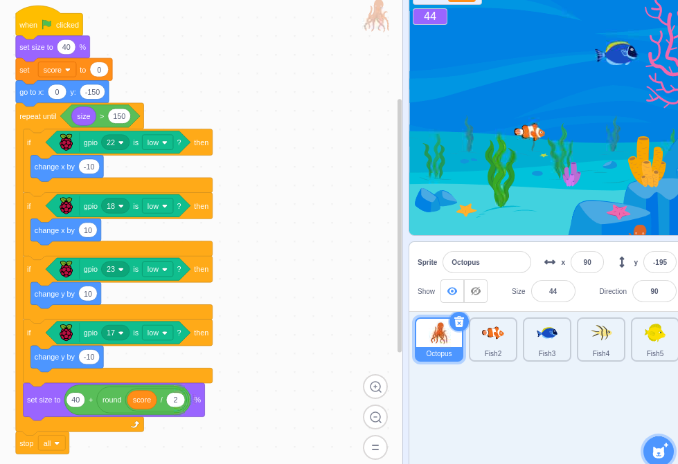

################################################################
Chapter Four button swithches games.
################################################################

Project 08.0_Pick_Apple and 08.1_Fish
****************************************************************

+------------------------------------------------------------------------------------------------+
|   Schematic diagram                                                                            |
|                                                                                                |
|   |scratch_f_button_Sc|                                                                        |
+------------------------------------------------------------------------------------------------+
|   Hardware connection. If you need any support,please feel free to contact us via:             |
|                                                                                                |
|   support@freenove.com                                                                         |
|                                                                                                |
|   |scratch_f_button_Fr|                                                                        |
+------------------------------------------------------------------------------------------------+

PicK_Apple
================================================================

Load the code to scratch3.

.. code-block:: console

    Freenove_Kit/Code/Scratch3/08.0_PicK_Apple.sb3
    
Click the green flag. Control the monkey to pick apple. And avoid to touch bat.

There are there items moving. So there are three section of code.

Fish
================================================================

Load the code to scratch3.

.. code-block:: console

    Freenove_Kit/Code/Scratch3/08.1_Fish.sb3

Click the green flag. Control the octopus to close fish.

THre is one octopus and four fish. All of them will move. So there are five section of code.

