##############################################################################
Raspberry Pi
##############################################################################

So far, at this writing, Raspberry Pi has advanced to its fifth generation product offering. Version changes are accompanied by increases in upgrades in hardware and capabilities. 

The A type and B type versions of the first generation products have been discontinued due to various reasons. What is most important is that other popular and currently available versions are consistent in the order and number of pins and their assigned designation of function, making compatibility of peripheral devices greatly enhanced between versions.

Below are the raspberry pi pictures and model pictures supported by this product. They have 40 pins.

.. table:: 
    :width: 100%
    :widths: 50 50

    ================================================================================    ================================================================================
    Practicality picture of Raspberry Pi 5                                              Model diagram of Raspberry Pi 5
    ================================================================================    ================================================================================
    |raspberrypi5-real|                                                                 |raspberrypi5-frzz|
    Practicality picture of Raspberry Pi 4 Model B:                                     Model diagram of Raspberry Pi 4 Model B
    |raspberrypi4b-real|                                                                |raspberrypi4b-frzz|
    Practicality picture of Raspberry Pi 3 Model B+                                     Model diagram of Raspberry Pi 3 Model B+
    |raspberrypi3p-real|                                                                |raspberrypi3p-frzz|
    Practicality picture of Raspberry Pi 3 Model B                                      Model diagram of Raspberry Pi 3 Model B
    |raspberrypi3b-real|                                                                |raspberrypi3b-frzz|
    Practicality picture of Raspberry Pi 2 Model B                                      Model diagram of Raspberry Pi 2 Model B
    |raspberrypi2b-real|                                                                |raspberrypi2b-frzz|
    Practicality picture of Raspberry Pi 1 Model B+                                     Model diagram of Raspberry Pi 1 Model B+
    |raspberrypi1p-real|                                                                |raspberrypi1p-frzz|
    Practicality picture of Raspberry Pi 3 Model A+                                     Model diagram of Raspberry Pi 3 Model A+
    |raspberrypi3a-real|                                                                |raspberrypi3a-frzz|
    Practicality picture of Raspberry Pi 1 Model A+                                     Model diagram of Raspberry Pi 1 Model A+
    |raspberrypi1a-real|                                                                |raspberrypi1a-frzz|
    Practicality picture of Raspberry Pi Zero W                                         CAD image of Raspberry Pi Zero W:
    |raspberrypi0w-real|                                                                |raspberrypi0w-frzz|
    Practicality picture of Raspberry Pi Zero                                           CAD image of Raspberry Pi Zero:
    |raspberrypi0-real|                                                                 |raspberrypi0-frzz|
    ================================================================================    ================================================================================

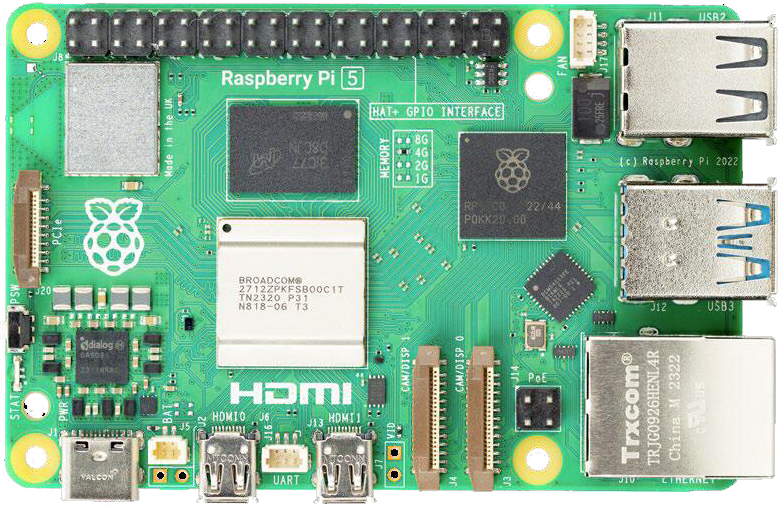
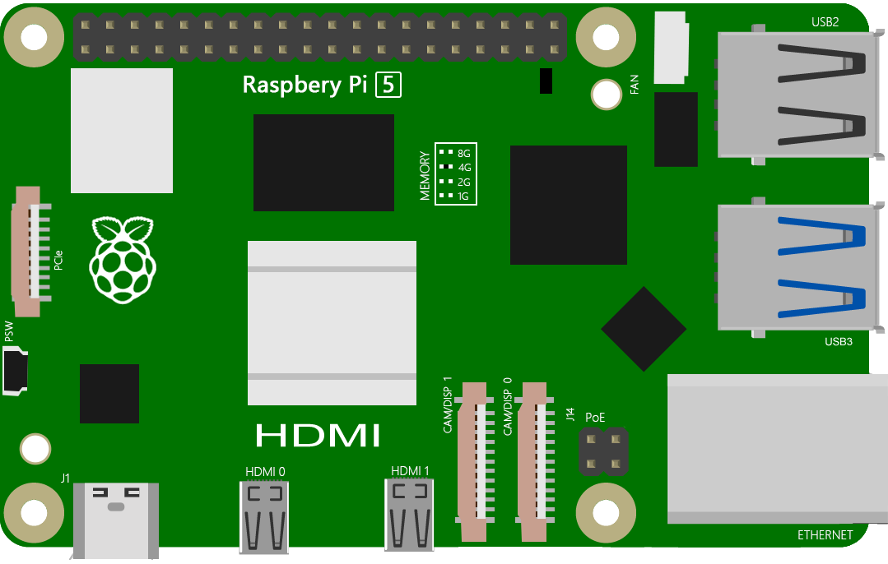

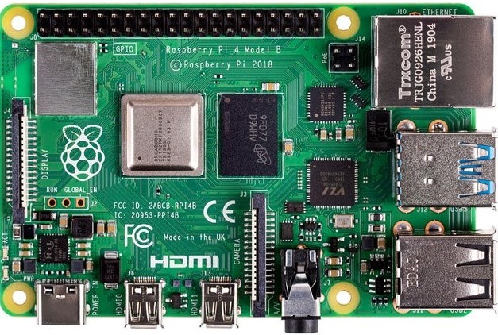
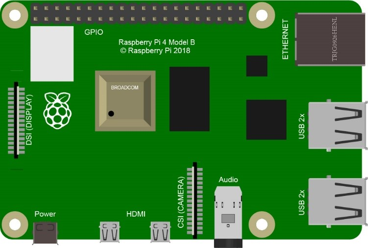

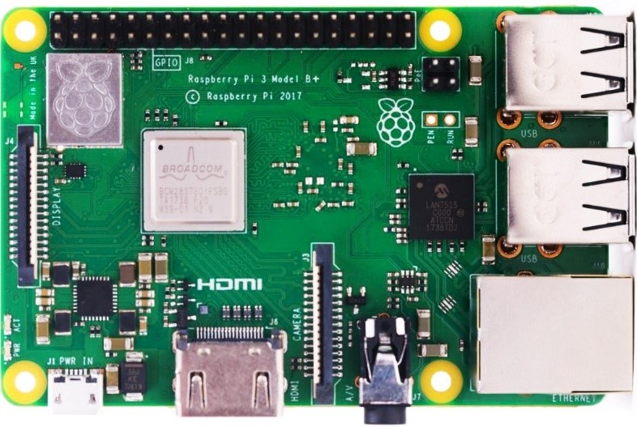
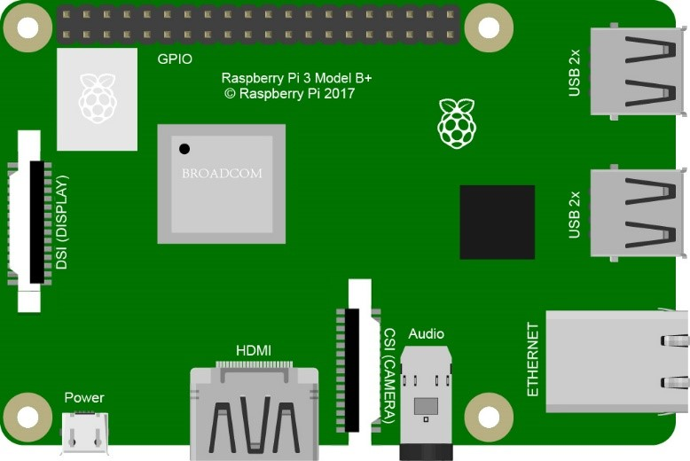

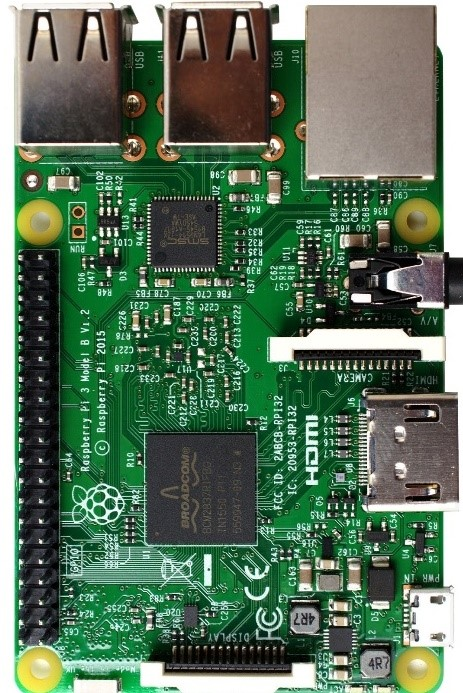
.. |raspberrypi3b-frzz| image:: ../_static/imgs/raspberrypi3b-frz.jpg

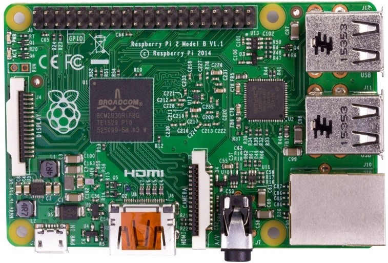
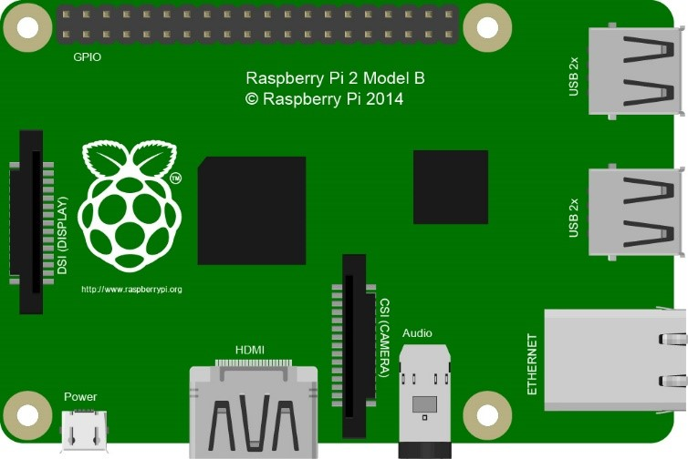

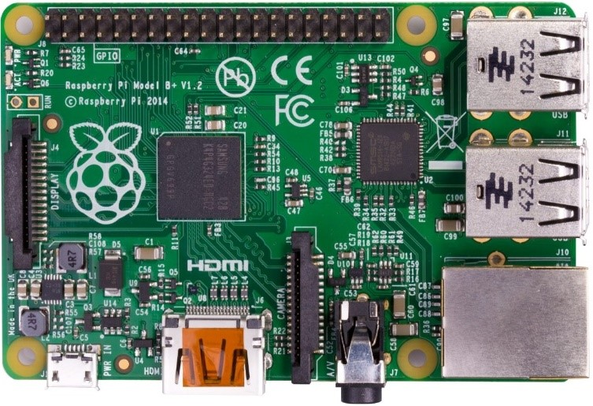
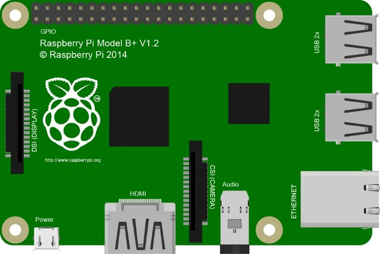

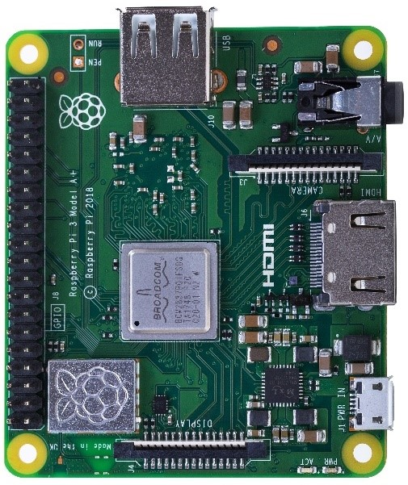
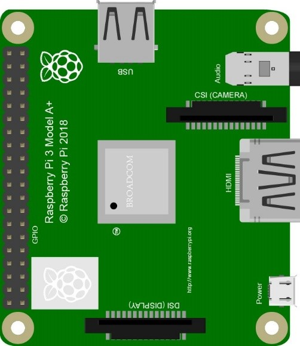

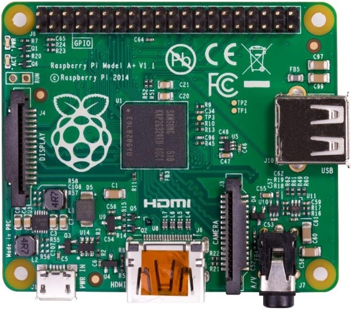
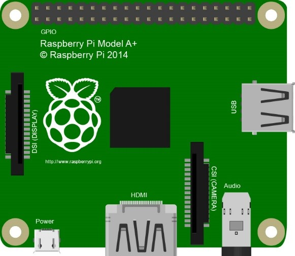

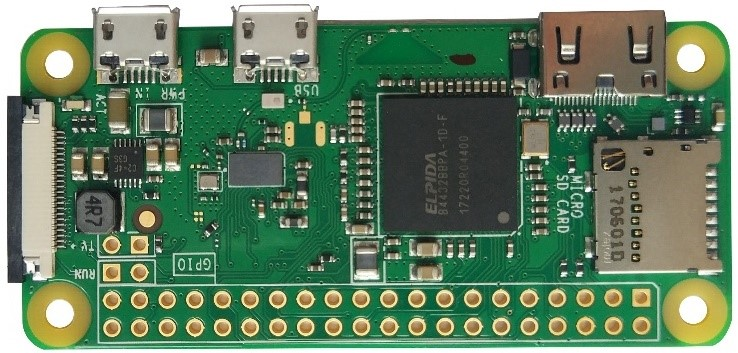
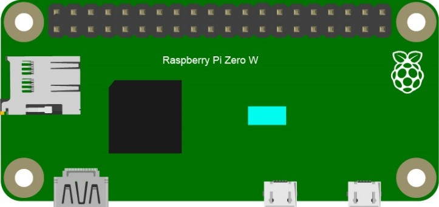

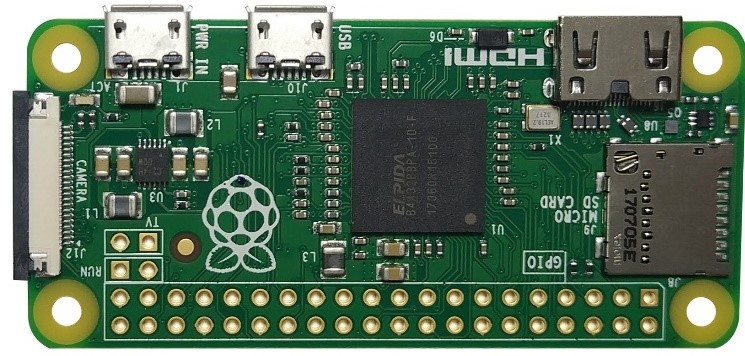
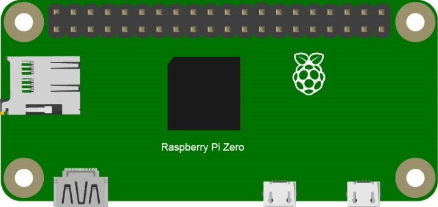

Below are the raspberry pi pictures and model pictures supported by this product. They have 40 pins.

Hardware interface diagram of RPi 5 is shown below: 

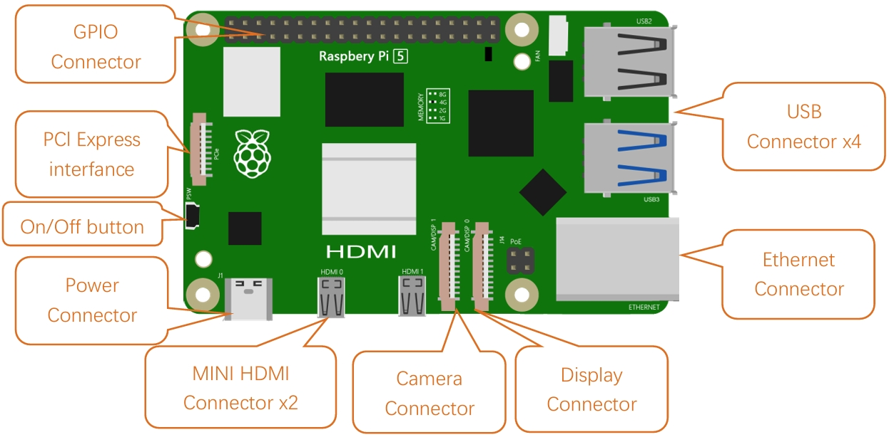

Hardware interface diagram of RPi 4B is shown below:

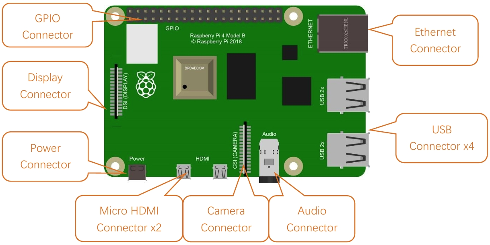

Hardware interface diagram of RPi 3B+/3B/2B/1B+:

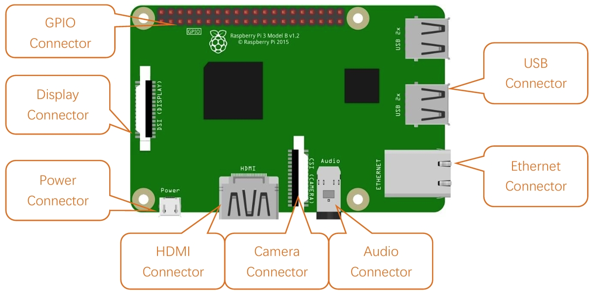

Hardware interface diagram of RPi 3A+/A+:

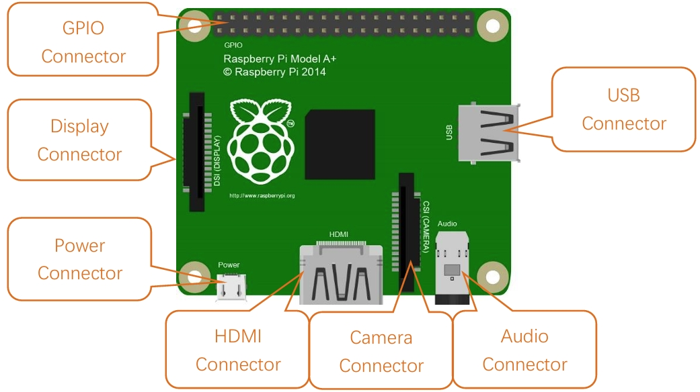

Hardware interface diagram of RPi Zero/Zero W/Zero W:

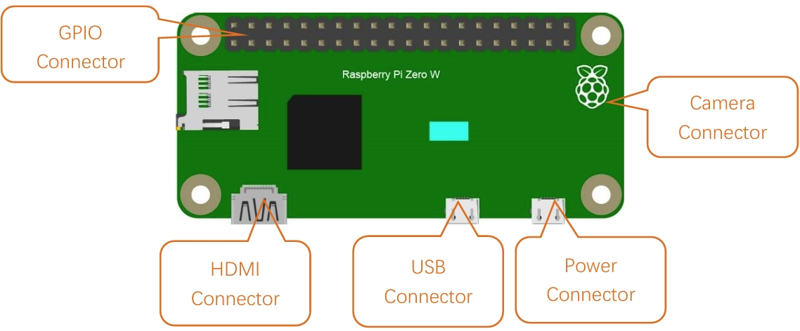