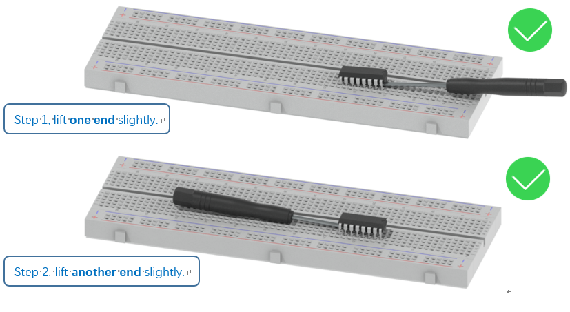
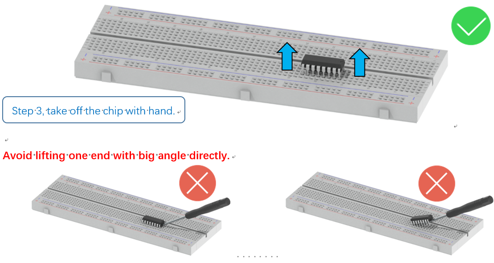
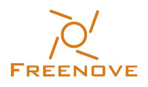

##############################################################################
Remove the Chips
##############################################################################

Some chips and modules are inserted into the breadboard to protect their pins.

You need to remove them from breadboard before use. (There is no need to remove GPIO Extension Board.)

Please find a tool (like a little screw driver) to handle them like below:

Get Support and Offer Input
****************************************************************

Freenove provides free and responsive product and technical support, including but not limited to:

* Product quality issues 
* Product use and build issues
* Questions regarding the technology employed in our products for learning and education
* Your input and opinions are always welcome
* We also encourage your ideas and suggestions for new products and product improvements

For any of the above, you may send us an email to: :blue:`support@freenove.com`

Safety and Precautions
****************************************************************

Please follow the following safety precautions when using or storing this product:

* Keep this product out of the reach of children under 6 years old. 
* This product should be used only when there is adult supervision present as young children lack necessary judgment regarding safety and the consequences of product misuse. 
* This product contains small parts and parts, which are sharp. This product contains electrically conductive parts. Use caution with electrically conductive parts near or around power supplies, batteries and powered (live) circuits.
* When the product is turned ON, activated or tested, some parts will move or rotate. To avoid injuries to hands and fingers, keep them away from any moving parts!
* It is possible that an improperly connected or shorted circuit may cause overheating. Should this happen, immediately disconnect the power supply or remove the batteries and do not touch anything until it cools down! When everything is safe and cool, review the product tutorial to identify the cause.
* Only operate the product in accordance with the instructions and guidelines of this tutorial, otherwise parts may be damaged or you could be injured.
* Store the product in a cool dry place and avoid exposing the product to direct sunlight.
* After use, always turn the power OFF and remove or unplug the batteries before storing.

About Freenove
****************************************************************

Freenove provides open source electronic products and services worldwide.

Freenove is committed to assist customers in their education of robotics, programming and electronic circuits so that they may transform their creative ideas into prototypes and new and innovative products. To this end, our services include but are not limited to:

* Educational and Entertaining Project Kits for Robots, Smart Cars and Drones
* Educational Kits to Learn Robotic Software Systems for Arduino, Raspberry Pi and micro: bit
* Electronic Component Assortments, Electronic Modules and Specialized Tools
* **Product Development and Customization Services**

You can find more about Freenove and get our latest news and updates through our website:

http://www.freenove.com

Copyright
****************************************************************

All the files, materials and instructional guides provided are released under 
`Creative Commons Attribution-NonCommercial-ShareAlike 3.0 Unported License <https://creativecommons.org/licenses/by-nc-sa/3.0/>`_ . 
A copy of this license can be found in the folder containing the Tutorial and software files associated with this product.

This means you can use these resource in your own derived works, in part or completely, but **NOT for the intent or purpose of commercial use**.

Freenove brand and logo are copyright of Freenove Creative Technology Co., Ltd. and cannot be used without written permission.

Raspberry Pi® is a trademark of Raspberry Pi Foundation (https://www.raspberrypi.org/).