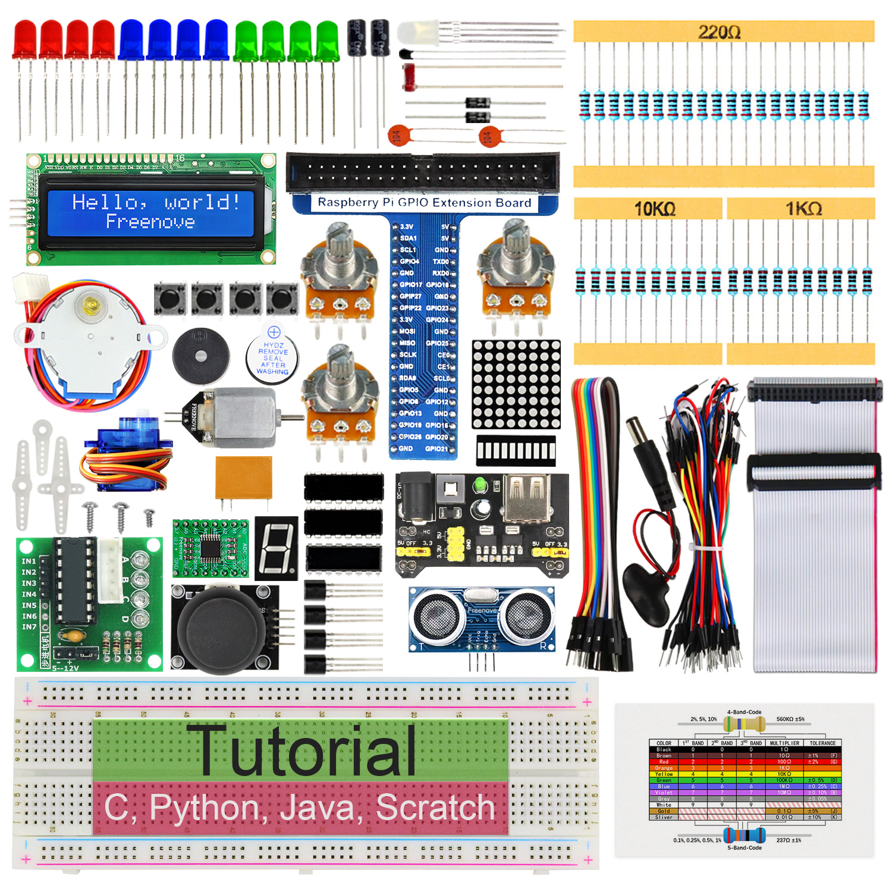
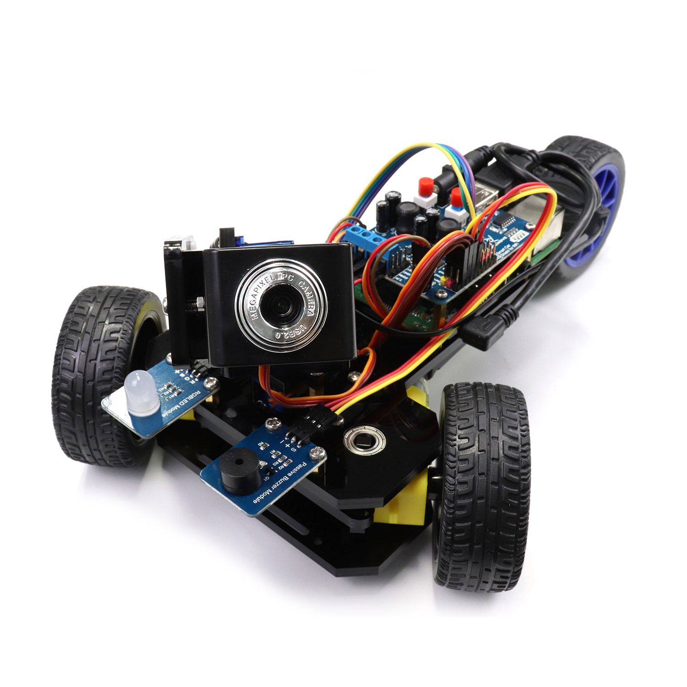
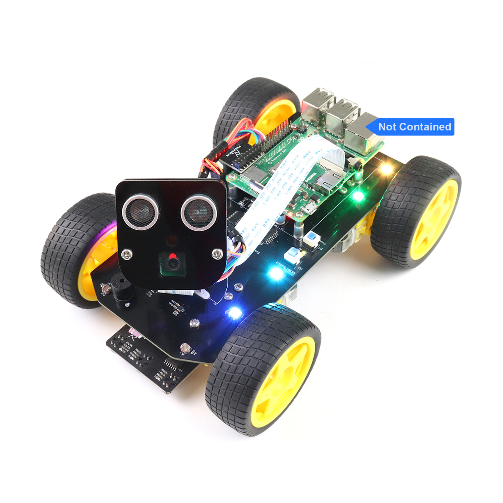
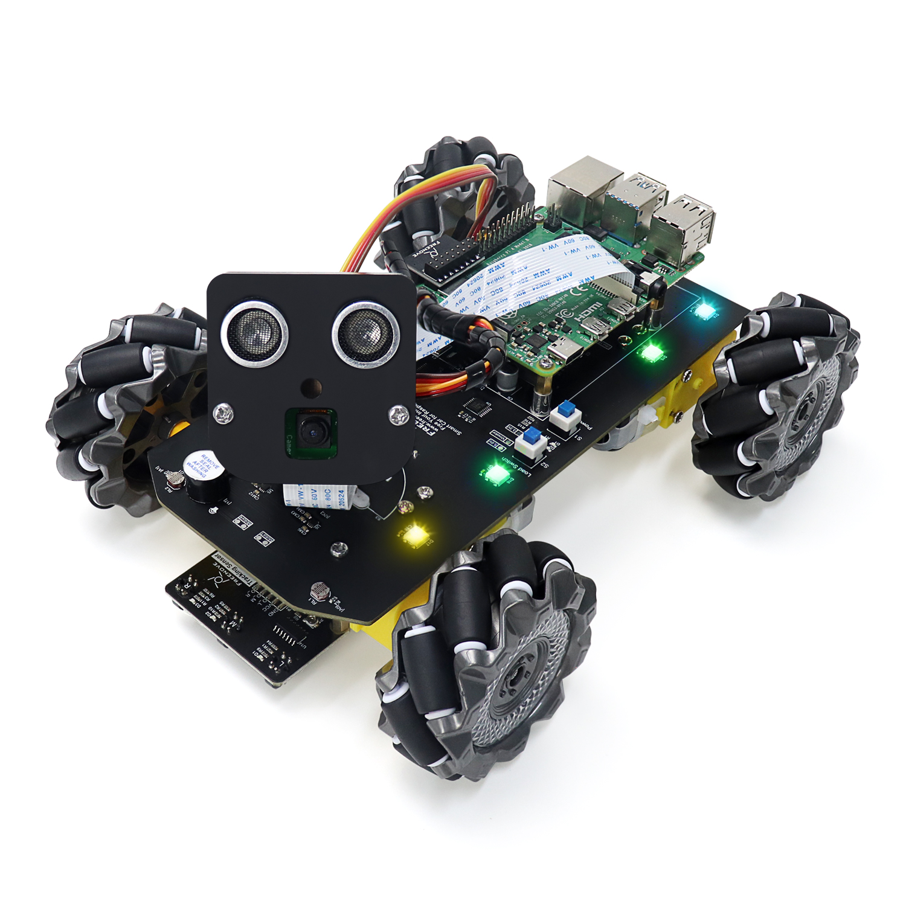
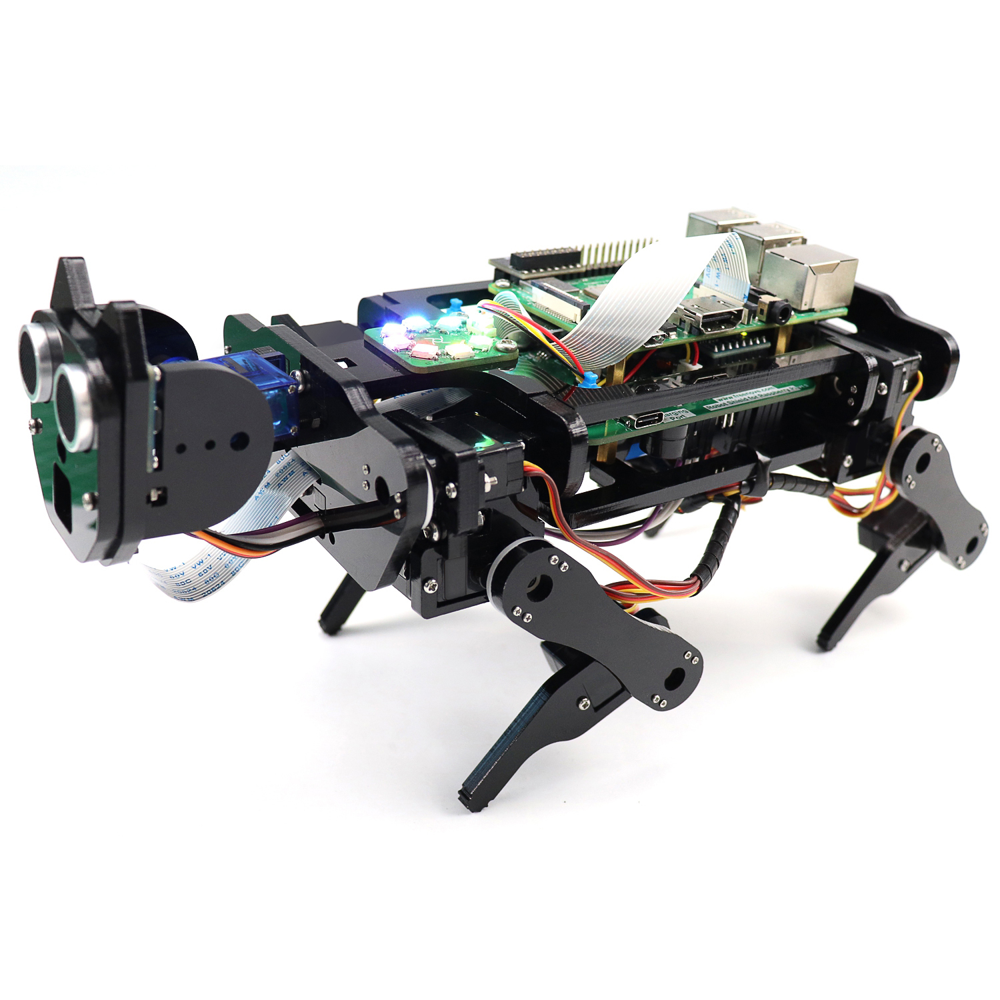
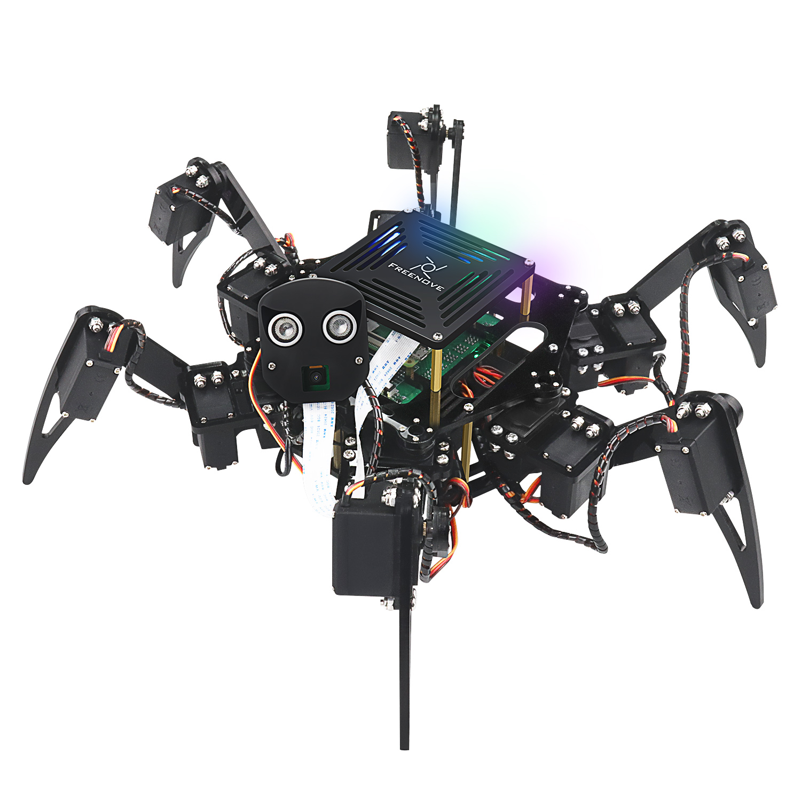
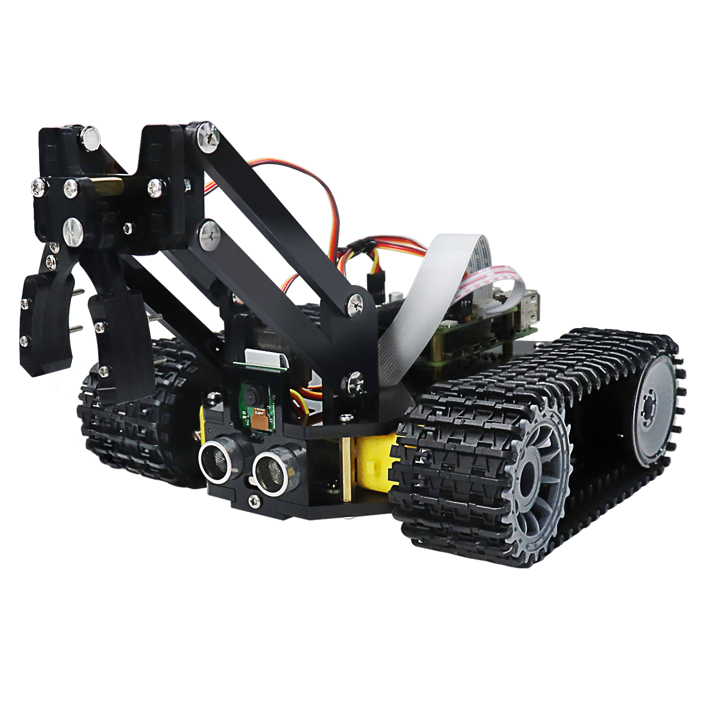

Starter kits
----------------------------------------------------------------

.. table:: Starter kit
    :width: 100%
    :class: product-table

    ====================================    ===============================================================     ==============================================================================
    Image                                   SKU                                                                 Name
    ====================================    ===============================================================     ==============================================================================
    |FNK0019.MAIN|                          :doc:`FNK0019 <rpi-starter-kit:fnk0019/fnk0019>`                    Freenove Super Starter Kit for Raspberry Pi
    |FNK0020.MAIN|                          :doc:`FNK0020 <rpi-starter-kit:fnk0020/fnk0020>`                    Freenove Ultimate Starter Kit for Raspberry Pi
    |FNK0022.MAIN|                          :doc:`FNK0022 <rpi-starter-kit:fnk0022/fnk0022>`                    Freenove Basic Starter Kit for Raspberry Pi
    |FNK0023.MAIN|                          :doc:`FNK0023 <rpi-starter-kit:fnk0023/fnk0023>`                    Freenove LCD1602 Starter Kit for Raspberry Pi
    |FNK0024.MAIN|                          :doc:`FNK0024 <rpi-starter-kit:fnk0024/fnk0024>`                    Freenove Ultrasonic Starter Kit for Raspberry Pi
    |FNK0025.MAIN|                          :doc:`FNK0025 <rpi-starter-kit:fnk0025/fnk0025>`                    Freenove RFID Starter Kit for Raspberry Pi
    |FNK0066.MAIN|                          :doc:`FNK0066 <rpi-starter-kit:fnk0066/fnk0066>`                    Freenove Complete Starter Kit for Raspberry Pi
    ====================================    ===============================================================     ==============================================================================

.. |FNK0019.MAIN| image:: ../../fnk_sku/codes/_static/products/FNK0019.MAIN.jpg    
    :class: product-image
.. |FNK0020.MAIN| image:: ../../fnk_sku/codes/_static/products/FNK0020.MAIN.jpg    
    :class: product-image
.. |FNK0022.MAIN| image:: ../../fnk_sku/codes/_static/products/FNK0022.MAIN.jpg    
    :class: product-image
.. |FNK0023.MAIN| image:: ../../fnk_sku/codes/_static/products/FNK0023.MAIN.jpg    
    :class: product-image

.. |FNK0025.MAIN| image:: ../../fnk_sku/codes/_static/products/FNK0025.MAIN.jpg    
    :class: product-image
.. |FNK0066.MAIN| image:: ../../fnk_sku/codes/_static/products/FNK0066.MAIN.jpg    
    :class: product-image

Robotics kits
----------------------------------------------------------------
.. table:: Robotics kit
    :width: 100%
    :class: product-table

    ====================================    ===============================================================     ==============================================================================
    Image                                   SKU                                                                 Name
    ====================================    ===============================================================     ==============================================================================
    |FNK0021.MAIN|                          :doc:`FNK0021 <rpi-starter-kit:fnk0021/fnk0021>`                    Freenove Three-wheeled Smart Car Kit for Raspberry Pi
    |FNK0036.MAIN|                          :doc:`FNK0036 <rpi-starter-kit:fnk0036/fnk0036>`                    Freenove Robot Arm Kit for Raspberry Pi
    |FNK0043.MAIN|                          :doc:`FNK0043 <rpi-starter-kit:fnk0043/fnk0043>`                    Freenove 4WD Smart Car Kit for Raspberry Pi
    |FNK0043B.MAIN|                         :doc:`FNK0043B <rpi-starter-kit:fnk0043B/fnk0043B>`                 Freenove 4MWD Smart Car Kit for Raspberry Pi
    |FNK0050.MAIN|                          :doc:`FNK0050 <rpi-starter-kit:fnk0050/fnk0050>`                    Freenove Robot Dog Kit for Raspberry Pi
    |FNK0052.MAIN|                          :doc:`FNK0052 <rpi-starter-kit:fnk0052/fnk0052>`                    Freenove Big Hexapod Robot Kit for Raspberry Pi
    |FNK0077.MAIN|                          :doc:`FNK0077 <rpi-starter-kit:fnk0077/fnk0077>`                    Freenove Tank Robot Kit for Raspberry Pi
    ====================================    ===============================================================     ==============================================================================

.. |FNK0036.MAIN| image:: ../../fnk_sku/codes/_static/products/FNK0036.MAIN.jpg
    :class: product-image

